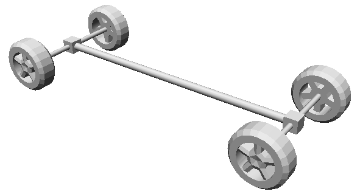

## AckermannVehicle

The `AckermannVehicle` PROTO allows the user to easily create any vehicle that complies with the ackermann model.
Position and orientation of the wheels are automatically computed using the fields of the PROTO.
These wheels are automatically connected to the appropriate joints in order to rotate along the correct axis.
Actuators ([Motor](../reference/motor.md) nodes called `right_steer` and `left_steer`) are connected to the front joints to be able to steer the vehicle.

The base node of the `AckermannVehicle` PROTO is a [Robot](../reference/robot.md) from which it inherits its first seven fields.
The rest of the vehicle (Shape, Sensors, other actuators) can be added using the `extensionSlot` field.

```
AckermannVehicle {
  SFVec3f    translation                    0 0.4 0
  SFRotation rotation                       0 1 0 0.0
  SFString   name                           "vehicle"
  SFString   model                          "AckermannVehicle"
  SFString   controller                     "void"
  MFString   controllerArgs                 []
  SFBool     supervisor                     FALSE
  SFBool     synchronization                TRUE
  SFFloat    trackFront                     1.7
  SFFloat    trackRear                      1.7
  SFFloat    wheelbase                      4.0
  SFFloat    minSteeringAngle              -1
  SFFloat    maxSteeringAngle               1
  SFFloat    suspensionFrontSpringConstant  100000
  SFFloat    suspensionFrontDampingConstant 4000
  SFFloat    suspensionRearSpringConstant   100000
  SFFloat    suspensionRearDampingConstant  4000
  SFFloat    wheelsDampingConstant          5
  SFFloat    maxSteeringTorque              10000
  MFNode     extensionSlot                  [ ]
  SFNode     boundingObject                 NULL
  SFNode     physics                        NULL
  SFFloat    radarCrossSection              100
  MFColor    recognitionColors              [ ]
  SFNode     wheelFrontRight                VehicleWheel { }
  SFNode     wheelFrontLeft                 VehicleWheel { }
  SFNode     wheelRearRight                 VehicleWheel { }
  SFNode     wheelRearLeft                  VehicleWheel { }
  MFNode     axisDevicesFrontRight          [ ]
  MFNode     axisDevicesFrontLeft           [ ]
  MFNode     axisDevicesRearRight           [ ]
  MFNode     axisDevicesRearLeft            [ ]
  SFString   data                           ""
}
```

### AckermannVehicle Field Summary

- `trackFront and trackRear`: Defines the front/rear distances between right and left wheels.
- `wheelbase`: Defines the distance between the front and the rear wheels axes.
- `minSteeringAngle and maxSteeringAngle`: Defines the minimum and maximum steering angle of the front wheels.
- `suspension...`: Defines the characteristics of the suspension.
- `wheelsDampingConstant`: Defines the `dampingConstant` of each wheel joint used to simulate the frictions of the vehicle.
- `maxSteeringTorque`: Defines the maximum torque applied on the y-axis of the front wheels.
- `extensionSlot`: Extension slot allowing the user to add other nodes (e.g., sensors, shape of the vehicle, etc.).
- `boundingObject`: Physical geometry of the vehicle.
- `physics`: `Physics` node of the vehicle defining the physical parameters of the vehicle.
- `radarCrossSection`: If greater than 0, this vehicle is a potential target for any Radar device.
It measures the vehicle's ability to reflect radar signals in the direction of the radar receiver.
- `recognitionColors`: If not empty, this vehicle may be recognized by any Camera device with recognition capability (i.e. with a Recognition node).
- `wheelX`: Slot to insert a `VehicleWheel` (or any `VehicleWheel` descendant PROTO nodes).
- `axisDevicesX`: Slot to add devices in the wheels joints (such as [Brake](../reference/brake.md), [PositionSensor](../reference/positionsensor.md) and [Motor](../reference/motor.md)).
- `data`: Defines a user `data` string of the [Robot](../reference/robot.md) node.

The center of the vehicle (position 0 0 0) is at the center of the rear wheels axis.
Any node added in the `extensionSlot` is added relatively to this position.
A `Transform` node should be used to move an extension node away from this center.

You can easily create your own PROTO that inherits from the `AckermannVehicle` PROTO, see for example the `SimpleVehicle` PROTO which automatically computes the shapes of the wheel axes.

%figure "Result of the SimpleVehicle PROTO which inherits from the AckermannVehicle PROTO"



%end
