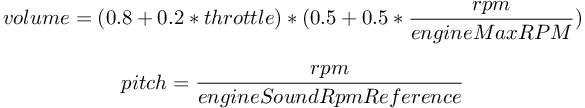
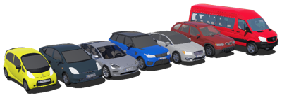

## Car

The `Car` PROTO inherits from the [AckermannVehicle](ackermannvehicle.md) PROTO and extends it.
It should be used with the [driver](driver-library.md) library in order to add a model of the engine, transmission, lights, gearbox and brake.
The joint devices are automatically filled in with the appropriate devices depending on the transmission type set in the parameters.

```
Car {
  #fields specific to Car
  SFString   type                           "traction"
  SFString   engineType                     "combustion"
  SFString   engineSound                    "sounds/engine.wav"
  SFFloat    engineSoundRpmReference        1000
  SFFloat    brakeCoefficient               500
  SFFloat    time0To100                     10
  SFFloat    maxVelocity                    50
  SFFloat    engineMaxTorque                250
  SFFloat    engineMaxPower                 50000
  SFFloat    engineMinRPM                   1000
  SFFloat    engineMaxRPM                   4500
  SFVec3f    engineFunctionCoefficients     150 0.1 0
  MFFloat    gearRatio                      [-12 10 7 5 2.5 1]
  SFFloat    hybridPowerSplitRatio          0.25
  SFFloat    hybridPowerSplitRPM            3000
}
```

### Car Field Summary

- `type`: Defines the transmission type of the car, supported types are: `traction` (front wheels), `propulsion` (rear wheels) or `4x4` (both).
- `engineType`: Defines the type of engine, supported types are: `combustion`, `electric`, `parallel hybrid` and `power-split hybrid` (for a serial hybrid please use electric instead).
See section [Engine models](driver-library.md#engine-models) for more information.
- `engineSound`: Defines the sound used to simulate the engine sound, if the string is empty the engine sound is not simulated.
- `engineSoundRpmReference`: Defines the reference rotation per minutes of the engine sound.
See the [Engine sound](#engine-sound) paragraph for more information about the engine sound simulation.
- `brakeCoefficient`: Defines the maximum `dampingConstant` applied by the [Brake](../reference/brake.md) on the wheels joint.
- `time0To100`: Defines the time to accelerate from 0 to 100 km/h in seconds, this value is used to compute the wheels acceleration when controlling the car in cruising speed thanks to the [driver](driver-library.md).
- `maxVelocity`: Defines the maximum velocity of the car in meters per second.
- `engineMaxTorque`: Defines the maximum torque of the motor in `Nm` used to compute the electric engine torque.
- `engineMaxPower`: Defines the maximum power of the motor in `W` used to compute the electric engine torque.
- `engineMinRPM and engineMaxRPM`: Defines the working range of the engine (`engineMinRPM` not used in case of `electric` `engineType`).
- `engineFunctionCoefficients`: Define the coefficients of the second order function used to approximate the output torque as a function of the rotational speed of the motor.
- `gearRatio`: Defines the total (not only the gearbox ratio) ratio between the rotational speed of the engine and the wheels, the number of elements defines the number of gears, the first element should be negative and is the reverse gear.
- `hybridPowerSplitRatio`: Defines the ratio of the output power of the combustion engine that is used to charge the battery in case of `power-split hybrid` `engineType`.
- `hybridPowerSplitRPM`: Defines the fixed rotational speed of the combustion engine in case of `power-split hybrid` `engineType`.

For more information about the last eight fields and how they are used internally please refer to the [Engine models](driver-library.md#engine-models) section.
The `extensionSlot` field is filled in by default with the `VehicleLights` PROTO.

#### Engine Sound

If the `engineSound` field of the `Car` PROTO is not empty, the sound file defined in this field is used to simulate the engine sound.
The amplitude and frequency of the sound is modulated in function of the rpm and throttle values:

%figure "Engine sound simulation"

%end

### VehicleLights

The `VehicleLights` PROTO is used to add all the models of the regular lights present in a car (based on [LED](../reference/led.md) nodes).
For each light you can specify its shape and the color emitted when the light is switched on.
Of course if you don't need to have lights you can safely remove the `VehicleLights` PROTO from `extensionSlot`.

```
VehicleLights {
  MFNode    front           [ ]
  MFColor   frontColor      [ 0.8 0.8 0.8 ]
  MFNode    rightIndicator  [ ]
  MFNode    leftIndicator   [ ]
  MFColor   indicatorColor  [ 1 0.7 0.1 ]
  MFNode    antifog         [ ]
  MFColor   antifogColor    [ 0.8 0.8 0.8 ]
  MFNode    braking         [ ]
  MFColor   brakingColor    [ 0.7 0.12 0.12 ]
  MFNode    rear            [ ]
  MFColor   rearColor       [ 0.8 0.8 0.8 ]
  MFNode    backwards       [ ]
  MFColor   backwardsColor  [ 0.7 0.12 0.12 ]
}
```

Here again, you can easily create your own PROTO that inherits from the [Car](#car) PROTO to define your own custom and complete model of car.
Several PROTO models that inherit from the [Car](#car) PROTO are provided.
They represent different models of car:

- the Sport SVR from Range Rover.
- the X5 from BMW.
- the Prius from Toyota.
- the MKZ from Lincoln.
- the C-Zero from Citroen.
- the Model 3 from Tesla.
- the Sprinter from Mercedes-Benz.

%figure "Models of cars created using the Car PROTO"



%end

An interesting aspect of these PROTO nodes is that the `extensionSlot` is divided into four `sensorsSlot` in order to provide smart predefined positions where to put sensors (or actuators if needed), which are in the front, top, rear and center of the car.
The position of the central sensors slot is always at 0 0 0 (which is the center of the rear wheels axis).
For the three other sensor slots, the positions are different for each model (because the size of the cars differs), see the [following table](#positions-of-the-car-sensor-slots) for the exact positions.

%figure "Positions of the car sensor slots"

| Model                | Front slot translation | Top slot translation | Rear slot translation |
| -------------------- | ---------------------- | -------------------- | --------------------- |
| BmwX5                | 0.0 0.45 3.85          | 0.0 1.45 1.0         | 0.0 0.3 -1.0          |
| LincolnMKZ           | 0.0 0.142 3.944        | 0.0 1.16 1.11        | 0.0 0.33 -1.06        |
| RangeRoverSportSVR   | 0.0 0.5 3.5            | 0.0 1.3 1.4          | 0.0 0.33 -1.06        |
| CitroenCZero         | 0.0 0.05 3.075         | 0.0 1.35 1.075       | 0.0 0.3 -0.425        |
| ToyotaPrius          | 0.0 0.40 3.635         | 0.0 1.30 1.1         | 0.0 0.3 -0.850        |
| TeslaModel3          | 0.0 0.142 3.79         | 0.0 1.16 1.11        | 0.0 0.2 -1.05         |
| MercedesBenzSprinter | 0.0 0.47 5.31          | 0.0 2.3 2.99         | 0.0 0.19 -1.62        |

%end

### Heavy-Weights

Just like the car models presented above, two generic heavy-weights PROTO inherit from the `Car` PROTO: a bus and a truck.
In the case of the truck, a trailer can be present or not.
The latter is the `endPoint` of a [HingeJoint](../reference/hingejoint.md) allowing the trailer to freely rotate around its attachment point.
There are currently two trailers to be used: a regular one and a tank shaped model.

%figure "Models of the bus and truck created using the `Car` PROTO"


%end

Similar to the car models, the heavy-weights provide four `sensorSlots` at the top, front, rear and center of the vehicles.
Because the trailer for the `Truck` is optional, the center slot is defined at the center of the rear wheel axis of the cab.
The rest of the positions can be seen in the [following table](#positions-of-the-heavy-weights-sensors-slots):

%figure "Positions of the heavy-weights sensors slots"

| Model   | Front slot translation | Top slot translation | Rear slot translation |
| ------- | ---------------------- | -------------------- | --------------------- |
| Bus     | 0.0 0.2 11.5           | 0.0 5.3 2.5          | 0.0 1.0 -6.2          |
| Truck   | 0.0 1.1 6.75           | 0.0 4.15 4.3         | 0.0 2.7 -7.3          |

%end

### Simple Vehicles

In addition to the controllable models of vehicle, several kinematic vehicles (called 'simple') are available.

> **Note**: These vehicles can be moved kinematically using a [Supervisor](../reference/supervisor.md). These are for example the vehicles used by the [SUMO interface](sumo-interface.md).

#### CarSimple

For each model of [Car](#car), a 'simple' PROTO is present too.
They should be used to model parked vehicles (non-moving) or vehicles moved by a [Supervisor](../reference/supervisor.md) changing their position and orientation. They are much faster to simulate than the normal PROTO models.

```
 PROTO CarSimple {
  SFVec3f    translation             0 0.4 0
  SFRotation rotation                0 1 0 0
  SFColor    color                   0.0 0.25 0.65
  MFColor    recognitionColors       [ 0.0 0.25 0.65, 0.1 0.1 0.1 ]
  MFString   plate                   "textures/plate.jpg"
  SFString   name                    "vehicle"
  SFString   controller              ""
  MFString   controllerArgs          []
  MFNode     sensorsSlot...          []
  SFBool     wheelBoundingObject     FALSE
 }
```

##### CarSimple Field Summary

- `controller`: Defines the controller of the vehicle.
The controller can be used for example to collect sensors data while the vehicle is moved by the [SUMO interface](sumo-interface.md).
If no controller is needed, you should leave the `controller` field empty.
It is not recommended to use the `void` controller for efficiency reasons.
- `sensorsSlot...`: These slots can be used to add sensor capabilities to the vehicle.
- `wheelBoundingObject`: Allows the physical geometry of the wheels to be enabled.

CarSimple is not an actual PROTO but defines the common structure of all the 'simple' versions of the cars.
The different simple versions of the car PROTO nodes represent the different models of [Car](#car):

- the Sport SVR from Range Rover.
- the X5 from BMW.
- the Prius from Toyota.
- the MKZ from Lincoln.
- the C-Zero from Citroen.
- the Model 3 from Tesla.
- the Sprinter from Mercedes-Benz.

%figure "Models of cars created using the CarSimple PROTO"


%end

#### TwoWheelerSimple

Due to the presence of driver, the TwoWheelerSimple PROTO nodes have a slightly different organization.
Similar to CarSimple, the TwoWheelerSimple PROTO displayed bellow is just a common structure for the different versions of the two wheelers.

```
PROTO TwoWheelerSimple {
  field       SFVec3f    translation             0 0.25 0
  field       SFRotation rotation                0 1 0 0
  vrmlField   SFColor    primaryColor            0.43 0.11 0.1
  vrmlField   SFColor    secondaryColor          0.69 0.43 0.43
  field       MFColor    recognitionColors       [ 0.43 0.11 0.1, 0.69 0.43 0.43 ]
  field       SFNode     driver                  TwoWheelerDriver { }
  field       SFString   name                    "vehicle"
  field       SFBool     wheelBoundingObject     FALSE
}
```

##### TwoWheelerSimple Field Summary

- `secondaryColor`: Defines a secondary color to be chosen alongside the main one.
- `driver`: Defines a `Slot` node for the two-wheeler driver.

ScooterSimple and MotorbikeSimple are examples of actual TwoWheelerSimple PROTO that represent a scooter and a motorbike:

%figure "Models of ScooterSimple and MotorbikeSimple currently available"


%end
