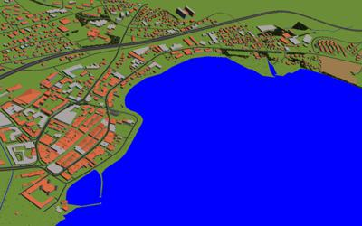

## CH Morges

%figure "The CH Morges world"

%end

The city of Morges is a medium sized city on the banks of Lake Geneva in Switzerland.
The entire city center was modeled using the [OpenStreetMap importer](openstreetmap-importer.md) tools.
The world includes around 400 roads, more than 1000 buildings, a few small forests, rivers, the lake, etc.
