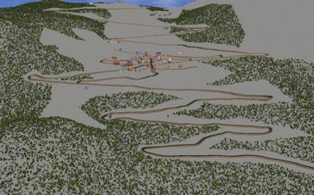

## CH Vens

%figure "The CH Vens world"

%end

Vens is a small mountain village in the Alps.
This world was modeled using the [OpenStreetMap importer](openstreetmap-importer.md) tools too.
This world uses an [ElevationGrid](../reference/elevationgrid.md) to define the uneven ground and have a few uneven roads.
The village is composed of a hundred buildings.
Furthermore, a road is going from the bottom of the valley to the village and continuing up to the top of the mountain.
This road and the village are surrounded by forests.
