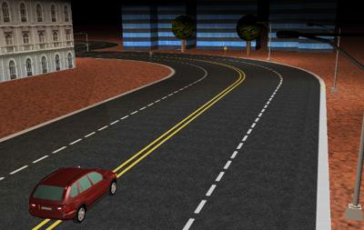

## City Night

%figure "The City night world"

%end

This world is similar to the `city` one, except that it simulates night lighting conditions.
The sun light was removed and a few street lights (including a defective blinking one) were added.
The front [SpotLights](../reference/spotlight.md) of the car were enabled too.
This world is useful to test the robustness of driving control algorithms by night.
