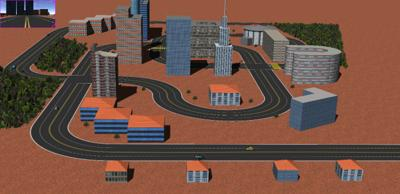

## City Traffic

%figure "The City traffic world"

%end

This world is an extension of the `city` world.
The road network was extended and some extra trees and buildings were added.
Like in the `city` world, a vehicle is driving autonomously using the on-board camera to follow the central line of the road.
In addition, SUMO is used to generate some traffic on the road network.
