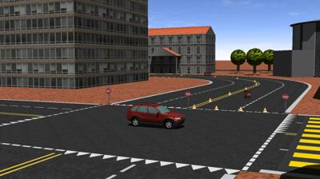

## City

%figure "The city world"

%end

This world represent a small part of a city, with several big buildings.
It has some traffic signs and a regulated intersection.
Moreover, the central line of the road is yellow in order to ease lane keeping using a camera.
