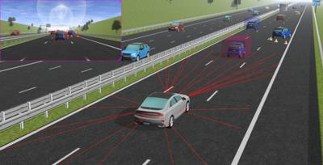

## Highway Overtake

%figure "The Highway overtake world"

%end

This world represents a simple straight highway with 4 lanes (including one emergency lane).
A dense traffic is added to the highway thanks to the SUMO interface.
A car tries to overtake the other vehicles using distance sensors, and a supervisor is used in order to display the radar targets seen by the car's front radar.
