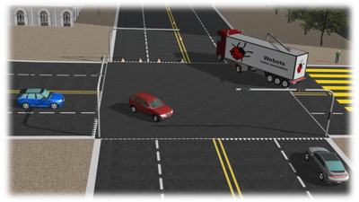

# Webots for Automobiles

Release {{ webots.version.full }}

%figure

%end

Copyright &copy; {{ date.year }} Cyberbotics Ltd.

Permission to use, copy and distribute this documentation for any purpose and without fee is hereby granted in perpetuity, provided that no modifications are performed on this documentation.

The copyright holder makes no warranty or condition, either expressed or implied, including but not limited to any implied warranties of merchantability and fitness for a particular purpose, regarding this manual and the associated software.
This manual is provided on an `as-is` basis.
Neither the copyright holder nor any applicable licensor will be liable for any incidental or consequential damages.

The Webots software was initially developed at the Laboratoire de Micro-Informatique (LAMI) of the Swiss Federal Institute of Technology, Lausanne, Switzerland (EPFL).
The EPFL makes no warranties of any kind on this software.
In no event shall the EPFL be liable for incidental or consequential damages of any kind in connection with the use and exploitation of this software.
