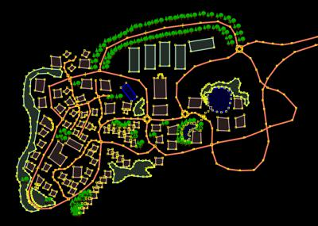
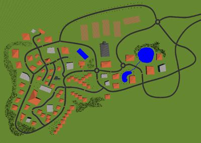

# OpenStreetMap Importer

In order to ease the creation of new environments for automobile simulations, Webots worlds can be generated from OpenStreetMap maps using the importer script described here.

You can download an OpenStreetMap map of any part of the world from [www.openstreetmap.org/export](http://www.openstreetmap.org/export) (do not use more than a few square kilometers if you want to be able to run your simulation in real-time) and then save it as a Webots world file (e.g. `myMap.wbt`) using the importer script.

## Movie Presentation


## Dependencies

Follow [these instructions](../guide/using-python.md) to install Python 3.

Then install the Python `lxml`, `pyproj`, `shapely` and `webcolors` modules, as described below.

### Linux

```sh
sudo apt-get install python3-pip
python3 -m pip install --upgrade pip
python3 -m pip install lxml pyproj shapely webcolors configparser --user
```

### macOS

```
python3 -m pip install --upgrade pip
python3 -m pip install lxml pyproj shapely webcolors configparser --user
```

### Windows

Download the `Shapely` and `pyproj` Python wheels:

- [`Shapely‑<<version>>‑cp<<python_version>>‑cp<<python_version>>m‑win_amd64.whl`](http://www.lfd.uci.edu/~gohlke/pythonlibs/#shapely)
- [`pyproj‑<<version>>‑cp<<python_version>>‑cp<<python_version>>m‑win_amd64.whl`](https://www.lfd.uci.edu/~gohlke/pythonlibs/#pyproj)

Type in the [Windows Command Prompt](https://en.wikipedia.org/wiki/Cmd.exe) open in *Administrator* mode:

```
%PYTHON_PATH%\Scripts\pip.exe install lxml
%PYTHON_PATH%\Scripts\pip.exe install %HOME%\Downloads\pyproj‑<<version>>‑cp<<python_version>>‑cp<<python_version>>m‑win_amd64.whl
%PYTHON_PATH%\Scripts\pip.exe install webcolors
%PYTHON_PATH%\Scripts\pip.exe install configparser
%PYTHON_PATH%\Scripts\pip.exe install %HOME%\Downloads\Shapely‑<<version>>‑cp<<python_version>>‑cp<<python_version>>m‑win_amd64.whl
```

## How to use the Importer

You should use the `importer.py` Python script to generate the `myMap.wbt` webots simulation world from the `myMap.osm` file:

%tab-component "os"

%tab "Windows"
```sh
cd $WEBOTS_HOME/resources/osm_importer
python3 importer.py --input=myMap.osm --output=myMap.wbt
```
%tab-end

%tab "Linux"
```sh
cd $WEBOTS_HOME/resources/osm_importer
python3 importer.py --input=myMap.osm --output=myMap.wbt
```
%tab-end

%tab "macOS"
```sh
cd $WEBOTS_HOME/Contents/Resources/osm_importer
python3 importer.py --input=myMap.osm --output=myMap.wbt
```
%tab-end

%end

Some extra folders such as `forest` can be generated in the target directory depending on the importer arguments.

Find [here](scenario-creation-tutorial.md) a detailed tutorial about an automobile scenario creation.

## Arguments

You can use several arguments with this script:

%figure "OpenStreetMap importer arguments"

| Argument               | Description                                                                                                                          | Default value                                                             |
| ---------------------- | ------------------------------------------------------------------------------------------------------------------------------------ | ------------------------------------------------------------------------- |
| --input                | Specifies the OSM file to be converted                                                                                               | If not specified, the script tries to convert "map.osm"                   |
| --output               | Specifies the name of the generated world file                                                                                       | If not specified, the generated world is called "map.wbt"                 |
| --config-file          | Specifies which configuration file to use                                                                                            | If not specified, the "config.ini" file in the importer directoy is used  |
| --layer-height         | Defines the height of a layer (the 'layer' tag is ignored if set to 0)                                                               | A default value of 5.0 is used                                            |
| --no-forests           | Does not include the forests in the generated world                                                                                  | By default, forests are included                                          |
| --no-roads             | Does not include the roads in the generated world                                                                                    | By default, roads are included                                            |
| --no-areas             | Does not include the areas (water area, landuse, etc.) in the generated world                                                        | By default, areas are included                                            |
| --no-parking           | Does not include the parkings in the generated world                                                                                 | By default, parkings are included                                         |
| --no-trees             | Does not include the isolated trees in the generated world                                                                           | By default, isolated trees are included                                   |
| --no-barriers          | Does not include the barriers (fence, wall, etc.) in the generated world                                                             | By default, barriers are included                                         |
| --no-rivers            | Does not include the rivers in the generated world                                                                                   | By default, rivers are included                                           |
| --no-buildings         | Does not include the buildings in the generated world                                                                                | By default, buildings are included                                        |
| --no-intersection-road-lines | Does not generate road start and end lines at intersections                                                                    | By default, road start and end lines are generated at intersections       |
| --enable-3D            | Uses an external service to retrieve elevation information and use an `ElevationGrid` for the ground (requires an internet connexion)| By default, the ground of the generated world is flat                     |
| --google-api-key       | If the 3D is enabled, defines the [access key to the Google Elevation API](https://developers.google.com/maps/documentation/elevation/get-api-key) | By default, Geonames is used instead of the Google Elevation API (but Geonames is way slower and less precise) |
| --disable-multipolygon-buildings | Does not generate buildings from multipolygon                                                                              | By default, buildings are generated from multipolygon                     |
| --projection           | Defines the projection parameters, the projection parameters should be defined following the [PROJ.4 rules](http://proj4.org/parameters.html), it should look like: `"+proj=robin +lon_0=2.3945 +lat_0=48.8365 +x_0=0.0725 +y_0=-5206258.932 +ellps=WGS84 +units=m +no_defs"`. Note that if you are not using the default projection, the GPS model of Webots may not match with the generated world. | By default, an empty string is used to define an UTM projection |
| --extract-projection   | Extracts the projection from the OSM file, displays it and exits.                                                                    | By default, this parameter is disabled.                                   |
| --removal-radius       | Specifies the radius (in meters) around each road waypoint beyond which any object is removed. It is possible to use the road.filter field of the [configuration file](a-typical-openstreetmap-importer-configuration-file.md) to specify which roads should be taken into account. | By default this feature is disabled (radius = 0.0).                       |
%end

## Map Edition and Creation

If you want to edit a map exported from OpenStreetMap before converting it into a Webots world, we recommend using JOSM.
[JOSM](https://josm.openstreetmap.de) is an open source software written in Java.
It is very powerful and easy to use.
Using JOSM you can easily edit a map in order to add some elements, correct some parts, etc.

%figure "Left: the OSM file created in JOSM. Right: the resulting world open in Webots after conversion"




%end

In addition to editing map from OpenStreetmap, JOSM is also very convenient to create new environment from scratch.
You can see in the [previous picture](#left-the-osm-file-created-in-josm-right-the-resulting-world-open-in-webots-after-conversion) a map fully created in JOSM and then exported and opened in Webots.

### Supported OSM Keywords

 Only a subset of the OpenStreetMap keywords are handled by the importer. Here is the list of keywords currently supported for each OpenStreetMap object type:

#### Node

##### Tree

The [natural](https://wiki.openstreetmap.org/wiki/Key:natural) keyword will result in an isolated tree. The following associated keywords are taken into account:
  - `leaf_type`: the value should be either `needleleaved` or `broadleaved`.
  - `height`.
  - `diameter_crown`.


#### Way

##### Building

The [building](https://wiki.openstreetmap.org/wiki/Key:building) or [building:part](https://wiki.openstreetmap.org/wiki/Key:building:part) keyword will result in a 3 dimensional building. The following associated keywords are taken into account:
  - `building:material` or `material`: the value should be either: `wood`, `old house`, `plaster`, `cement_block`, `concrete`, `glass` or `mirror`.
  - `roof:material`: the value should be either: `tile`, `roof_tiles`, `concrete`, `slate`, `asbestos` or `metal`.
  - `building:colour`.
  - `roof:colour`.
  - `name` or `ref`.
  - `roof:height`.
  - `min_height`.
  - `height`.
  - `roof:shape`.
  - `layer`.
  - `building:levels`.
  - `building:min_level`.

##### Road

The [highway](https://wiki.openstreetmap.org/wiki/Key:highway) keyword will result in a road. The following associated keywords are taken into account:
  - `maxspeed`.
  - `addr:country`: if the `maxspeed` keyword is not defined, the `addr:country` keyword is used to determine the speed limit of the road according to [this conversion table](https://wiki.openstreetmap.org/wiki/Speed_limits#Country_code.2Fcategory_conversion_table).
  - `oneway`: the value should be `yes`.
  - `name`.
  - `lanes`.
  - `layer`.
  - `lanes:forward`.
  - `lanes:backward`.
  - `turn:lanes:forward`.
  - `turn:lanes:backward`.
  - `width`.

##### River

The [waterway](https://wiki.openstreetmap.org/wiki/Key:waterway) keyword will result in a river if its value is `river` or `stream`. The following associated keywords are taken into account:
  - `name`.
  - `width`.

##### Wall and Fence

The [barrier](https://wiki.openstreetmap.org/wiki/Key:waterway) keyword will result in a wall if its value is `wall` and in a fence if its value is `fence`. The following associated keywords are taken into account:
  - `height`.
  - `width`.

##### Forest

The [natural](https://wiki.openstreetmap.org/wiki/Key:natural) keyword will result in a forest if its value is `forest`. The following associated keyword is taken into account:
  - `leaf_type`: the value should be either `needleleaved` or `broadleaved`.

##### Parking Lines

If the value of the [name](https://wiki.openstreetmap.org/wiki/Key:name) keyword is `parking line` it will result in a parking line.

##### Area

The following keywords will result in a flat area:
  - `amenity`: if the value is `parking`.
  - `landuse`.
  - `waterway`.

#### Relation

The following keywords are taken into account, they work the exact same way as for [way](#way):
  - `building`
  - `natural`
  - `landuse`
  - `parking`

### Configuration File

In addition to the defined keywords, a configuration file can be used to define the default value when a keyword is not defined (e.g. the default height of the buildings or of the buildings of a specific type) or to define which objects should or should not be imported.

It is possible to set default values for all the entities of an object in the section determined by its name (e.g. `building` section for buildings, or `road` section for roads).


It is also possible to set default values for a specific type of object, the name of the section should respect the following syntax: `<<name of the object>>_<<value of the associated keyword>>`. For example:
  - `building_residential` for buildings whose `building` keyword value is `residential`.
  - `road_primary` for roads whose `highway` keyword value is `primary`. In this case the name of the object is `road` and not `highway` because in Webots they are called `road` and not `highway` like in OpenStreetMap.

A typical configuration file is provided in [appendix](a-typical-openstreetmap-importer-configuration-file.md).
