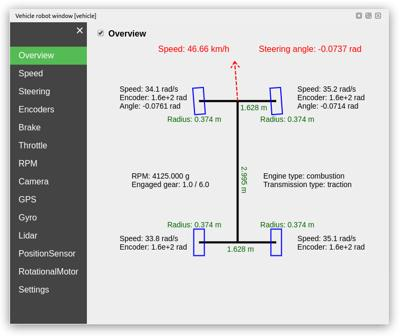

## Overview Tab

In addition to the usual tabs for each sensors/actuators, the automobile robot window's first tab gives a quick overview of the vehicle state.

%figure "The Overview tab of the automobile robot window"

%end

The following tabs give more detailed information about specific states of the vehicle (e.g. speed, steering angles, wheels encoders, etc.).
After those specific tabs about vehicles, you can find the usual tabs regarding sensors/actuators added in the sensors slots of the vehicle.
