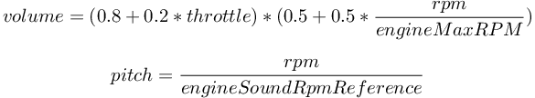
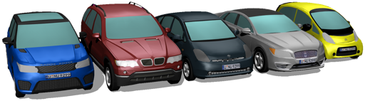

# PROTO Nodes

This section presents the set of PROTO nodes developed specifically for automobile related simulations, from the PROTO of a wheel to the PROTO of a complete car.

## Abstract PROTO Nodes
- [AckermannVehicle](https://webots.cloud/run?url={{ url.github_tree }}/projects/vehicles/protos/abstract/AckermannVehicle.proto) is the base class of almost all vehicles.
- [VehicleWheel](https://webots.cloud/run?url={{ url.github_tree }}/projects/vehicles/protos/abstract/VehicleWheel.proto) is a configurable wheel.
- [VehicleLights](https://webots.cloud/run?url={{ url.github_tree }}/projects/vehicles/protos/abstract/VehicleLights.proto) defines the set of lights in a standard vehicle.
- [SimpleVehicle](https://webots.cloud/run?url={{ url.github_tree }}/projects/vehicles/protos/abstract/SimpleVehicle.proto) is a simple example of derivating the AckermannVehicle PROTO.
- [Car](https://webots.cloud/run?url={{ url.github_tree }}/projects/vehicles/protos/abstract/Car.proto) is a generic model of a car derived from the AckermannVehicle PROTO.

Please refer to the [Engine models](driver-library.md#engine-models) section to understand the various engine options available to equip a car.

If the `engineSound` field of the `Car` PROTO is not empty, the sound file defined in this field is used to simulate the engine sound.
The amplitude and frequency of the sound is modulated in function of the rpm and throttle values:

%figure "Engine sound simulation"

%end

## Generic PROTO Nodes

- [Bus](https://webots.cloud/run?url={{ url.github_tree }}/projects/vehicles/protos/generic/protos/Bus.proto) / [BusSimple](https://webots.cloud/run?url={{ url.github_tree }}/projects/vehicles/protos/generic/protos/BusSimple.proto) / [BusWheel](https://webots.cloud/run?url={{ url.github_tree }}/projects/vehicles/protos/generic/protos/BusWheel.proto)
- [MotorbikeDriver](https://webots.cloud/run?url={{ url.github_tree }}/projects/vehicles/protos/generic/protos/MotorbikeDriver.proto) / [MotorbikeSimple](https://webots.cloud/run?url={{ url.github_tree }}/projects/vehicles/protos/generic/protos/MotorbikeSimple.proto) / [MotorbikeWheel](https://webots.cloud/run?url={{ url.github_tree }}/projects/vehicles/protos/generic/protos/MotorbikeWheel.proto)
- [ScooterDriver](https://webots.cloud/run?url={{ url.github_tree }}/projects/vehicles/protos/generic/protos/ScooterDriver.proto) / [ScooterSimple](https://webots.cloud/run?url={{ url.github_tree }}/projects/vehicles/protos/generic/protos/ScooterSimple.proto) / [ScooterWheel](https://webots.cloud/run?url={{ url.github_tree }}/projects/vehicles/protos/generic/protos/ScooterWheel.proto)
- [Tractor](https://webots.cloud/run?url={{ url.github_tree }}/projects/vehicles/protos/generic/protos/Tractor.proto) / [TractorFrontWheel](https://webots.cloud/run?url={{ url.github_tree }}/projects/vehicles/protos/generic/protos/TractorFrontWheel.proto) / [TractorRearWheel](https://webots.cloud/run?url={{ url.github_tree }}/projects/vehicles/protos/generic/protos/TractorRearWheel.proto)
- [Truck](https://webots.cloud/run?url={{ url.github_tree }}/projects/vehicles/protos/generic/protos/Truck.proto) / [TruckSimple](https://webots.cloud/run?url={{ url.github_tree }}/projects/vehicles/protos/generic/protos/TruckSimple.proto) / [TruckTank](https://webots.cloud/run?url={{ url.github_tree }}/projects/vehicles/protos/generic/protos/TruckTank.proto) / [TruckTankSimple](https://webots.cloud/run?url={{ url.github_tree }}/projects/vehicles/protos/generic/protos/TruckTankSimple.proto) / [TruckTrailer](https://webots.cloud/run?url={{ url.github_tree }}/projects/vehicles/protos/generic/protos/TruckTrailer.proto) / [TruckTrailerSimple](https://webots.cloud/run?url={{ url.github_tree }}/projects/vehicles/protos/generic/protos/TruckTrailerSimple.proto) / [TruckWheel](https://webots.cloud/run?url={{ url.github_tree }}/projects/vehicles/protos/generic/protos/TruckWheel.proto)

The tractor PROTO model provides a `sensorSlot` at center of the vehicle.
The other heavy-weights provide four `sensorSlots` at the top, front, rear and center of the vehicles.
Because the trailer for the `Truck` is optional, the center slot is defined at the center of the rear wheel axis of the cab.
The rest of the positions can be seen in the [following table](#positions-of-the-heavy-weights-sensors-slots):

%figure "Positions of the heavy-weights sensors slots"

| Model   | Front slot translation | Top slot translation | Rear slot translation |
| ------- | ---------------------- | -------------------- | --------------------- |
| Bus     |             11.5 0 0.2 |            2.5 0 5.3 |              -6.2 0 1 |
| Truck   |             6.75 0 1.1 |           4.3 0 4.15 |            -7.3 0 2.7 |

%end

## Specific PROTO Nodes

%figure "Models of cars created using the Car PROTO"

%end

- [BmwX5](https://webots.cloud/run?url={{ url.github_tree }}/projects/vehicles/protos/bmw/protos/BmwX5.proto) / [BmwX5Simple](https://webots.cloud/run?url={{ url.github_tree }}/projects/vehicles/protos/bmw/protos/BmwX5Simple.proto)
- [CitroenCZero](https://webots.cloud/run?url={{ url.github_tree }}/projects/vehicles/protos/citroen/CitroenCZero.proto) / [CitroenCZeroSimple](https://webots.cloud/run?url={{ url.github_tree }}/projects/vehicles/protos/citroen/CitroenCZeroSimple.proto)
- [LincolnMKZ](https://webots.cloud/run?url={{ url.github_tree }}/projects/vehicles/protos/lincoln/LincolnMKZ.proto) / [LincolnMKZSimple](https://webots.cloud/run?url={{ url.github_tree }}/projects/vehicles/protos/lincoln/LincolnMKZSimple.proto)
- [MercedesBenzSprinter](https://webots.cloud/run?url={{ url.github_tree }}/projects/vehicles/protos/mercedes_benz/MercedesBenzSprinter.proto) / [MercedesBenzSprinterSimple](https://webots.cloud/run?url={{ url.github_tree }}/projects/vehicles/protos/mercedes_benz/MercedesBenzSprinterSimple.proto)
- [RangeRoverSportSVR](https://webots.cloud/run?url={{ url.github_tree }}/projects/vehicles/protos/range_rover/RangeRoverSportSVR.proto) / [RangeRoverSportSVRSimple](https://webots.cloud/run?url={{ url.github_tree }}/projects/vehicles/protos/range_rover/RangeRoverSportSVRSimple.proto)
- [TeslaModel3](https://webots.cloud/run?url={{ url.github_tree }}/projects/vehicles/protos/tesla/TeslaModel3.proto) / [TeslaModel3Simple](https://webots.cloud/run?url={{ url.github_tree }}/projects/vehicles/protos/tesla/TeslaModel3Simple.proto)
- [ToyotaPrius](https://webots.cloud/run?url={{ url.github_tree }}/projects/vehicles/protos/toyota/ToyotaPrius.proto) / [ToyotaPriusSimple](https://webots.cloud/run?url={{ url.github_tree }}/projects/vehicles/protos/toyota/ToyotaPriusSimple.proto)

Like the heavy-weights, the cars provide four `sensorsSlot`.
The position of the central sensor slot is always 0 0 0 (which is the center of the rear wheels axis).
For the three other sensor slots, the positions are different for each model (because the size of the cars differs), see the [following table](#positions-of-the-car-sensor-slots) for the exact positions.

%figure "Positions of the car sensor slots"

| Model                | Front slot translation | Top slot translation | Rear slot translation |
| -------------------- | ---------------------- | -------------------- | --------------------- |
| BmwX5                |            3.85 0 0.45 |             1 0 1.45 |              -1 0 0.3 |
| LincolnMKZ           |          3.944 0 0.142 |          1.11 0 1.16 |          -1.06 0 0.33 |
| RangeRoverSportSVR   |              3.5 0 0.5 |            1.4 0 1.3 |          -1.06 0 0.33 |
| CitroenCZero         |           3.075 0 0.05 |         1.075 0 1.35 |          -0.425 0 0.3 |
| ToyotaPrius          |            3.635 0 0.4 |            1.1 0 1.3 |           -0.85 0 0.3 |
| TeslaModel3          |           3.79 0 0.142 |          1.11 0 1.16 |           -1.05 0 0.2 |
| MercedesBenzSprinter |            5.31 0 0.47 |           2.99 0 2.3 |          0 0 1 3.1415 |

%end
