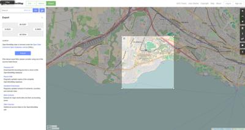
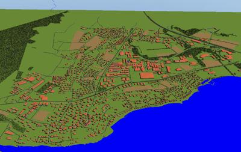

## Scenario Creation Tutorial

This small tutorial explains step-by-step how to create a scenario inspired from a real world map and then add traffic using SUMO.
This tutorial was written for `linux` and `macOS`, but the same can be achieved on `Windows` converting the following commands to `DOS`.

Please refer to [these instructions](sumo-interface.md#dependencies) to install SUMO.

### Creation of the Webots Project Directory

```sh
export WBT_PROJECT_PATH=/your/webots/project/path  # define here your project path
mkdir -p $WBT_PROJECT_PATH/worlds/myMap_net
```

### Download the OpenStreetMap Map

We will use a part of the OpenStreetMap map to generate the Webots world file.
To download the map go to the [OpenStreetMap website](https://www.openstreetmap.org/export).
From there you can select the part of the map you want and download it:

%figure "Export a part of map from OpenStreetMap"

%end

### Generate the Webots World

As explained in the [OpenStreetMap importer](openstreetmap-importer.md) section, you should use the previously downloaded map to generate the Webots world.

> **Note**: It is strongly recommended to not use the 3D feature of the [OpenStreetMap importer](openstreetmap-importer.md) otherwise it will not be possible to add traffic using SUMO.

%tab-component "os"

%tab "Linux"

```sh
cd $WEBOTS_HOME/resources/osm_importer
python importer.py --input=$WBT_PROJECT_PATH/worlds/myMap_net/myMap.osm --output=$WBT_PROJECT_PATH/worlds/myMap.wbt
```

%tab-end

%tab "macOS"

```sh
cd $WEBOTS_HOME/Contents/Resources/osm_importer
python importer.py --input=$WBT_PROJECT_PATH/worlds/myMap_net/myMap.osm --output=$WBT_PROJECT_PATH/worlds/myMap.wbt
```

%tab-end

%end

You should be able to open the generated world file directly in Webots:

%figure "resulting world generated by the importer"


%end

It is recommended at this stage to edit the imported roads and crossroads in Webots.
Indeed, the importer may generate some bugs, depending on the OSM complexity.
A good workflow is to fix the OSM data using the `JOSM` editor by adding/removing OSM nodes.
We recommend to push the modifications on the OSM data server.
You can also enable the spline subdivision on some of the roads in Webots in order to smooth them if needed.
Finally, you may add a [Fog](../reference/fog.md) node to make your world look nicer.

### Generate the SUMO Network Files

On Linux, the path to the SUMO binaries and to the Webots libraries directories should be added in your LD\_LIBRARY\_PATH environment variable in order to run the SUMO binaries:

```sh
export LD_LIBRARY_PATH=$LD_LIBRARY_PATH:$SUMO_HOME/bin:$WEBOTS_HOME/lib
```

We can also use the previously generated Webots world to generate the SUMO network file.
You need to use the [netconvert](http://sumo.dlr.de/wiki/NETCONVERT) utility for this:

%tab-component "os"

%tab "Linux"

```sh
cd $WEBOTS_HOME/resources/sumo_exporter
python exporter.py --input=$WBT_PROJECT_PATH/worlds/myMap.wbt --output=$WBT_PROJECT_PATH/worlds/myMap_net
$SUMO_HOME/bin/netconvert --node-files=$WBT_PROJECT_PATH/worlds/myMap_net/sumo.nod.xml --edge-files=$WBT_PROJECT_PATH/worlds/myMap_net/sumo.edg.xml --output-file=$WBT_PROJECT_PATH/worlds/myMap_net/sumo.net.xml
```

%tab-end

%tab "macOS"

```sh
cd $WEBOTS_HOME/Contents/Resources/sumo_exporter
python exporter.py --input=$WBT_PROJECT_PATH/worlds/myMap.wbt --output=$WBT_PROJECT_PATH/worlds/myMap_net
$SUMO_HOME/bin/netconvert --node-files=$WBT_PROJECT_PATH/worlds/myMap_net/sumo.nod.xml --edge-files=$WBT_PROJECT_PATH/worlds/myMap_net/sumo.edg.xml --output-file=$WBT_PROJECT_PATH/worlds/myMap_net/sumo.net.xml
```

%tab-end

%end

> **Note**: The `myMap.wbt` base name and the `myMap_net` directory prefix should match.

It is recommended at this stage to perform a manual check of the SUMO network file.
To do this, open the `sumo.net.xml` file in SUMO `netedit`:

%tab-component "os"

%tab "Linux"

```sh
$SUMO_HOME/netedit $WBT_PROJECT_PATH/worlds/myMap_net/sumo.net.xml
```

%tab-end

%tab "macOS"

```sh
$SUMO_HOME/bin/netedit $WBT_PROJECT_PATH/worlds/myMap_net/sumo.net.xml
```

%tab-end

%end

### Generate the SUMO Route File

At this stage, a SUMO route file should be created to describe the traffic, i.e., the number of vehicles, which road they should take, the vehicle properties, etc.

This [SUMO document](http://sumo.dlr.de/wiki/Definition_of_Vehicles,_Vehicle_Types,_and_Routes) explains in detail how this is done.

The following subsections describe two ways to create a SUMO route file.
The use of the SUMO [duarouter](http://sumo.dlr.de/wiki/DUAROUTER) program is required in both cases.

#### Create a SUMO Route File Randomly

The purpose of the SUMO `randomTrips.py` script is to generate a random SUMO trip file.
This file can be used as an input argument of `SUMO duarouter` to create the expected SUMO route file.
Here are the commands to do so:

%tab-component "os"

%tab "Linux"

```sh
python $SUMO_HOME/tools/randomTrips.py -n $WBT_PROJECT_PATH/worlds/myMap_net/sumo.net.xml -o $WBT_PROJECT_PATH/worlds/myMap_net/sumo.trip.xml
$SUMO_HOME/bin/duarouter --trip-files $WBT_PROJECT_PATH/worlds/myMap_net/sumo.trip.xml --net-file $WBT_PROJECT_PATH/worlds/myMap_net/sumo.net.xml --output-file $WBT_PROJECT_PATH/worlds/myMap_net/sumo.rou.xml --ignore-errors true
```

%tab-end

%tab "macOS"

```sh
python $SUMO_HOME/tools/randomTrips.py -n $WBT_PROJECT_PATH/worlds/myMap_net/sumo.net.xml -o $WBT_PROJECT_PATH/worlds/myMap_net/sumo.trip.xml
$SUMO_HOME/bin/duarouter --trip-files $WBT_PROJECT_PATH/worlds/myMap_net/sumo.trip.xml --net-file $WBT_PROJECT_PATH/worlds/myMap_net/sumo.net.xml --output-file $WBT_PROJECT_PATH/worlds/myMap_net/sumo.rou.xml --ignore-errors true
```

%tab-end

%end

#### Create a SUMO Route File Manually

Alternatively a SUMO flow file can be created to define the traffic by vehicle flows.
Please refer to the [SUMO documentation](http://sumo.dlr.de/wiki/Definition_of_Vehicles,_Vehicle_Types,_and_Routes) to learn how to create this file, and put it there:

`$WBT_PROJECT_PATH/worlds/myMap_net/sumo.flow.xml`

Then use `SUMO duarouter` to create the target SUMO route file, like this:

%tab-component "os"

%tab "Linux"

```sh
$SUMO_HOME/bin/duarouter --flows $WBT_PROJECT_PATH/worlds/myMap_net/sumo.flow.xml --net-file $WBT_PROJECT_PATH/worlds/myMap_net/sumo.net.xml --output-file $WBT_PROJECT_PATH/worlds/myMap_net/sumo.rou.xml
```

%tab-end

%tab "macOS"

```sh
$SUMO_HOME/bin/duarouter --flows $WBT_PROJECT_PATH/worlds/myMap_net/sumo.flow.xml --net-file $WBT_PROJECT_PATH/worlds/myMap_net/sumo.net.xml --output-file $WBT_PROJECT_PATH/worlds/myMap_net/sumo.rou.xml
```

%tab-end

%end

### Add the SUMO Interface

Now that you have all the required files, you can open the generated world in Webots and add the `SumoInterface` PROTO (or a [Supervisor](../reference/supervisor.md) node and associate the `sumo_supervisor` controller to it).
Since the network files are already generated, you need to set the `useNetconvert` field to FALSE (or use the `--noNetconvert` parameter) and set in the `networkfiles` field (or use the `--d or --directory` parameter) the path to the directory where the SUMO network files are located.

#### Add Traffic Lights

Currently the [OpenStreetMap importer](openstreetmap-importer.md) and the [SUMO exporter](sumo-exporter.md) ignore traffic lights.
However, it is simple to add them manually afterwards.
First, you need to open the network file with [Netedit](http://sumo.dlr.de/wiki/NETEDIT#Traffic_Lights_2) and use the traffic light mode to add traffic lights on junctions.
Then, for each traffic light junction you need to add a `TrafficLight` node in Webots in the children field of the `SumoInterface` node and respect the [naming convention](sumo-interface.md#traffic-lights-synchronization) for the LEDs.
