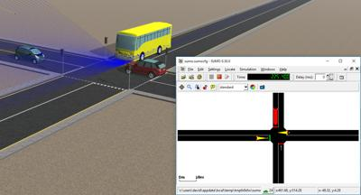

## SUMO Interface Example

%figure "The SUMO interface example world"

%end

This world simply represents a 4 roads intersection regulated by some traffic lights.
The goal of this world is to show the interface with SUMO.
At the beginning of the simulation, SUMO is started in graphic mode and will simulate some vehicles on the `horizontal` road.
When a priority vehicle arrives from the `vertical` road, it will be detected from the lane sensor and the states of the traffic lights will change.

One of the vehicles moved by SUMO has a [Lidar](../reference/lidar.md) sensor on the front and displays the measured point cloud.
This vehicle showcases the possibility of collecting sensor data for vehicles controlled by SUMO.

> **Note**: SUMO should be installed on the system and the `SUMO_HOME` environment variable should be defined and point to the SUMO installation path.
