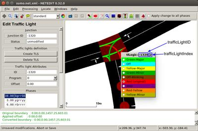

## SUMO Interface

An interface with a microscopic traffic simulator called `SUMO` (Simulation of Urban MObility) has been developed using a [Supervisor](../reference/supervisor.md) node.
The advantage of interfacing SUMO with Webots is that it allows to easily generate traffic using a large number of vehicles in real-time.
This interface is written in Python in a [Supervisor](../reference/supervisor.md) controller and uses [TraCI](http://sumo.dlr.de/wiki/TraCI) to communicate with SUMO.

### Movie Presentation


### Dependencies

In order to use the SUMO Interface, you have to install the SUMO package on your system.
Please refer to the official [SUMO User Documentation](https://sumo.dlr.de/docs/Installing/index.html) for the complete installation instructions.

#### Debian or Ubuntu

```sh
sudo apt install sumo sumo-tools sumo-doc
```

`SUMO_HOME` environment variable will be automatically set during the installation, but it may be necessary to logout and login, or even reboot, after the installation to correctly run the SUMO Interface.

<br />

Note that if you installed Webots using the snap package, Webots will be unable to launch the SUMO because of the snap sand-boxing.
To work around this problem, the `SumoInterface.exterController` field should be set to TRUE and the controller should be launched as [extern controller](../guide/running-extern-robot-controllers.md) from outside Webots by running these commands:
```sh
export WEBOTS_HOME=/snap/webots/current/usr/share/webots
$WEBOTS_HOME/webots-controller $WEBOTS_HOME/projects/default/controllers/sumo_supervisor/sumo_supervisor.py
```

If you want to set some SUMO options you have to specify them at the end of the launcher line, for example:
```
$WEBOTS_HOME/webots-controller $WEBOTS_HOME/projects/default/controllers/sumo_supervisor/sumo_supervisor.py --use-netconvert --no-gui
```

#### macOS

Using [Homebrew](https://brew.sh), first install [XQuartz](https://www.xquartz.org) for the SUMO interface, that relies on X11, to work:
```sh
brew install --cask xquartz
```

It may be necessary to logout and login or even reboot to activate the XQuartz.
Then, install the lastest stable version of SUMO:
```sh
brew tap dlr-ts/sumo
brew install sumo
```

Finally, setup the `SUMO_HOME` environment variable to point to the directory of your SUMO installation by adding the following line at the end of the `~/.bashrc` file:
```sh
export SUMO_HOME=/your/path/to/sumo
```

The default installation directory is `/opt/homebrew/opt/sumo/share/sumo`.

#### Windows

Download and run the latest installer from the [SUMO documentation](https://sumo.dlr.de/docs/Installing/index.html#windows).

### How to Include the Interface

In order to use this interface, a `SumoInterface` PROTO node should to be added to the world.
And a folder called `worldName_net` should be present at the same level as the world file.
This folder should contain the usual files defining a network in SUMO (.edg.xml, .nod.xml, .rou.xml, etc.) and the configuration files (.netccfg and .sumocfg), for more information please refer to the [SUMO documentation](http://sumo.dlr.de/wiki/Networks/SUMO_Road_Networks).
The configuration files called `sumo.netccfg` and `sumo.sumocfg` will be loaded by default.
If those configuration files do not exist, the interface will look for a configuration file with any other name (it is not recommended to have several configuration files for SUMO or NETCONVERT in the same folder as you don't know which one is going to be used).

> **Note**: SUMO should be installed on the system and the `SUMO_HOME` environment variable should be defined and point to the SUMO installation path.

The interface will automatically start SUMO and run it in synchronization with Webots time.
Each time a new vehicle enters the SUMO simulation, it will be created in Webots too and its position and orientation will be continually updated.
The vehicle DEF name is set to `SUMO_VEHICLEX`, with `X` being the vehicle number (starting from 0).

### Use Vehicles Already Present in the World

If some vehicles whose DEF name is `SUMO_VEHICLEX` are already present in the world at the simulation start, then the interface will automatically use them before creating new vehicles, this can be useful to avoid real-time addition of vehicles (which can make the simulation speed drop for a very short time).
Furthermore, when a vehicle enters the SUMO network, if a vehicle whose DEF name is identical to the ID of the vehicle in SUMO is present in the simulation, this vehicle is then associated to the one in SUMO.

#### Collect Sensor Data

It is very convenient to use the vehicles controlled by SUMO to collect sensor data in realistic traffic conditions.
You simply need to add your vehicle in the simulation and set an appropriate DEF name as explained previously.
Then, you can add sensors in its sensor slots and assign a controller to the vehicle.
The controller can in turn enable the sensors and record the output of the sensors in a file (or send them to an external process).
The [SUMO Interface](sumo-interface-example.md) example simulation showcases this possibility in a very simple manner.

### Automatic Injection of Webots Vehicles in SUMO

If some vehicles whose DEF name is `WEBOTS_VEHICLEX` (with `X` being the vehicle number starting from 0) are present in the simulation, the interface will automatically add them and update their position and orientation in SUMO in order to close the loop.

### Vehicle Type

If the SUMO abstract vehicle class (vClass vehicle attribute, refer to SUMO documentation for more information about this attribute) of the vehicle is `passenger` (default), one of the available car PROTO models will be randomly selected and created in Webots.
If the abstract vehicle class of the vehicle is `bus` Webots will use the `Bus` PROTO.
Similarly, the class `motorbike` will randomly select between the `Motorbike` and the `Scooter` PROTO.
Finally, the classes `trailer` and `truck` will select the `Truck` PROTO, respectively with and without a trailer.

### Traffic Lights Synchronization

If the simulation contains traffic lights, the name of the corresponding `LEDs` node of these traffic lights in Webots should respect the following syntax: `trafficLightID_trafficLightIndex_r/y/g`.
If the `LEDs` names are respected, the state of the traffic light will be automatically updated in Webots from SUMO by the interface.

A simple way to get the traffic light Ids and indexes is to open the network file in [Netedit](http://sumo.dlr.de/wiki/NETEDIT#Traffic_Lights_2).
In the traffic lights mode you can simply select a traffic light and right click on one of the connections to get all the required information.

%figure "Netedit in traffic lights mode. Here the 'trafficLightID' is equal to '-1320' and the trafficLightIndex is equal to '2'"

%end

### The SumoInterface PROTO

Here are the parameters of the `SumoInterface` PROTO (which inherits from the [Supervisor](../reference/supervisor.md) node):

```
PROTO SumoInterface [
  field SFString  name                  "sumo interface"
  field SFBool    gui                   TRUE
  field SFBool    useNetconvert         FALSE
  field SFBool    enableTrafficLights   TRUE
  field SFBool    enableWheelsRotation  FALSE
  field SFInt32   maxVehicles           100
  field SFInt32   radius               -1
  field SFFloat   maximumLateralSpeed   2.5
  field SFFloat   maximumAngularSpeed   3
  field SFFloat   laneChangeDelay       3
  field SFBool    enableHeight          FALSE
  field SFInt32   step                  200
  field SFInt32   port                  8873
  field SFInt32   seed                  1
  field SFString  networkFiles          ""
  field SFString  sumoArguments         ""
  field SFNode    display               NULL
  field SFBool    verbose               FALSE
  field SFBool    synchronization       TRUE
  field MFNode    children              []
]
```

#### SumoInterface Fields Summary

- `gui`: Defines if the command-line or GUI version of SUMO should be used.
- `useNetconvert`: Defines if NETCONVERT should be called before launching SUMO, this should be disabled if a `*.net` is already provided.
- `enableTrafficLights`: Defines if the traffic lights synchronization should be used or not.
- `enableWheelsRotation`: Defines if the wheels of the vehicles should rotate or not (wheels rotation has an impact on the simulation speed but makes the simulation look more realistic).
- `maxVehicles`: Defines the maximum number of vehicles added in Webots from SUMO.
- `radius`: Defines the visibility radius of the vehicles in meters (if the distance between the viewpoint and a vehicle is greater than this radius, the vehicle will not be added in Webots).
A negative value means that all the vehicles are added.
- `maximumLateralSpeed`: Defines the maximal lateral speed of any vehicle in meter per second.
- `maximumAngularSpeed`: Defines the maximal angular speed of any vehicle in radian per second.
- `laneChangeDelay`: Defines the time spent to change lane (during this period, the position of the vehicle in Webots and SUMO may not be synchronized anymore).
- `enableHeight`: Defines whether height information should be extracted from the edge name (experimental).
- `step`: Defines the time step of SUMO in milliseconds (should be bigger or equal to the world time step).
- `port`: Defines which port SUMO and Webots should use to communicate.
- `seed`: Defines the seed of the SUMO random number generator.
Use `0` for a random time-based seed (equivalent to the `--random` option of SUMO, for more information please refer to the [SUMO documentation](http://sumo.dlr.de/wiki/Simulation/Randomness)).
- `networkFiles`: Defines the directory where the SUMO network files are stored.
If this field is empty, the files should be stored in a directory called `worldName_net` located in the same directory as the world file.
- `sumoArguments`: Defines additional arguments passed to SUMO when started.
- `display`: Can optionally contain a `SumoDisplay` node.
- `verbose`: Defines if SUMO output should be printed in the Webots console.
- `synchronization`: Defines if the interface controller is synchronized with Webots or not.
- `children`: Can be used to insert other nodes, in particular the traffic lights should be added in this field.

### The SumoDisplay PROTO

It is sometimes useful to see the GUI view of SUMO inside Webots (e.g. to emulate a GPS view).
This can easily be achieved by adding a `SumoInterface` node in the `display` field of the `SumoInterface` PROTO and using SUMO in GUI mode.

```
PROTO SumoDisplay [
  field SFInt32 width       256
  field SFInt32 height      256
  field SFFloat zoom        1.0
  field SFInt32 refreshRate 1000
  field SFBool  fitSize     FALSE
]
```

#### SumoDisplay Fields Summary

- `width`: Defines the width of the [Display](../reference/display.md).
- `height`: Defines the height of the [Display](../reference/display.md).
- `zoom`: Defines the zooming factor that will make SUMO automatically zoom in/out at startup.
- `refreshRate`: Defines the refresh rate of the display in milliseconds.
- `fitSize`: If the current size of the SUMO window is bigger than the resolution defined by the `width` and `height` fields, only the center of the view will be visible in the [Display](../reference/display.md).
On the contrary, if the SUMO window is smaller than the resolution, the image will not entirely fill it.
If `fitSize` is set to `TRUE`, the image will be automatically rescaled, in that case the width / height aspect ratio may not be respected depending on the SUMO window size.

### Plugin Mechanism

In addition to the PROTO parameters, the plugin mechanism can be used to extend the interface.
The plugin should be written in python, be in the same folder as the SUMO network files, and should implement the `SumoSupervisorPlugin` class with the two following entry-point functions:

```python
class SumoSupervisorPlugin:
  def __init__(self, supervisor, traci, net):
    # TODO

  def run(self, ms):
    # TODO
```

The first function is called at initialization of the interface, the arguments are: the [Supervisor](../reference/supervisor.md) itself, the traci class in order to get information regarding the traci context and the net class to get information regarding the network.
The second one is called at each SUMO step and the argument is the time step.

Such a plugin can be used for example to change traffic light state in SUMO.
