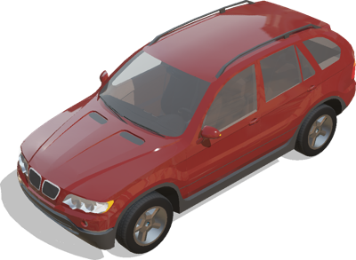
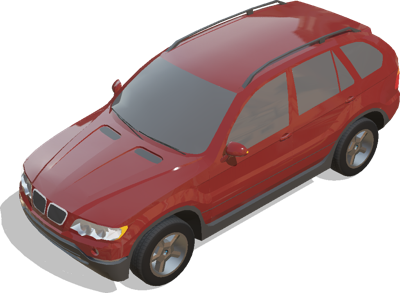
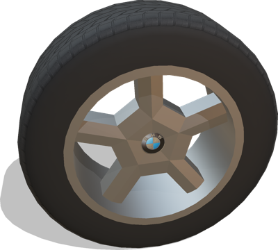

# Bmw

## BmwX5

Model of an BMW X5 car using the [Car](car.md) PROTO as a base.
The vehicle is modelled with realistic physics properties: motor torques, body mass, friction forces, suspensions, etc.
This model was sponsored by the CTI project RO2IVSim ([http://transport.epfl.ch/simulator-for-mobile-robots-and-intelligent-vehicles](http://transport.epfl.ch/simulator-for-mobile-robots-and-intelligent-vehicles)).
For the last 6 fields to have any effect, the 'interior' has to be enabled.

%figure



%end

Derived from [Robot](../reference/robot.md).

```
BmwX5 {
  SFVec3f     translation              0 0 0.4
  SFRotation  rotation                 0 0 1 0
  SFColor     color                    0.43 0.11 0.1
  SFString    engineSound              "sounds/engine.wav"
  SFString    name                     "vehicle"
  SFString    controller               "<generic>"
  MFString    controllerArgs           []
  SFBool      supervisor               FALSE
  SFBool      synchronization          TRUE
  SFBool      windshieldWipers         TRUE
  SFBool      frontSpotLights          FALSE
  SFBool      rearMirror               FALSE
  SFBool      leftWingMirror           FALSE
  SFBool      rightWingMirror          FALSE
  SFFloat     mirrorFar                200.0
  MFNode      sensorsSlotFront         []
  MFNode      sensorsSlotRear          []
  MFNode      sensorsSlotTop           []
  MFNode      sensorsSlotCenter        []
  SFBool      interior                 TRUE
  SFBool      dynamicSpeedDisplay      TRUE
  SFBool      indicatorLevers          TRUE
  SFNode      steeringWheel            CarSteeringWheel {}
  SFBool      completeInterior         TRUE
  SFBool      shifter                  TRUE
  SFFloat     outerWindowTransparency  0.4
  SFFloat     innerWindowTransparency  0.7
  SFBool      innerWindowDust          FALSE
  SFString    window                   "automobile"
}
```

> **File location**: "[WEBOTS\_HOME/projects/vehicles/protos/bmw/BmwX5.proto]({{ url.github_tree }}/projects/vehicles/protos/bmw/BmwX5.proto)"

> **License**: Copyright Cyberbotics Ltd. Licensed for use only with Webots.
[More information.](https://cyberbotics.com/webots_assets_license)

### BmwX5 Field Summary

- `color`: Defines the car body color.

- `windshieldWipers`: Defines whether the car should have windshiel wipers.

- `frontSpotLights`: Defines whether the car should have front spot lights.

- `rearMirror`: Defines whether the car should have a rear mirror.

- `leftWingMirror`: Defines whether the car should have a left wing mirror.

- `rightWingMirror`: Defines whether the car should have a right wing mirror.

- `mirrorFar`: Defines the far clipping plane for the rear, left and right mirrors.

- `sensorsSlotFront`: Extends the robot with new nodes on the front of the car.

- `sensorsSlotRear`: Extends the robot with new nodes on the back of the car.

- `sensorsSlotTop`: Extends the robot with new nodes on the roof of the car.

- `sensorsSlotCenter`: Extends the robot with new nodes at the center of the car.

- `interior`: Defines whether the car should have the interior walls and the dashboard.

- `dynamicSpeedDisplay`: Defines whether the current speed can be displaed in the dashboard.

- `indicatorLevers`: Defines whether the car has indicator levers.

- `steeringWheel`: Defines the car steering wheel.

- `completeInterior`: Defines whether the interior of the car should have seats, armrests, and handbrake.

- `shifter`: Defines whether the interior of the car should have the gear shifter.

- `outerWindowTransparency`: Defines the transparency level of the windows seen from outside.

- `innerWindowTransparency`: Defines the transparency level of the windows seen from inside.

- `innerWindowDust`: Defines whether there is dust on windows seen from inside.

## BmwX5Simple

Simple kinematic model of the BMW X5 to be moved with a Supervisor.
This model was sponsored by the CTI project RO2IVSim ([http://transport.epfl.ch/simulator-for-mobile-robots-and-intelligent-vehicles](http://transport.epfl.ch/simulator-for-mobile-robots-and-intelligent-vehicles)).

%figure



%end

Derived from [Robot](../reference/robot.md).

```
BmwX5Simple {
        SFVec3f    translation         0 0 0.4
        SFRotation rotation            0 0 1 0
        SFColor    color               0.43 0.11 0.1
        MFColor    recognitionColors   [ 0.43 0.11 0.1 ]
        SFString   name                "vehicle"
        SFString   controller          "<none>"
        MFString   controllerArgs      [ ]
        SFString   window              "<none>"
        MFNode     sensorsSlotFront    [ ]
        MFNode     sensorsSlotRear     [ ]
        MFNode     sensorsSlotTop      [ ]
        MFNode     sensorsSlotCenter   [ ]
        SFBool     wheelBoundingObject FALSE
}
```

> **File location**: "[WEBOTS\_HOME/projects/vehicles/protos/bmw/BmwX5Simple.proto]({{ url.github_tree }}/projects/vehicles/protos/bmw/BmwX5Simple.proto)"

> **License**: Copyright Cyberbotics Ltd. Licensed for use only with Webots.
[More information.](https://cyberbotics.com/webots_assets_license)

### BmwX5Simple Field Summary

- `color`: Defines the car body color.

- `sensorsSlotFront`: Extends the robot with new nodes on the front of the car.

- `sensorsSlotRear`: Extends the robot with new nodes on the back of the car.

- `sensorsSlotTop`: Extends the robot with new nodes on the roof of the car.

- `sensorsSlotCenter`: Extends the robot with new nodes at the center of the car.

- `wheelBoundingObject`: Defines whether the wheels should have a bounding object.

## BmwX5Wheel

Model of the BMW X5 wheels using the generic [VehicleWheel](vehiclewheel.md) PROTO including physic properties and baseColorMaps.
This model was sponsored by the CTI project RO2IVSim ([http://transport.epfl.ch/simulator-for-mobile-robots-and-intelligent-vehicles](http://transport.epfl.ch/simulator-for-mobile-robots-and-intelligent-vehicles)).

%figure



%end

Derived from [Slot](../reference/slot.md).

```
BmwX5Wheel {
  SFString name           "BMW X5 wheel"
  SFNode   physics        NULL
  SFBool   boundingObject TRUE
  SFBool   wheelSide      FALSE
}
```

> **File location**: "[WEBOTS\_HOME/projects/vehicles/protos/bmw/BmwX5Wheel.proto]({{ url.github_tree }}/projects/vehicles/protos/bmw/BmwX5Wheel.proto)"

> **License**: Copyright Cyberbotics Ltd. Licensed for use only with Webots.
[More information.](https://cyberbotics.com/webots_assets_license)

