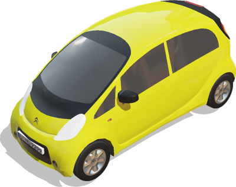
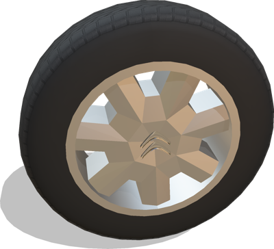
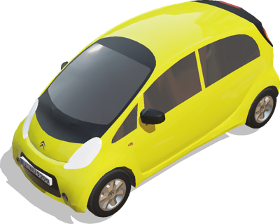

# Citroen

## CitroenCZero

Model of a Citroën C-Zero car using the [Car](car.md) PROTO as a base.
The vehicle is modeled with realistic physics properties: motor torques, body mass, friction forces, suspensions, etc.
The contactMaterial of the wheels is "CitroenCZeroWheels".
This model was sponsored by the CTI project RO2IVSim ([http://transport.epfl.ch/simulator-for-mobile-robots-and-intelligent-vehicles](http://transport.epfl.ch/simulator-for-mobile-robots-and-intelligent-vehicles)).
1.199 -0.007 0.272  I-Mev benchmark

%figure



%end

Derived from [Robot](../reference/robot.md).

```
CitroenCZero {
  SFVec3f    translation       0 0 0.4
  SFRotation rotation          0 0 1 0
  SFColor    color             0.85 0.85 0.05
  MFString   plate             "../textures/plate.jpg"
  SFString   engineSound       ""
  SFString   name              "vehicle"
  SFString   controller        "<generic>"
  MFString   controllerArgs    []
  SFBool     supervisor        FALSE
  SFBool     synchronization   TRUE
  MFNode     sensorsSlotFront  []
  MFNode     sensorsSlotRear   []
  MFNode     sensorsSlotTop    []
  MFNode     sensorsSlotCenter []
  SFBool     frontSpotLights   FALSE
  SFString   window            "automobile"
}
```

> **File location**: "[WEBOTS\_HOME/projects/vehicles/protos/citroen/CitroenCZero.proto]({{ url.github_tree }}/projects/vehicles/protos/citroen/CitroenCZero.proto)"

> **License**: Copyright Cyberbotics Ltd. Licensed for use only with Webots.
[More information.](https://cyberbotics.com/webots_assets_license)

### CitroenCZero Field Summary

- `color`: Defines the car body color.

- `plate`: Defines the plate texture.

- `sensorsSlotFront`: Extends the robot with new nodes on the front of the car.

- `sensorsSlotRear`: Extends the robot with new nodes on the back of the car.

- `sensorsSlotTop`: Extends the robot with new nodes on the roof of the car.

- `sensorsSlotCenter`: Extends the robot with new nodes at the center of the car.

- `frontSpotLights`: Defines whether the car should have front spot lights.

## CitroenCZeroFrontWheel

Model of the Citroën C-Zero front wheels using the generic [VehicleWheel](vehiclewheel.md) PROTO including physic properties and textures.
The contactMaterial is "CitroenCZeroWheels".
Size: 145/65/R15.
This model was sponsored by the CTI project RO2IVSim ([http://transport.epfl.ch/simulator-for-mobile-robots-and-intelligent-vehicles](http://transport.epfl.ch/simulator-for-mobile-robots-and-intelligent-vehicles)).

%figure



%end

Derived from [Slot](../reference/slot.md).

```
CitroenCZeroFrontWheel {
  SFString name           "Citroen C-Zero front wheel"
  SFNode   physics        NULL
  SFBool   boundingObject TRUE
  SFBool   wheelSide      FALSE
}
```

> **File location**: "[WEBOTS\_HOME/projects/vehicles/protos/citroen/CitroenCZeroFrontWheel.proto]({{ url.github_tree }}/projects/vehicles/protos/citroen/CitroenCZeroFrontWheel.proto)"

> **License**: Copyright Cyberbotics Ltd. Licensed for use only with Webots.
[More information.](https://cyberbotics.com/webots_assets_license)

## CitroenCZeroRearWheel

Model of the Citroën C-Zero rear wheels using the generic [VehicleWheel](vehiclewheel.md) PROTO including physic properties and textures.
The contactMaterial is "CitroenCZeroWheels".
Size: 175/55/R15.
This model was sponsored by the CTI project RO2IVSim ([http://transport.epfl.ch/simulator-for-mobile-robots-and-intelligent-vehicles](http://transport.epfl.ch/simulator-for-mobile-robots-and-intelligent-vehicles)).

%figure


%end

Derived from [Slot](../reference/slot.md).

```
CitroenCZeroRearWheel {
  SFString name           "Citroen C-Zero rear wheel"
  SFNode   physics        NULL
  SFBool   boundingObject TRUE
  SFBool   wheelSide      FALSE
}
```

> **File location**: "[WEBOTS\_HOME/projects/vehicles/protos/citroen/CitroenCZeroRearWheel.proto]({{ url.github_tree }}/projects/vehicles/protos/citroen/CitroenCZeroRearWheel.proto)"

> **License**: Copyright Cyberbotics Ltd. Licensed for use only with Webots.
[More information.](https://cyberbotics.com/webots_assets_license)

## CitroenCZeroSimple

Simple kinematic model of the Citroën C-Zero to be moved with a Supervisor.
This model was sponsored by the CTI project RO2IVSim ([http://transport.epfl.ch/simulator-for-mobile-robots-and-intelligent-vehicles](http://transport.epfl.ch/simulator-for-mobile-robots-and-intelligent-vehicles)).

%figure



%end

Derived from [Robot](../reference/robot.md).

```
CitroenCZeroSimple {
  SFVec3f    translation         0 0 0.4
  SFRotation rotation            0 0 1 0
  SFColor    color               0.85 0.85 0.05
  MFColor    recognitionColors   [ 0.85 0.85 0.05 ]
  MFString   plate               "../textures/plate.jpg"
  SFString   name                "vehicle"
  SFString   controller          "<none>"
  MFString   controllerArgs      [ ]
  SFString   window              "<none>"
  MFNode     sensorsSlotFront    [ ]
  MFNode     sensorsSlotRear     [ ]
  MFNode     sensorsSlotTop      [ ]
  MFNode     sensorsSlotCenter   [ ]
  SFBool     wheelBoundingObject FALSE
}
```

> **File location**: "[WEBOTS\_HOME/projects/vehicles/protos/citroen/CitroenCZeroSimple.proto]({{ url.github_tree }}/projects/vehicles/protos/citroen/CitroenCZeroSimple.proto)"

> **License**: Copyright Cyberbotics Ltd. Licensed for use only with Webots.
[More information.](https://cyberbotics.com/webots_assets_license)

### CitroenCZeroSimple Field Summary

- `color`: Defines the car body color.

- `plate`: Defines the plate texture.

- `sensorsSlotFront`: Extends the robot with new nodes on the front of the car.

- `sensorsSlotRear`: Extends the robot with new nodes on the back of the car.

- `sensorsSlotTop`: Extends the robot with new nodes on the roof of the car.

- `sensorsSlotCenter`: Extends the robot with new nodes at the center of the car.

- `wheelBoundingObject`: Defines whether the wheels should have a bounding object.

