# Generic

## Bus

A simple bus.
This model was sponsored by the CTI project RO2IVSim ([http://transport.epfl.ch/simulator-for-mobile-robots-and-intelligent-vehicles](http://transport.epfl.ch/simulator-for-mobile-robots-and-intelligent-vehicles)).

%figure

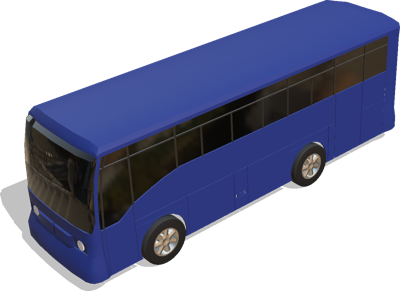

%end

Derived from [Robot](../reference/robot.md).

```
Bus {
  SFVec3f    translation       0 0 0.55
  SFRotation rotation          0 0 1 0
  SFColor    color             0.03 0.12 0.42
  SFString   name              "vehicle"
  SFString   controller        "<generic>"
  MFString   controllerArgs    [ ]
  SFBool     supervisor        FALSE
  SFBool     synchronization   TRUE
  MFNode     sensorsSlotFront  [ ]
  MFNode     sensorsSlotRear   [ ]
  MFNode     sensorsSlotTop    [ ]
  MFNode     sensorsSlotCenter [ ]
  SFString   window            "automobile"
}
```

> **File location**: "[WEBOTS\_HOME/projects/vehicles/protos/generic/Bus.proto]({{ url.github_tree }}/projects/vehicles/protos/generic/Bus.proto)"

> **License**: Copyright Cyberbotics Ltd. Licensed for use only with Webots.
[More information.](https://cyberbotics.com/webots_assets_license)

### Bus Field Summary

- `color`: Defines the bus body color.

- `sensorsSlotFront`: Extends the robot with new nodes on the front of the vehicle.

- `sensorsSlotRear`: Extends the robot with new nodes on the back of the vehicle.

- `sensorsSlotTop`: Extends the robot with new nodes on the roof of the vehicle.

- `sensorsSlotCenter`: Extends the robot with new nodes at the center of the vehicle.

## BusSimple

Simple kinematic model of bus to be moved with a Supervisor.
This model was sponsored by the CTI project RO2IVSim ([http://transport.epfl.ch/simulator-for-mobile-robots-and-intelligent-vehicles](http://transport.epfl.ch/simulator-for-mobile-robots-and-intelligent-vehicles)).

%figure

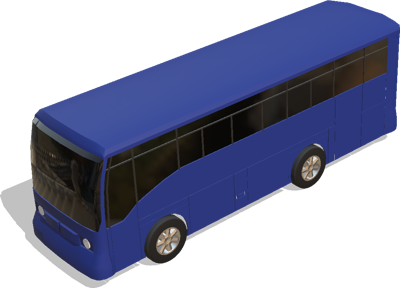

%end

Derived from [Robot](../reference/robot.md).

```
BusSimple {
  SFVec3f    translation         0 0 0.55
  SFRotation rotation            0 0 1 0
  SFColor    color               0.03 0.12 0.42
  MFColor    recognitionColors   [  0.03 0.12 0.42 ]
  SFString   name                "vehicle"
  SFString   controller          "<none>"
  MFString   controllerArgs      [ ]
  SFString   window              "<none>"
  MFNode     sensorsSlotFront    [ ]
  MFNode     sensorsSlotRear     [ ]
  MFNode     sensorsSlotTop      [ ]
  MFNode     sensorsSlotCenter   [ ]
  SFBool     wheelBoundingObject FALSE
}
```

> **File location**: "[WEBOTS\_HOME/projects/vehicles/protos/generic/BusSimple.proto]({{ url.github_tree }}/projects/vehicles/protos/generic/BusSimple.proto)"

> **License**: Copyright Cyberbotics Ltd. Licensed for use only with Webots.
[More information.](https://cyberbotics.com/webots_assets_license)

### BusSimple Field Summary

- `color`: Defines the car body color.

- `sensorsSlotFront`: Extends the robot with new nodes on the front of the vehicle.

- `sensorsSlotRear`: Extends the robot with new nodes on the back of the vehicle.

- `sensorsSlotTop`: Extends the robot with new nodes on the roof of the vehicle.

- `sensorsSlotCenter`: Extends the robot with new nodes at the center of the vehicle.

- `wheelBoundingObject`: Defines whether the wheels should have a bounding object.

## BusWheel

Model of a bus wheel using the generic [VehicleWheel](vehiclewheel.md) PROTO including physic properties and textures.
This model was sponsored by the CTI project RO2IVSim ([http://transport.epfl.ch/simulator-for-mobile-robots-and-intelligent-vehicles](http://transport.epfl.ch/simulator-for-mobile-robots-and-intelligent-vehicles)).

%figure

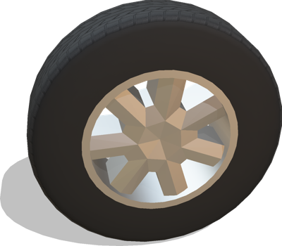

%end

Derived from [Slot](../reference/slot.md).

```
BusWheel {
  SFString name           "bus wheel"
  SFNode   physics        NULL
  SFBool   boundingObject TRUE
  SFBool   wheelSide      FALSE
}
```

> **File location**: "[WEBOTS\_HOME/projects/vehicles/protos/generic/BusWheel.proto]({{ url.github_tree }}/projects/vehicles/protos/generic/BusWheel.proto)"

> **License**: Copyright Cyberbotics Ltd. Licensed for use only with Webots.
[More information.](https://cyberbotics.com/webots_assets_license)

## MotorbikeDriver

The Motorbike driver is based on the pedestrian PROTO.

%figure

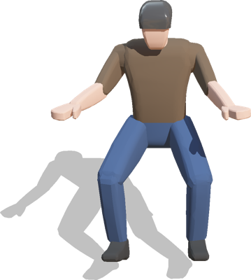

%end

Derived from [Slot](../reference/slot.md).

```
MotorbikeDriver {
  SFColor  shirtColor     0.404 0.329 0.255
  SFColor  pantsColor     0.215 0.310 0.478
  SFColor  skinColor      0.996 0.765 0.674
  SFColor  helmetColor    0.267 0.267 0.267
}
```

> **File location**: "[WEBOTS\_HOME/projects/vehicles/protos/generic/MotorbikeDriver.proto]({{ url.github_tree }}/projects/vehicles/protos/generic/MotorbikeDriver.proto)"

> **License**: Copyright Cyberbotics Ltd. Licensed for use only with Webots.
[More information.](https://cyberbotics.com/webots_assets_license)

### MotorbikeDriver Field Summary

- `shirtColor`: Defines the shirt color of the driver.

- `pantsColor`: Defines the pants color of the driver.

- `skinColor`: Defines the skin color of the driver.

- `helmetColor`: Defines the helmet color of the driver.

## MotorbikeSimple

Simple non-controllable model of a generic motorbike without physics properties.

%figure

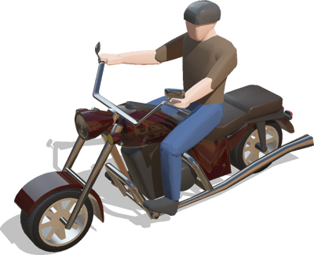

%end

Derived from [Solid](../reference/solid.md).

```
MotorbikeSimple {
  SFVec3f    translation                0 0 0.25
  SFRotation rotation                   0 0 1 0
  SFColor    primaryColor               0.153 0.004 0.004
  SFColor    secondaryColor             0.647 0.647 0.647
  MFColor    recognitionColors          [0.153 0.004 0.004, 0.647 0.647 0.647]
  SFNode     driver                     MotorbikeDriver { }
  SFString   name                       "vehicle"
  SFBool     wheelBoundingObject        FALSE
}
```

> **File location**: "[WEBOTS\_HOME/projects/vehicles/protos/generic/MotorbikeSimple.proto]({{ url.github_tree }}/projects/vehicles/protos/generic/MotorbikeSimple.proto)"

> **License**: Copyright Cyberbotics Ltd. Licensed for use only with Webots.
[More information.](https://cyberbotics.com/webots_assets_license)

### MotorbikeSimple Field Summary

- `primaryColor`: Defines the primary color of the motorbike.

- `secondaryColor`: Defines the secondary color of the motorbike.

- `driver`: Defines a `Slot` node for the motorbike driver.

- `wheelBoundingObject`: Defines whether the wheels should have a bounding object.

## MotorbikeWheel

Model of a motorbike wheel using the generic [VehicleWheel](vehiclewheel.md) PROTO.

%figure

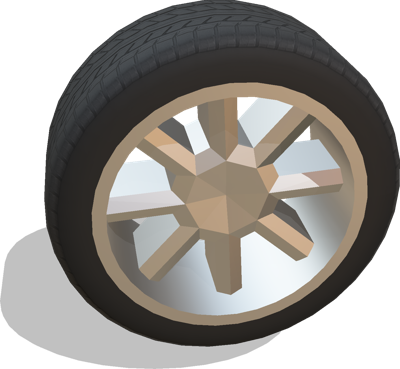

%end

Derived from [Slot](../reference/slot.md).

```
MotorbikeWheel {
  SFString name           "motorbike wheel"
  SFNode   physics        NULL
  SFBool   boundingObject TRUE
}
```

> **File location**: "[WEBOTS\_HOME/projects/vehicles/protos/generic/MotorbikeWheel.proto]({{ url.github_tree }}/projects/vehicles/protos/generic/MotorbikeWheel.proto)"

> **License**: Copyright Cyberbotics Ltd. Licensed for use only with Webots.
[More information.](https://cyberbotics.com/webots_assets_license)

## ScooterDriver

The Scooter driver is based on the pedestrian PROTO.

%figure

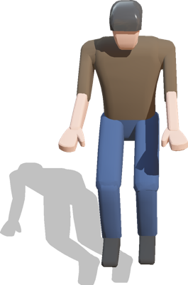

%end

Derived from [Slot](../reference/slot.md).

```
ScooterDriver {
  SFColor  shirtColor     0.40 0.33 0.25
  SFColor  pantsColor     0.22 0.31 0.48
  SFColor  skinColor      0.99 0.76 0.67
  SFColor  helmetColor    0.27 0.27 0.27
}
```

> **File location**: "[WEBOTS\_HOME/projects/vehicles/protos/generic/ScooterDriver.proto]({{ url.github_tree }}/projects/vehicles/protos/generic/ScooterDriver.proto)"

> **License**: Copyright Cyberbotics Ltd. Licensed for use only with Webots.
[More information.](https://cyberbotics.com/webots_assets_license)

### ScooterDriver Field Summary

- `shirtColor`: Defines the shirt color of the driver.

- `pantsColor`: Defines the pants color of the driver.

- `skinColor`: Defines the skin color of the driver.

- `helmetColor`: Defines the helmet color of the driver.

## ScooterSimple

Simple non-controllable model of a generic scooter without physics properties.

%figure

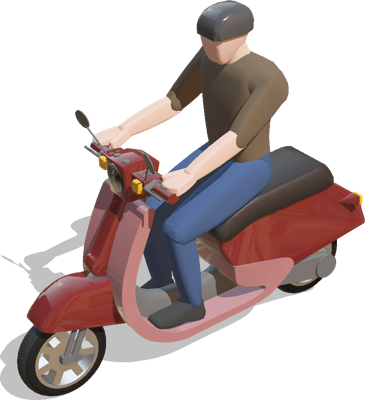

%end

Derived from [Solid](../reference/solid.md).

```
ScooterSimple {
  SFVec3f    translation                0 0 0.23
  SFRotation rotation                   0 0 1 0
  SFColor    primaryColor               0.43 0.11 0.1
  SFColor    secondaryColor             0.69 0.43 0.43
  MFColor    recognitionColors          [ 0.43 0.11 0.1, 0.69 0.43 0.43 ]
  SFNode     driver                     ScooterDriver { }
  SFString   name                       "vehicle"
  SFBool     wheelBoundingObject        FALSE
}
```

> **File location**: "[WEBOTS\_HOME/projects/vehicles/protos/generic/ScooterSimple.proto]({{ url.github_tree }}/projects/vehicles/protos/generic/ScooterSimple.proto)"

> **License**: Copyright Cyberbotics Ltd. Licensed for use only with Webots.
[More information.](https://cyberbotics.com/webots_assets_license)

### ScooterSimple Field Summary

- `primaryColor`: Defines the primary color of the scooter.

- `secondaryColor`: Defines the secondary color of the scooter.

- `driver`: Defines a `Slot` node for the scooter driver.

- `wheelBoundingObject`: Defines whether the wheels should have a bounding object.

## ScooterWheel

Model of a scooter wheel using the generic [VehicleWheel](vehiclewheel.md) PROTO.

%figure

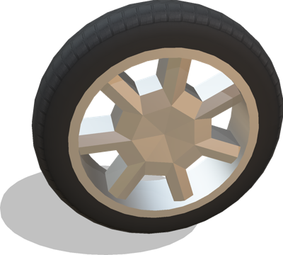

%end

Derived from [Slot](../reference/slot.md).

```
ScooterWheel {
  SFString name           "scooter wheel"
  SFNode   physics        NULL
  SFBool   boundingObject TRUE
}
```

> **File location**: "[WEBOTS\_HOME/projects/vehicles/protos/generic/ScooterWheel.proto]({{ url.github_tree }}/projects/vehicles/protos/generic/ScooterWheel.proto)"

> **License**: Copyright Cyberbotics Ltd. Licensed for use only with Webots.
[More information.](https://cyberbotics.com/webots_assets_license)

## Tractor

A simple tractor.

%figure

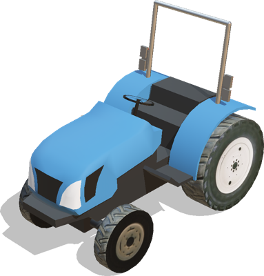

%end

Derived from [Robot](../reference/robot.md).

```
Tractor {
  SFVec3f    translation       0 0 0.6
  SFRotation rotation          0 1 0 0.13
  SFColor    color             0.24 0.53 0.79
  SFString   name              "vehicle"
  SFString   controller        "<generic>"
  MFString   controllerArgs    [ ]
  SFBool     supervisor        FALSE
  SFBool     synchronization   TRUE
  MFNode     sensorSlot        [ ]
  SFString   window            "automobile"
  MFColor    recognitionColors []
}
```

> **File location**: "[WEBOTS\_HOME/projects/vehicles/protos/generic/Tractor.proto]({{ url.github_tree }}/projects/vehicles/protos/generic/Tractor.proto)"

> **License**: Copyright Cyberbotics Ltd. Licensed for use only with Webots.
[More information.](https://cyberbotics.com/webots_assets_license)

### Tractor Field Summary

- `color`: Defines the tractor body color.

- `sensorSlot`: Extends the robot with new nodes at the center of the vehicle.

## TractorFrontWheel

Tractor front wheel.

%figure

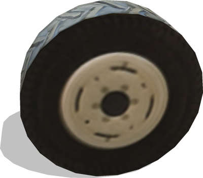

%end

Derived from [Slot](../reference/slot.md).

```
TractorFrontWheel {
  SFString name           "tractor front wheel"
  SFFloat  tireRadius     0.38
  SFFloat  width          0.19
  SFInt32  subdivision    24
  SFBool   wheelSide      FALSE
  SFNode   physics        Physics { density -1 mass 30 }
  SFBool   boundingObject TRUE
}
```

> **File location**: "[WEBOTS\_HOME/projects/vehicles/protos/generic/TractorFrontWheel.proto]({{ url.github_tree }}/projects/vehicles/protos/generic/TractorFrontWheel.proto)"

> **License**: Copyright Cyberbotics Ltd. Licensed for use only with Webots.
[More information.](https://cyberbotics.com/webots_assets_license)

### TractorFrontWheel Field Summary

- `name`: Identifies the wheel.

- `tireRadius`: Defines the outer radius of the wheel.

- `width`: Defines the thickness of the wheel.

- `subdivision`: Defines the number of subdivisions for the cylinder approximation.

- `wheelSide`: Defines whether the wheel is positioned on the right or on the left of the tractor.

- `physics`: Physics node of the wheel defining all the physical characteristics.

- `boundingObject`: Defines whether the wheel should have a bounding object.

## TractorRearWheel

Tractor rear wheel.

%figure

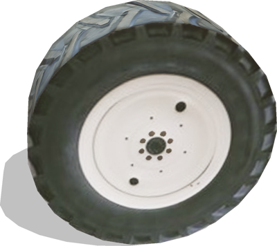

%end

Derived from [Slot](../reference/slot.md).

```
TractorRearWheel {
  SFString name           "tractor rear wheel"
  SFFloat  tireRadius     0.6
  SFFloat  width          0.37
  SFInt32  subdivision    24
  SFBool   wheelSide      FALSE
  SFNode   physics        Physics { density -1 mass 60 }
  SFBool   boundingObject TRUE
}
```

> **File location**: "[WEBOTS\_HOME/projects/vehicles/protos/generic/TractorRearWheel.proto]({{ url.github_tree }}/projects/vehicles/protos/generic/TractorRearWheel.proto)"

> **License**: Copyright Cyberbotics Ltd. Licensed for use only with Webots.
[More information.](https://cyberbotics.com/webots_assets_license)

### TractorRearWheel Field Summary

- `name`: Identifies the wheel.

- `tireRadius`: Defines the outer radius of the wheel.

- `width`: Defines the thickness of the wheel.

- `subdivision`: Defines the number of subdivisions for the cylinder approximation.

- `wheelSide`: Defines whether the wheel is positioned on the right or on the left of the tractor.

- `physics`: Physics node of the wheel defining all the physical characteristics.

- `boundingObject`: Defines whether the wheel should have a bounding object.

## Truck

A simple truck.

%figure

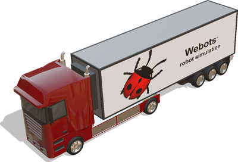

%end

Derived from [Robot](../reference/robot.md).

```
Truck {
  SFVec3f    translation       0 0 0.5
  SFRotation rotation          0 0 1 0
  SFColor    color             0.39 0 0
  SFNode     trailer           TruckTrailer { }
  SFFloat    wheelbase         5.25
  SFFloat    kingPinDistance   1.35
  SFFloat    mass              8000
  SFString   name              "vehicle"
  SFString   controller        "<generic>"
  MFString   controllerArgs    [ ]
  SFBool     supervisor        FALSE
  SFBool     synchronization   TRUE
  MFNode     sensorsSlotFront  [ ]
  MFNode     sensorsSlotRear   [ ]
  MFNode     sensorsSlotTop    [ ]
  MFNode     sensorsSlotCenter [ ]
  SFString   window            "automobile"
}
```

> **File location**: "[WEBOTS\_HOME/projects/vehicles/protos/generic/Truck.proto]({{ url.github_tree }}/projects/vehicles/protos/generic/Truck.proto)"

> **License**: Copyright Cyberbotics Ltd. Licensed for use only with Webots.
[More information.](https://cyberbotics.com/webots_assets_license)

### Truck Field Summary

- `color`: Defines the main color of the truck.

- `trailer`: Defines an optional trailer.

- `wheelbase`: Defines the distance between the front and rear wheels.

- `kingPinDistance`: Defines the distance (along the Z direction) between the rear wheel axis and the trailer rotation axis.

- `mass`: Defines the mass of the truck (trailer not included).

- `sensorsSlotFront`: Extends the truck with new nodes in the front slot.

- `sensorsSlotRear`: Extends the truck with new nodes in the rear slot.

- `sensorsSlotTop`: Extends the truck with new nodes in the top slot.

- `sensorsSlotCenter`: Extends the truck with new nodes in the center slot.

## TruckSimple

Simple kinematic model of truck to be moved with a Supervisor.

%figure


%end

Derived from [Robot](../reference/robot.md).

```
TruckSimple {
  SFVec3f    translation         0 0 0.5
  SFRotation rotation            0 0 1 0
  SFColor    color               0.39 0 0
  MFColor    recognitionColors   [ 0.39 0 0 ]
  SFNode     trailer             TruckTrailerSimple { }
  SFString   name                "vehicle"
  SFString   controller          "<none>"
  MFString   controllerArgs      [ ]
  SFString   window              "<none>"
  MFNode     sensorsSlotFront    [ ]
  MFNode     sensorsSlotRear     [ ]
  MFNode     sensorsSlotTop      [ ]
  MFNode     sensorsSlotCenter   [ ]
  SFBool     wheelBoundingObject FALSE
}
```

> **File location**: "[WEBOTS\_HOME/projects/vehicles/protos/generic/TruckSimple.proto]({{ url.github_tree }}/projects/vehicles/protos/generic/TruckSimple.proto)"

> **License**: Copyright Cyberbotics Ltd. Licensed for use only with Webots.
[More information.](https://cyberbotics.com/webots_assets_license)

### TruckSimple Field Summary

- `color`: Defines the main color of the truck.

- `recognitionColors`: Defines the main color of the truck.

- `trailer`: Defines an optional trailer.

- `sensorsSlotFront`: Extends the truck with new nodes in the front slot.

- `sensorsSlotRear`: Extends the truck with new nodes in the rear slot.

- `sensorsSlotTop`: Extends the truck with new nodes in the top slot.

- `sensorsSlotCenter`: Extends the truck with new nodes in the center slot.

## TruckTank

A non-controllable truck tank model with physics properties.

%figure

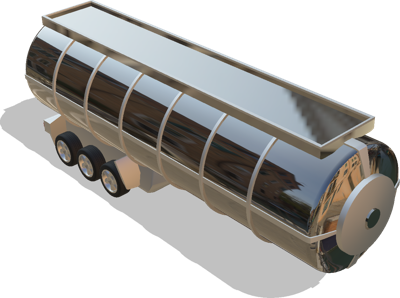

%end

Derived from [Slot](../reference/slot.md).

```
TruckTank {
  SFString name    "truck tank"
  SFColor  color   0.66 0.66 0.66
}
```

> **File location**: "[WEBOTS\_HOME/projects/vehicles/protos/generic/TruckTank.proto]({{ url.github_tree }}/projects/vehicles/protos/generic/TruckTank.proto)"

> **License**: Copyright Cyberbotics Ltd. Licensed for use only with Webots.
[More information.](https://cyberbotics.com/webots_assets_license)

### TruckTank Field Summary

- `name`: Identifies the truck tank.

- `color`: Defines the color of the truck tank.

## TruckTankSimple

A simple non-controllable truck tank model without physics properties.

%figure

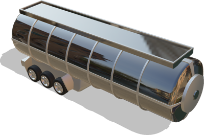

%end

Derived from [Slot](../reference/slot.md).

```
TruckTankSimple {
  SFString   name                 "truck tank"
  SFColor    color                0.66 0.66 0.66
  SFRotation rotation             0 0 1 0
  SFBool     wheelBoundingObject  FALSE
}
```

> **File location**: "[WEBOTS\_HOME/projects/vehicles/protos/generic/TruckTankSimple.proto]({{ url.github_tree }}/projects/vehicles/protos/generic/TruckTankSimple.proto)"

> **License**: Copyright Cyberbotics Ltd. Licensed for use only with Webots.
[More information.](https://cyberbotics.com/webots_assets_license)

### TruckTankSimple Field Summary

- `name`: Identifies the truck tank.

- `color`: Defines the color of the truck tank.

- `rotation`: Defines the rotation of the truck tank w.r.t the truck cabin. Only the rotation in Z should be used (Javascript is not used for efficiency reasons).

- `wheelBoundingObject`: Defines whether the wheels should have a bounding object.

## TruckTrailer

A non-controllable truck trailer model with physics properties.
The length and number of wheels is configurable.

%figure

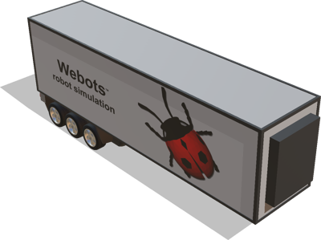

%end

Derived from [Slot](../reference/slot.md).

```
TruckTrailer {
  SFString  name             "truck trailer"
  SFFloat   length           11.15
  SFFloat   kingPinDistance  2.4
  SFFloat   mass             5000
  MFFloat   wheelAxles       [ 7.93, 9.03, 10.13 ]
  SFNode    appearance       PBRAppearance { metalness 0 roughness 0.4 baseColorMap ImageTexture { url [ "textures/truck_trailer_webots.jpg" ] } }
}
```

> **File location**: "[WEBOTS\_HOME/projects/vehicles/protos/generic/TruckTrailer.proto]({{ url.github_tree }}/projects/vehicles/protos/generic/TruckTrailer.proto)"

> **License**: Copyright Cyberbotics Ltd. Licensed for use only with Webots.
[More information.](https://cyberbotics.com/webots_assets_license)

### TruckTrailer Field Summary

- `name`: Identifies the trailer.

- `length`: Defines the total length of the trailer.

- `kingPinDistance`: Defines the distance (along the Z direction) between the front of the trailer and the rotation axis.

- `mass`: Defines the mass of the trailer (wheels not included).

- `wheelAxles`: Defines the number and position of the trailer wheels.

## TruckTrailerSimple

A simple non-controllable truck trailer model without physics properties.

%figure

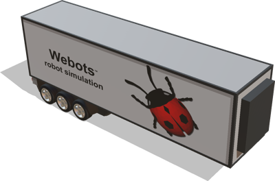

%end

Derived from [Slot](../reference/slot.md).

```
TruckTrailerSimple {
  SFString   name                 "truck trailer"
  SFNode     appearance           PBRAppearance { metalness 0 roughness 0.4 baseColorMap ImageTexture { url [ "textures/truck_trailer_webots.jpg" ] } }
  SFRotation rotation             0 0 1 0
  SFBool     wheelBoundingObject  FALSE
}
```

> **File location**: "[WEBOTS\_HOME/projects/vehicles/protos/generic/TruckTrailerSimple.proto]({{ url.github_tree }}/projects/vehicles/protos/generic/TruckTrailerSimple.proto)"

> **License**: Copyright Cyberbotics Ltd. Licensed for use only with Webots.
[More information.](https://cyberbotics.com/webots_assets_license)

### TruckTrailerSimple Field Summary

- `name`: Identifies the trailer.

- `appearance`: Defines the appearance of the trailer.

- `rotation`: Defines the rotation of the truck tank w.r.t the truck cabin. Only the rotation in Z should be used (Javascript is not used for efficiency reasons).

- `wheelBoundingObject`: Defines whether the wheels should have a bounding object.

## TruckWheel

Model of a truck wheel using the generic [VehicleWheel](vehiclewheel.md) PROTO.

%figure

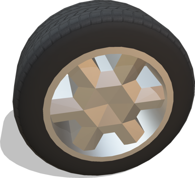

%end

Derived from [Slot](../reference/slot.md).

```
TruckWheel {
  SFString name           "truck wheel"
  SFNode   physics        NULL
  SFBool   boundingObject TRUE
  SFBool   wheelSide      FALSE    
}
```

> **File location**: "[WEBOTS\_HOME/projects/vehicles/protos/generic/TruckWheel.proto]({{ url.github_tree }}/projects/vehicles/protos/generic/TruckWheel.proto)"

> **License**: Copyright Cyberbotics Ltd. Licensed for use only with Webots.
[More information.](https://cyberbotics.com/webots_assets_license)

