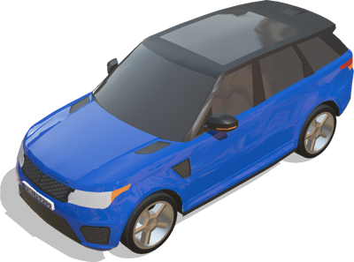
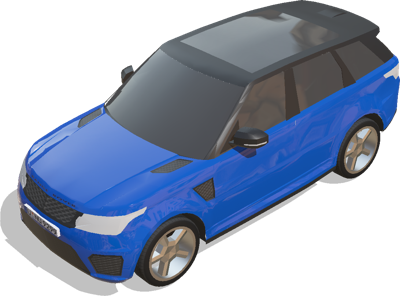

# Range Rover

## RangeRoverSportSVR

Model of a Range Rover Sport SVR 2015.

%figure



%end

Derived from [Robot](../reference/robot.md).

```
RangeRoverSportSVR {
  SFVec3f    translation       0 0 0.4
  SFRotation rotation          0 0 1 0
  SFColor    color             0.0 0.25 0.65
  SFColor    secondaryColor    0.1 0.1 0.1
  MFString   plate             "../textures/plate.jpg"
  SFString   engineSound       "sounds/engine.wav"
  SFString   name              "vehicle"
  SFString   controller        "<generic>"
  MFString   controllerArgs    []
  SFBool     supervisor        FALSE
  SFBool     synchronization   TRUE
  MFNode     sensorsSlotFront  []
  MFNode     sensorsSlotRear   []
  MFNode     sensorsSlotTop    []
  MFNode     sensorsSlotCenter []
  SFBool     frontSpotLights   FALSE
  SFString   window            "automobile"
}
```

> **File location**: "[WEBOTS\_HOME/projects/vehicles/protos/range\_rover/RangeRoverSportSVR.proto]({{ url.github_tree }}/projects/vehicles/protos/range_rover/RangeRoverSportSVR.proto)"

> **License**: Copyright Cyberbotics Ltd. Licensed for use only with Webots.
[More information.](https://cyberbotics.com/webots_assets_license)

### RangeRoverSportSVR Field Summary

- `color`: Defines the car primary body color.

- `secondaryColor`: Defines the car secondary body color.

- `plate`: Defines the plate texture.

- `sensorsSlotFront`: Extends the robot with new nodes on the front of the car.

- `sensorsSlotRear`: Extends the robot with new nodes on the back of the car.

- `sensorsSlotTop`: Extends the robot with new nodes on the roof of the car.

- `sensorsSlotCenter`: Extends the robot with new nodes at the center of the car.

- `frontSpotLights`: Defines whether the car should have front spot lights.

## RangeRoverSportSVRSimple

Simple kinematic model of the Range Rover Sport SVR 2015 to be moved with a Supervisor.

%figure



%end

Derived from [Robot](../reference/robot.md).

```
RangeRoverSportSVRSimple {
  SFVec3f    translation                    0 0 0.4
  SFRotation rotation                       0 0 1 0
  SFColor    color                          0.0 0.25 0.65
  SFColor    secondaryColor                 0.1 0.1 0.1
  MFColor    recognitionColors              [ 0.0 0.25 0.65, 0.1 0.1 0.1 ]
  MFString   plate                          "../textures/plate.jpg"
  SFString   name                           "vehicle"
  SFString   controller                     "<none>"
  MFString   controllerArgs                 [ ]
  SFString   window                         "<none>"
  MFNode     sensorsSlotFront               [ ]
  MFNode     sensorsSlotRear                [ ]
  MFNode     sensorsSlotTop                 [ ]
  MFNode     sensorsSlotCenter              [ ]
  SFBool     wheelBoundingObject            FALSE
}
```

> **File location**: "[WEBOTS\_HOME/projects/vehicles/protos/range\_rover/RangeRoverSportSVRSimple.proto]({{ url.github_tree }}/projects/vehicles/protos/range_rover/RangeRoverSportSVRSimple.proto)"

> **License**: Copyright Cyberbotics Ltd. Licensed for use only with Webots.
[More information.](https://cyberbotics.com/webots_assets_license)

### RangeRoverSportSVRSimple Field Summary

- `color`: Defines the car primary body color.

- `secondaryColor`: Defines the car secondary body color.

- `plate`: Defines the plate texture.

- `sensorsSlotFront`: Extends the robot with new nodes on the front of the car.

- `sensorsSlotRear`: Extends the robot with new nodes on the back of the car.

- `sensorsSlotTop`: Extends the robot with new nodes on the roof of the car.

- `sensorsSlotCenter`: Extends the robot with new nodes at the center of the car.

- `wheelBoundingObject`: Defines whether the wheels should have a bounding object.

