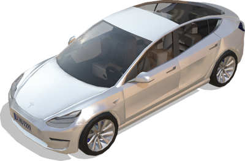
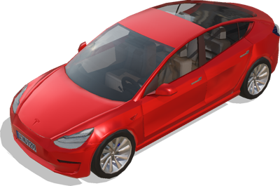

# Tesla

## TeslaModel3

Model of a Tesla model 3 car using the [Car](car.md) PROTO as a base.
The vehicle is modelled with realistic physics properties: motor torques, body mass, friction forces, suspensions, etc.
Weight, transmission and motor properties are calibrated according to the 'Long Range Battery AWD Performance' version.

%figure



%end

Derived from [Robot](../reference/robot.md).

```
TeslaModel3 {
  SFVec3f    translation       0 0 0.4
  SFRotation rotation          0 0 1 0
  SFColor    color             1 1 1
  MFString   plate             "../textures/plate.jpg"
  SFString   engineSound       ""
  SFString   name              "vehicle"
  SFString   controller        "<generic>"
  MFString   controllerArgs    []
  SFBool     supervisor        FALSE
  SFBool     synchronization   TRUE
  MFNode     sensorsSlotFront  []
  MFNode     sensorsSlotRear   []
  MFNode     sensorsSlotTop    []
  MFNode     sensorsSlotCenter []
  SFBool     frontSpotLights   FALSE
  SFString   window            "automobile"
}
```

> **File location**: "[WEBOTS\_HOME/projects/vehicles/protos/tesla/TeslaModel3.proto]({{ url.github_tree }}/projects/vehicles/protos/tesla/TeslaModel3.proto)"

> **License**: Copyright Cyberbotics Ltd. Licensed for use only with Webots.
[More information.](https://cyberbotics.com/webots_assets_license)

### TeslaModel3 Field Summary

- `color`: Defines the car body color.

- `plate`: Defines the plate texture.

- `sensorsSlotFront`: Extends the robot with new nodes on the front of the car.

- `sensorsSlotRear`: Extends the robot with new nodes on the back of the car.

- `sensorsSlotTop`: Extends the robot with new nodes on the roof of the car.

- `sensorsSlotCenter`: Extends the robot with new nodes at the center of the car.

- `frontSpotLights`: Defines whether the car should have front spot lights.

## TeslaModel3Simple

Simple kinematic model of the Tesla model 3 to be moved with a Supervisor.

%figure



%end

Derived from [Robot](../reference/robot.md).

```
TeslaModel3Simple {
  SFVec3f    translation                    0 0 0.4
  SFRotation rotation                       0 0 1 0
  SFColor    color                          1 0 0
  MFColor    recognitionColors              [ 1 0 0 ]
  MFString   plate                          "../textures/plate.jpg"
  SFString   name                           "vehicle"
  SFString   controller                     "<none>"
  MFString   controllerArgs                 [ ]
  SFString   window                         "<none>"
  MFNode     sensorsSlotFront               [ ]
  MFNode     sensorsSlotRear                [ ]
  MFNode     sensorsSlotTop                 [ ]
  MFNode     sensorsSlotCenter              [ ]
  SFBool     wheelBoundingObject            FALSE
}
```

> **File location**: "[WEBOTS\_HOME/projects/vehicles/protos/tesla/TeslaModel3Simple.proto]({{ url.github_tree }}/projects/vehicles/protos/tesla/TeslaModel3Simple.proto)"

> **License**: Creative Commons Attribution 4.0 International License.
[More information.](https://creativecommons.org/licenses/by/4.0/legalcode)

### TeslaModel3Simple Field Summary

- `color`: Defines the car body color.

- `plate`: Defines the plate texture.

- `sensorsSlotFront`: Extends the robot with new nodes on the front of the car.

- `sensorsSlotRear`: Extends the robot with new nodes on the back of the car.

- `sensorsSlotTop`: Extends the robot with new nodes on the roof of the car.

- `sensorsSlotCenter`: Extends the robot with new nodes at the center of the car.

- `wheelBoundingObject`: Defines whether the wheels should have a bounding object.

