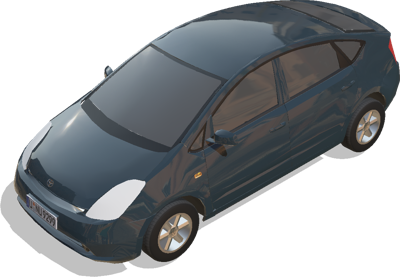
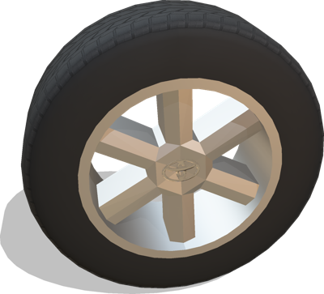

# Toyota

## ToyotaPrius

Model of a Toyota Prius car using the Car PROTO as a base.
The contactMaterial of the wheels is "ToyotaPriusWheels"
This model was sponsored by the CTI project RO2IVSim ([http://transport.epfl.ch/simulator-for-mobile-robots-and-intelligent-vehicles](http://transport.epfl.ch/simulator-for-mobile-robots-and-intelligent-vehicles)).

%figure



%end

Derived from [Robot](../reference/robot.md).

```
ToyotaPrius {
  SFVec3f    translation       0 0 0.4
  SFRotation rotation          0 0 1 0
  SFColor    color             0.1 0.15 0.18
  MFString   plate             "../textures/plate.jpg"
  SFString   engineSound       "sounds/engine.wav"
  SFString   name              "vehicle"
  SFString   controller        "<generic>"
  MFString   controllerArgs    []
  SFBool     supervisor        FALSE
  SFBool     synchronization   TRUE
  MFNode     sensorsSlotFront  []
  MFNode     sensorsSlotRear   []
  MFNode     sensorsSlotTop    []
  MFNode     sensorsSlotCenter []
  SFBool     frontSpotLights   FALSE
  SFString   window            "automobile"
}
```

> **File location**: "[WEBOTS\_HOME/projects/vehicles/protos/toyota/ToyotaPrius.proto]({{ url.github_tree }}/projects/vehicles/protos/toyota/ToyotaPrius.proto)"

> **License**: Copyright Cyberbotics Ltd. Licensed for use only with Webots.
[More information.](https://cyberbotics.com/webots_assets_license)

## ToyotaPriusSimple

Simple kinematic model of the Toyota Prius to be moved with a Supervisor.
This model was sponsored by the CTI project RO2IVSim ([http://transport.epfl.ch/simulator-for-mobile-robots-and-intelligent-vehicles](http://transport.epfl.ch/simulator-for-mobile-robots-and-intelligent-vehicles)).

%figure


%end

Derived from [Robot](../reference/robot.md).

```
ToyotaPriusSimple {
  SFVec3f    translation         0 0 0.4
  SFRotation rotation            0 0 1 0
  SFColor    color               0.1 0.15 0.18
  MFColor    recognitionColors   [ 0.1 0.15 0.18 ]
  MFString   plate               "../textures/plate.jpg"
  SFString   name                "vehicle"
  SFString   controller          "<none>"
  MFString   controllerArgs      [ ]
  SFString   window              "<none>"
  MFNode     sensorsSlotFront    [ ]
  MFNode     sensorsSlotRear     [ ]
  MFNode     sensorsSlotTop      [ ]
  MFNode     sensorsSlotCenter   [ ]
  SFBool     wheelBoundingObject FALSE
}
```

> **File location**: "[WEBOTS\_HOME/projects/vehicles/protos/toyota/ToyotaPriusSimple.proto]({{ url.github_tree }}/projects/vehicles/protos/toyota/ToyotaPriusSimple.proto)"

> **License**: Copyright Cyberbotics Ltd. Licensed for use only with Webots.
[More information.](https://cyberbotics.com/webots_assets_license)

## ToyotaPriusWheel

Model of the Toyota Prius wheels using the generic VehicleWheel proto
including physic properties and textures
The contactMaterial is "ToyotaPriusWheels"
Size: 195/65 R15
This model was sponsored by the CTI project RO2IVSim ([http://transport.epfl.ch/simulator-for-mobile-robots-and-intelligent-vehicles](http://transport.epfl.ch/simulator-for-mobile-robots-and-intelligent-vehicles)).

%figure



%end

Derived from [Slot](../reference/slot.md).

```
ToyotaPriusWheel {
  SFString name           "Toyota Prius wheel"
  SFNode   physics        NULL
  SFBool   boundingObject TRUE
  SFBool   wheelSide      FALSE
}
```

> **File location**: "[WEBOTS\_HOME/projects/vehicles/protos/toyota/ToyotaPriusWheel.proto]({{ url.github_tree }}/projects/vehicles/protos/toyota/ToyotaPriusWheel.proto)"

> **License**: Copyright Cyberbotics Ltd. Licensed for use only with Webots.
[More information.](https://cyberbotics.com/webots_assets_license)

