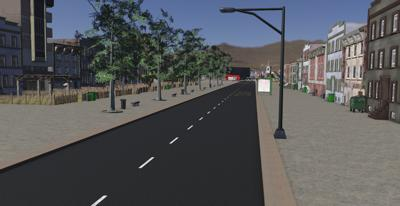

## Village Center

%figure "The Village Center world"

%end

This world represents the center of a fictive village with a high level of realism.
A particular care was taken to the details in order to have an environment as complete and as realistic as possible.
Furthermore, all the adequate traffic signs have been added and some dynamic traffic lights too.
This world uses the [SUMO interface](sumo-interface.md) to manage traffic.
