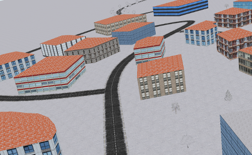
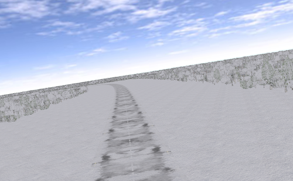

## Village Winter

%figure "The Village winter world"

%end

This world represents a small fictive village too, but during the winter.
A variable amount of snow was added on top of the roads, buildings and trees, which make it difficult to follow the road using on-board cameras.
Moreover, friction coefficients between the road and the tires were changed with regards to the amount of snow.

Of course the friction phenomena between snow/ice and tires is very complex and this world should not be used as a ground truth but can still be used as a rough approximation.
