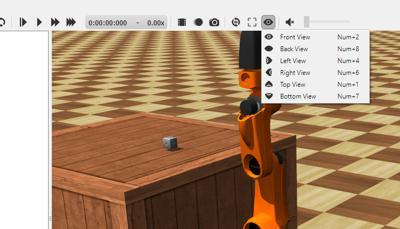
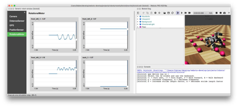
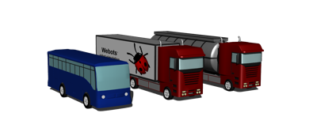
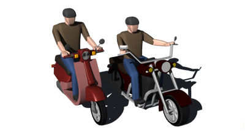
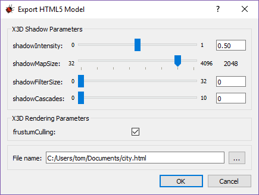

# Version R2018a Released

By Tom Norton - 19th December 2017

---

Today we're happy to announce the release of the all-new Webots 2018a, packed with some great new features.
We're going to talk about some of them here, but for a comprehensive list of changes please refer to the ChangeLog, found [here](../reference/changelog-r2018.md).

This release brings a change to the way Webots is released.
We have been looking for a means of improving our release schedule to provide reliability for our users, and a more strict release schedule that ensures updates are shipped predictably and reliably.
Thus, we are migrating to from Major-Minor-Maintenance to a Year-Release-Mainteance versioning system.
We will now be aiming to release new editions of Webots annualy, with major intermediate releases every six months, starting with Webots R2018a, then Webots R2018b, then Webots R2019a etc.
Maintenance revisions will still be shipped to fix critical bugs between these release milestones.

## Enhanced Viewpoint Movement

### Line It up Just Right

Take better screenshots and record better videos of your robot by aligning the viewpoint on one of the six world axes, using the new Change View tool:

%figure "New Change View Menu"

%end

### Smooth

Now, all automated Viewpoint movement is animated, when resetting the viewpoint, moving the viewpoint to an object, or moving to any of the six default views:

%figure "Animated Views In Action"
<video class="webm" autoplay loop>
  <source src="https://www.cyberbotics.com/files/repository/videos/viewpoint_animation.webm" type="video/webm">
</video>
%end

---

## HTML5 Robot Windows

%figure "HTML5 Robot Windows In Webots"

%end

Over the last couple of years we have been slowly phasing out our native Qt-based robot window system, in order to use Web technologies for more powerful layout & design tools.
The biggest and most comprehensive step in this task is implementing the default generic robot window in HTML5/JavaScript/CSS, as most of our distributed robot models use the generic window.
This update brings a new, shiny, faster generic HTML5-based dockable robot window for use with any robot you create:

%figure "Viewing Different Robot Devices In New Window"
<video class="webm" autoplay loop>
  <source src="https://www.cyberbotics.com/files/repository/videos/html_robot_window.webm" type="video/webm">
</video>
%end

We will continue to port features in from the legacy windows (such as the Motion Editor) over time, along with extending the original design for better information about your robot.

---

## Python 3

%figure "Python 3 Support For Webots"

%end

One of our most requested features in recent months has been to support Python 3.
With a divided community and people migrating their codebases from 2.7 to 3.4 and up, we have decided to provide support for both, so users can take advantage of the many Python 3 libraries, and users who aren't quite ready to make the leap can still continue working on their controllers without a hitch.

---

## On the Road

### New Truck and Two-Wheeled Models

In addition to the `Bus` PROTO two new models of trucks have been added:

%figure "Models of large vehicles"

%end

Furthermore, a model of a motorbike and a model of a scooter have been added:

%figure "Models of two wheels vehicles"

%end

All these new models are now used in the SUMO interface.

---

## Web Interface

As you may know, this year we opened [Robotbenchmark](https://robotbenchmark.net) to allow anyone to program simulated robots online.
As a part of building and updating this site we have made numerous improvements to our web interface, including widening the support for object animation (materials, texture animation in the Track node, etc), performance optimization in animation playback and loading times, and an all new X3D export parameter dialog:

%figure "X3D Export Dialog"

%end

This dialog lets you tune specific parameters related to the X3DOM scene rendered in the browser.

---

## Extra Goodies

Movies can now be recorded in slow motion.

To ensure reproducible simulations, floating-point precision when saving files has been maximised.

Large MF fields are no longer saved vertically, to reduce file sizes and improve loading times.

The `street_furniture` folder has been filled with more models!
