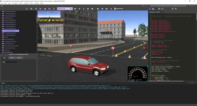

# Version R2018b Released

By Tom Norton - 4th July 2018

---

It's that time of year again!
Today marks the release of the all-new Webots R2018b, packed with some game-changing features.
As always, for a comprehensive list of changes please refer to the ChangeLog, found [here](../reference/changelog-r2018.md).

## WREN: Webots Renderer

For the past decade, Webots has used the [Object-Oriented Graphics Rendering Engine](https://www.ogre3d.org/) (OGRE) to handle 3D rendering.
We encountered many roadblocks with OGRE, especially in modernizing our worlds and achieving a greater level of realism, and as such decided that it was better for us to implement our own bespoke rendering engine - from scratch!
This allows us to implement and use only the features we need / desire, giving us a very lightweight and efficient renderer.

We've spent the past year making this idea a reality, and are proud to present our own bespoke OpenGL 3.3 based renderering engine, WREN (Webots RENderer).
Thus, Webots R2018b and all future versions of Webots will make use of WREN for all 3D work.

### Lightning Fast

As a result of implementing only what we need, and focusing on using modern techniques introduced with OpenGL 3+, Webots with WREN is much faster than with OGRE.
OGRE 1.9 (the version we used) is a CPU-bound renderer, which is bad news for Webots, which is optimised for single-thread performance.
Ideally, a 3D renderer for use with Webots should be GPU bound, and be as CPU-overhead minimal as possible, to provide "room" for the simulation's CPU-sided simulation workload (robot controllers, physics, GUI) as possible.
WREN is extremely CPU-light, and is GPU-bound for rendering.
This has allowed us to improve world performance considerably.

To illustrate this in practical terms, the simulation speedometer in "Run" mode is used as our performance indicator, to show the real-life implications of faster rendering in a Webots simulation.
The following benchmarks were performed on Windows 10, 64-bit with an Intel 6700k processor @ 3.40GHz and an NVIDIA GTX 970 graphics cards on some familiar Webots worlds.

|    World    | R2018a | R2018b | speedup |
|:-----------:|:------:|:------:|:-------:|
|   city.wbt  |  2.82x |  7.60x |  2.70x  |
| battery.wbt |  35.1x |  43.6x |  1.24x  |
| create.wbt  | 30.4x  |  52.4x |  1.72x  |

As you can see from this table, even with robot controller taking a large part of the timestep in these worlds, all of them run considerably faster than before, with a greater speedup in complex worlds due to higher rendering demand.
WREN now shines in large worlds, and is still way ahead of OGRE even in simple scenarios.

### Physically-Based Rendering

%figure "A model of a telephone, from the GLTF sample library, rendered in Webots."

%end

In a bid to make Webots look as realistic as possible, we have implemented a Physically-Based Rendering pipeline into Webots.
Physically based rendering relies on improved lighting models, and the use of several additional non-colour textures (normal maps, roughness maps and metalness maps) to represent a material's interactions with light to a very high degree of realism.
This is useable with the new [PBRAppearance](../reference/pbrappearance.md) and `Cubemap` nodes.
This is still an experimental feature for now, however.
We will be rolling it out across our objects and simulations as time goes on, and this will likely change the appearance of your simulation worlds.

We plan to continue developing advanced graphics features for Webots in the coming months, to complement this rollout.

---

## New Look and Feel

### New Themes

%figure "Webots Night, The new default theme for Webots"

%end

We've done lots of work on user experience with this latest update.
Shown above is one of the new looks for Webots R2018b, Webots Night.
This new look features clean lines, flat design, and a subdued color palette with highlights in just the right places to make interacting with Webots even more intuitive.
If you prefer the old look, we've also kept the previous style, in a theme called "Webots Classic".
There's also a more vibrant dark theme named "Webots Dusk".
Additionally, the splash screen has been re-designed to match our new themes.

### It's All about Context

We've wanted to streamline actions normally undertaken during normal simulation design workflow.
These include editing a robot's controller, seeing a robot's window, deleting an object from the scene, etc.
So, to improve this, we've added a context menu to the 3D view and Scene Tree!

%figure "A Typical Context Menu for a Selected Robot Node"

%end

The menu adapts to the currently selected tree item or object in the 3D view, providing selection-specific actions and options.

Boot up Webots R2018b and have an explore of these new GUI features!

---

## Simulation Reset

Reloading an entire world just to re-run your simulation can be slow, especially for large worlds.
With this in mind, we have developed an alternative method of resetting a simulation, and our terminology has changed as such.
"Revert" has become "Reload" and now users can benefit from the new "Reset Simulation" action, also accessible via the [Supervisor API](../reference/supervisor.md#wb_supervisor_simulation_reset).

%figure "Reset Simulation Action"

%end

This feature makes resetting even the most complex simulations instantaneous.

---

## New PROTOs

For more realistic and immersive vehicle simulations, we have expanded our available building models and street furniture extensively, with more than 80 new models.
Below is a preview of just some of these new assets.

%figure "New PROTO models of Buildings and Street Furniture"

%end

---

## Extra Goodies

Webots R2018b supports Ubuntu 18.04 LTS out of the box.

The [Speaker API](../reference/speaker.md#speaker-functions) can now load and play all major audio formats.

If you don't want to run a controller for your Robot node, you can now simply use an empty string as the controller name, to avoid running the void controller unnecessarily.

Projection mode, rendering mode, optional renderings and disable selection are now saved per world instead of globally.

**Go and [download](https://cyberbotics.com/#download) Webots R2018b today, so you don't miss out on all these great new features!**
