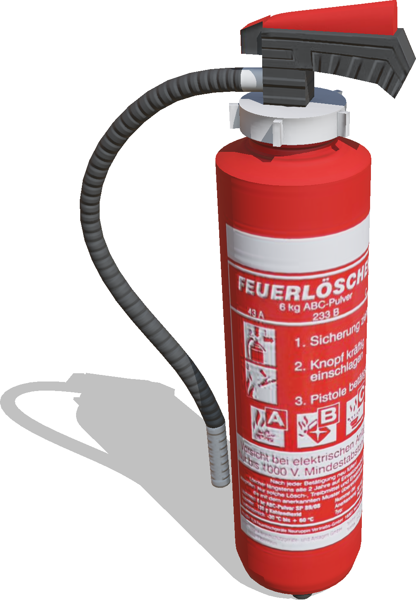
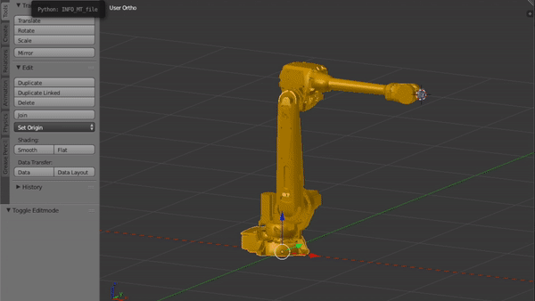

# Version R2019b Released

By Fabien Rohrer - 17th June 2019

---

Today we're happy to announce the release of the all-new Webots R2019b, packed with some great new features.
We're going to talk about some of them here, but for a comprehensive list of changes please refer to the ChangeLog, found [here](https://www.cyberbotics.com/dvd/common/doc/webots/ChangeLog.html).

---

## New Post-processing Effects Available in Robot Cameras

In order to increase the realism of robot cameras, they can now be affected by post-processing effects already included in Webots such as Bloom and Ambient Occlusion.

%figure "Ambient occlusion in a robot camera"

%end

---

## Bunch of New Robot Models

We've added a couple of new robot models in this release.

### Universal Robots UR3e, UR5e and UR10e Arms and ROBOTIQ 3-Finger Gripper

The Universal Robots [UR3e](https://www.cyberbotics.com/doc/guide/ure), [UR5e](https://www.cyberbotics.com/doc/guide/ure) and [UR10e](https://www.cyberbotics.com/doc/guide/ure) are flexible collaborative robot arms with 6 degrees of freedom.
These arms can be equipped by the a [ROBOTIQ 3F Gripper is a 3-fingers adaptive robot gripper](https://www.cyberbotics.com/doc/guide/gripper-actuators#robotiq-3f-gripper).

This model is fully compatible with the [universal\_robot ROS package](http://wiki.ros.org/action/show/universal_robots).

### Clearpath Moose

The [Clearpath Robotics Moose robot](https://www.clearpathrobotics.com/moose-ugv/) is a large 8-wheeled all-terrain unmanned ground vehicle.
More information [here](https://www.cyberbotics.com/doc/guide/moose).

### ABB IRB 4600/40 Arm

The [ABB IRB 4600/40](https://www.cyberbotics.com/doc/guide/irb4600-40) is a 6 DOF indoor arm.

### Telerob Telemax PRO

The [Telerob Telemax PRO robot](https://www.cyberbotics.com/doc/guide/telemax-pro) is a tracked robot equipped with a 7-axis manipulator.

---

## More Assets

In order to improve our asset library, we have added many new configurable 3D objects and appearances.

| | | |
| :---: | :---: | :---: |
|  |   |   |
|  |   |   |
|  |   |   |
|  |   |   |

---

## Blender to Webots Exporter Add-on

%figure "Export a Blender world to Webots"

%end

We are glad to announce the release of [our new Blender tool](https://github.com/omichel/blender-webots-exporter) for importing your Blender creations to Webots.
The model creation process can be greatly facilitated through this tool.

---

## Quality Matters

To improve even more the quality of the source code and therefore of Webots, we have improved our testing procedure.
Our workflow uses now [Travis](https://travis-ci.com/omichel/webots), [AppVeyor](https://ci.appveyor.com/project/omichel/webots) and [GitGuardian](https://app.gitguardian.com) to make sure that every change to the source code is safe, clean and doesn't break anything.

In addition, nightly builds are now created and uploaded to the [Github repository](https://github.com/omichel/webots/releases).

---

## Webots Online 3D Viewer: Level Up!

We completely refactored our Online 3D Viewer `webots.min.js`.
It is now using `Javascript ES6` and `three.js`.
Our new rendering pipeline using PBR and HDR background textures is now supported in the web client, while loading time and rendering speed has been improved.

%figure "Comparison of Webots (on the left) and `webots.min.js` in Chrome (on the right)"
| |
| :---: |
|  |
|  |
%end

---

## Extra Goodies

The installation of Webots on Windows as been simplified: the administrator privileges are not needed anymore.

To follow the announce of the Python 2.7 deprecation early next year, we also decided to display a deprecation message when using it before dropping it completely in the next release.

**Go and [download](https://cyberbotics.com/#download) Webots R2019b today, so you don't miss out on all these great new features!**
