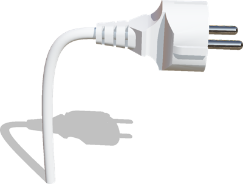

# Version R2019b Released

By Fabien Rohrer - 17th June 2019

---

Today we're happy to announce the release of the all-new Webots R2019b, packed with some great new features.
We're going to talk about some of them here, but for a comprehensive list of changes please refer to the changelog, found [here](https://cyberbotics.com/doc/reference/changelog-r2019).

In this release, other than improving the rendering quality and extending our robot and assets library, we focused on simplifying the installation and development workflow to encourage and further support user contributions.

---

## Post-processing Effects in Robot Cameras

Realism of robot camera has been greatly improved. They can now be affected by the same post-processing effects that are already available for the Webots 3D scene such as Bloom and Ambient Occlusion.

%figure "Ambient occlusion in a robot camera"

%end

---

## New Robot Models

We've added a couple of new robot models in this release.

### Universal Robots and ROBOTIQ 3-Finger Gripper

The Universal Robots [UR3e](https://www.cyberbotics.com/doc/guide/ure), [UR5e](https://www.cyberbotics.com/doc/guide/ure) and [UR10e](https://www.cyberbotics.com/doc/guide/ure) are flexible collaborative robot arms with 6 degrees of freedom.
These arms can be equipped with the [ROBOTIQ 3-Finger Gripper](https://www.cyberbotics.com/doc/guide/gripper-actuators#robotiq-3f-gripper) that is a 3-finger adaptive robot gripper ideal for advanced manufacturing and robotic research.

This model is fully compatible with the [universal\_robot ROS package](http://wiki.ros.org/action/show/universal_robots).

### ABB IRB 4600/40 Arm

We have added another robotics arm with inverse kinematics support: the [ABB IRB 4600/40](https://www.cyberbotics.com/doc/guide/irb4600-40) 6 DOF indoor arm.

### Telerob Telemax PRO

The [Telerob Telemax PRO robot](https://www.cyberbotics.com/doc/guide/telemax-pro) is a tracked robot equipped with several cameras and a 7-axis manipulator.

### Clearpath Moose

The [Clearpath Robotics Moose robot](https://www.clearpathrobotics.com/moose-ugv/) is a large 8-wheeled all-terrain unmanned ground vehicle.
More information [here](https://www.cyberbotics.com/doc/guide/moose).

---

## More Assets

In order to improve our asset library, we have added many new configurable 3D objects and appearances.

| | | |
| :---: | :---: | :---: |
|  |   |   |
|  |   |   |
|  |   |   |
|  |   |   |

Most of these assets are used in our new [hall](https://www.cyberbotics.com/doc/guide/samples-environments#hall-wbt) environment.
%figure "Hall Environment"

%end

---

## Blender to Webots Exporter Add-on

%figure "Export a Blender model to Webots"

%end

We are glad to announce the release of [our new Blender tool](https://github.com/cyberbotics/blender-webots-exporter) for importing your Blender creations to Webots.
Thanks to this tool the model creation process is now simpler and smoother.

Install it and start modeling your Webots objects and robots!

---

## Quality Matters

To improve even more the quality of the source code and therefore Webots itself, we have improved our testing procedures.
Our workflow now uses [Travis](https://travis-ci.com/cyberbotics/webots), [AppVeyor](https://ci.appveyor.com/project/cyberbotics/webots) and [GitGuardian](https://app.gitguardian.com) to make sure that every change to the source code is safe, clean and doesn't break anything.

Moreover, nightly builds are now created and uploaded to the [Github repository](https://github.com/cyberbotics/webots/releases).

---

## Webots Online 3D Viewer: Level Up!

We completely refactored our Online 3D Viewer `webots.min.js`.
It is now using `Javascript ES6` and `three.js`.
Our new rendering pipeline using [PBR](https://en.wikipedia.org/wiki/Physically_based_rendering) and [HDR](https://en.wikipedia.org/wiki/High_dynamic_range) background textures is now supported in the web client too, while loading time and rendering speed has been improved.

%figure "Comparison of Webots (on the left) and `webots.min.js` in Chrome (on the right)"
| | |
| :---: | :---: |
|  |  |
%end

---

## Extra Goodies

The installation of Webots on Windows has been simplified: administrator privileges are not needed anymore.

Following the announcement of Python 2.7 deprecation early next year, Webots now displays a deprecation message when a robot controller is using Python 2.7. We will drop Python 2.7 completely from the next release in favor of Python 3.

**Go and [download](https://cyberbotics.com/#download) Webots R2019b today, so you don't miss out on all these great new features!**
