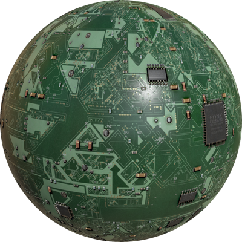

# Version R2020a Released

By Stefania Pedrazzi - 9th December 2019

---

Here we are! It's already time for a new Webots release!

This new Webots version focuses on improving the performance of the scene load and the robustness of the simulation.
But as usual we also extended our robot and asset library with new environments, worlds and appearances.
Moreover the [Supervisor API](../reference/supervisor.md) has been extended.

This article only lists some of the major changes.
Besides these, we are always fixing bugs and improving the quality and robustness of Webots.
Please refer to the changelog for a comprehensive list of all the changes, found [here](../reference/changelog-r2020.md).

---

## New TIAGo Robots Model

Simulate the TIAGo robot from [PAL Robotics](http://pal-robotics.com/) in Webots.

%figure "Tiago Model in Webots"

%end

Several models of the robot have been created for Webots:
  - [TIAGo Base](../guide/tiago-base.md)
  - [TIAGo Iron](../guide/tiago-iron.md)
  - [TIAGo Steel](../guide/tiago-steel.md)
  - [TIAGo Titanium](../guide/tiago-titanium.md)
  - [TIAGo++](../guide/tiagopp.md)

---

## Extended Supervisor API

We are always collecting feedbacks form users, and in particular recently we received many requests about adding new functionalities to the [Supervisor API](../reference/supervisor.md).

So for this release we extended the [Supervisor API](../reference/supervisor.md) features to be able to:
  - Add [force](../reference/supervisor.md#wb_supervisor_node_add_force) or [torque](../reference/supervisor.md#wb_supervisor_node_add_torque) to a [Solid](../reference/solid.md) node.
  - [Import](../reference/supervisor.md#wb_supervisor_field_import_sf_node) and [remove](../reference/supervisor.md#wb_supervisor_field_remove_sf) nodes in SFNode fields.
  - [Reset](../reference/supervisor.md#wb_supervisor_simulation_reset) the simulation without restarting the controllers.

We also improved the [reset of the physics](../reference/supervisor.md#wb_supervisor_simulation_reset_physics) to avoid dynamics explosions with articulated objects.

---

## New Appearances

To let you model more realistic robots and environments we expanded our `PBRAppearance` library with some new PROTO files.

| | | |
| :---: | :---: | :---: |
|  |  |   |
|  |  |   |

---

## Simplify the HDR Backgrounds

In last releases we did a great effort to improve the quality of the rendering in Webots, using PBR and HDR backgrounds.
Unfortunately former equirectangular HDR background images turned out to be very heavy and memory-intensive.
This is causing some issues with low to mid range graphics cards and in general they are significantly slowing down the world loading.
That's why we dropped the support of the equirectangular HDR images and the `Cubemap` node.
Instead we restored the standard `<cube_face>Url` VRML fields and added the new `<cube_face>IrradianceUrl` and `luminosity` fields of the [Background](../reference/background.md) node to specify light reflections and scale the light contribution on the [PBR appearances](../reference/pbrappearance.md).
So now we have a better performance with the same realistic rendering quality.

%figure "New structure of Background node"

%end

But do not worry about the compatibility of your custom HDR backgrounds!
We are now also providing some tools to help you with the update.
You can find them on the [Webots GitHub repository](https://github.com/cyberbotics/webots/tree/R2020a/scripts/image_tools), and in case you need some help with the conversion please do not hesitate to contact us on Discord.

### Updated TexturedBackground PROTO

The [TexturedBackground PROTO](../guide/object-backgrounds.md#texturedbackground) has been updated accordingly to the new [Background](../reference/background.md) node definition and we added some new HDR textures.

Note that we deprecated some of the old default backgrounds that were not in HDR format.

---

## Viewpoint Follow Functionality

We all know that it could be tricky to make the viewpoint follow smoothly a robot to record fancy movies or just to run nice simulations.
To help you in this task, we replaced the `followOrientation` field of the [Viewpoint](../reference/viewpoint.md) node with the `followType` and added a new "Pan and Tilt Shot" option that will automatically move the viewpoint so that it always looks at the object center.

---

## Extra Goodies

We are very happy to communicate that we fixed the error accumulation issues occurring when reverting the scene using the physics reset function. Thank you to all the users that reported this problem!

Webots 2020a contains a new complete apartment environment: check it [here](../guide/samples-environments.md#complete_apartment-wbt).

On Linux, you can now also program your controllers with Python 3.8.

**Go and [download](https://cyberbotics.com/#download) Webots R2020a today, so you don't miss out on all these great new features!**
