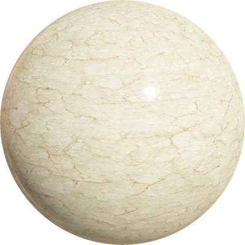

# Version R2020b Released

By Olivier Michel - 31st July 2020

---

Webots R2020b is there! And it's packed with a bunch of new features, new models, improvements and, of course, bug fixes.

However, this article only lists some of the major changes.
Please refer to the [2020 changelog](../reference/changelog-r2020.md) for a comprehensive list of all changes.

---

## 3 New Robot Models

### Spot from Boston Dynamics

Play around with a simulated Spot robot from [Boston Dynamics](http://bostondynamics.com) in Webots.

%figure "Spot Model in Webots"

%end

### P-Rob 3 from F&P Robotics  

P-Rob 3 is a new collaborative robotic arm developed by [F&P Robotics](https://www.fp-robotics.com).

%figure "P-Rob 3 Model in Webots"

%end

### AT-ST Walker Robot Inspired from Star Wars

Matt Denton contributed a nice [demo](https://twitter.com/mantisrobot/status/1254693299702714369) of a two-legged robot inspired by the Star Wars AT-ST walker.

%figure "AT-ST walker in Webots"

%end

---

## ROS 2 & Webots

We are continuing to develop and improve the support for ROS 2 in Webots with now [11 Webots packages for ROS 2](https://discourse.ros.org/t/new-packages-and-patch-release-for-ros-2-foxy-fitzroy-2020-07-10/15348).
This version of Webots is fully compatible with the two latest versions of ROS 2:
  - [Eloquent Elusor](https://index.ros.org/doc/ros2/Releases/Release-Eloquent-Elusor)
  - [Foxy Fitzroy](https://index.ros.org/doc/ros2/Releases/Release-Foxy-Fitzroy)

See the [webots\_ros2 package documentation](http://wiki.ros.org/webots_ros2) for the installation and usage instructions.
Or, if you can't wait to see the latest features and supported robots, go directly to the [webots\_ros2 Github repository](https://github.com/cyberbotics/webots_ros2).

Moreover, we added a new API function to facilitate the integration with the ROS ecosystem.
The [wb\_robot\_get\_urdf](https://cyberbotics.com/doc/reference/robot#wb_robot_get_urdf) function allows users to retrieve a URDF model of a Webots robot.
This is useful, in particular, to display the robot in [RViz](http://wiki.ros.org/rviz).
We also improved the `ros_python` and `universal_robots_ros` ROS simulations to use extern controllers instead of embedding the ROS libraries and we enabled multi-robot ROS 2 simulations.
Last, but not least, Webots now fully supports the ENU [axes convention](https://en.wikipedia.org/wiki/Axes_conventions) which is the standard used [in ROS](https://www.ros.org/reps/rep-0103.html#axis-orientation).

---

## Improved Console

The Webots [console](https://www.cyberbotics.com/doc/guide/the-console) was greatly improved to respond to provide a clearer, easier to manage, text output and error log.
It is now possible to open several consoles.
A new popup menu allow you to select which kind of output is going to be displayed in each console.
This way robots may have their own console, the robot name prefix being removed from the console output.
Other consoles may display for example only the compilation results or only some Webots warnings.
Also, more ANSI control codes are now supported allowing you to output [colorful styled text](https://cyberbotics.com/doc/guide/controller-programming#console-output) from your controller in the Webots consoles.
This should make debugging your robot controllers easier and render the corresponding output more elegant.

---

## New Appearances

To let you model more realistic robots and environments we expanded our `PBRAppearance` library with some new PROTO files.

| | | |
| :---: | :---: | :---: |
|  |  |   |
|  |  |   |
|  |  |  |

---

## Support for External Mesh Files

---

### MJPEG Simulation Streaming

---

## Extra Goodies

Need a break? Go ahead and visit our brand new [break\_room](../guide/samples-environments.md#break_room-wbt) world.

We are very happy to communicate that we fixed the error accumulation issues occurring when reverting the scene using the physics reset function. Thank you to all the users that reported this problem!

Webots R2020a contains a new complete apartment environment: check it [here](../guide/samples-environments.md#complete_apartment-wbt).

On Linux, you can now also program your controllers with Python 3.8.

Finally, after one year of open-source, we removed the license system and turned also the old Webots versions prior to R2019a free.
Please check the [documentation](../guide/general-faq.md#can-i-still-use-a-webots-version-before-the-r2019a-release) for further details.
Just note that old versions are no longer maintained.

**Go and [download](https://cyberbotics.com/#download) Webots R2020b today, so you don't miss out on all these great new features!**
