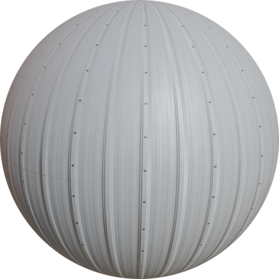
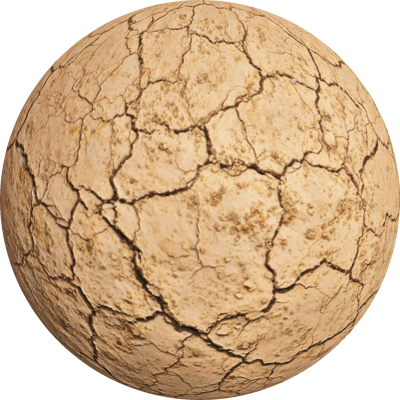
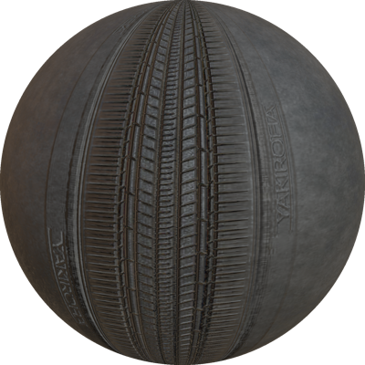

# Version R2020b Released

By Olivier Michel - 31st July 2020

---

Webots R2020b is there! And it's packed with a bunch of new features, new models, improvements and, of course, bug fixes.

However, this article only lists some of the major changes.
Please refer to the [2020 changelog](../reference/changelog-r2020.md) for a comprehensive list of all changes.

---

## 3 New Robot Models

### Spot from Boston Dynamics

Play around with a simulated Spot robot from [Boston Dynamics](http://bostondynamics.com/) in Webots.

%figure "Spot Model in Webots"

%end

### P-Rob 3 from F&P Robotics  

P-Rob 3 is a new collaborative robotic arm developed by [F&P Robotics](https://www.fp-robotics.com).

%figure "P-Rob 3 Model in Webots"

%end

### AT-ST Walker Robot Inspired from Star Wars

Matt Denton contributed a nice [demo](https://twitter.com/mantisrobot/status/1254693299702714369) of a two-legged robot inspired by the Star Wars AT-ST walker.

%figure "AT-ST walker in Webots"

%end

---

## ROS 2 & Webots

ROS 2 Eloquent has been [released](https://index.ros.org/doc/ros2/Releases/Release-Eloquent-Elusor/) approximately one month ago.
We understood the high interest for ROS 2 among the robotics community and we are therefore proud to announce that Webots is now compatible with the following versions of ROS 2:
  - [Crystal Clemmys](https://index.ros.org/doc/ros2/Releases/Release-Crystal-Clemmys)
  - [Dashing Diademata](https://index.ros.org/doc/ros2/Releases/Release-Dashing-Diademata)
  - [Eloquent Elusor](https://index.ros.org/doc/ros2/Releases/Release-Eloquent-Elusor)

%figure "Simulation of UR and ABB robots in Webots with ROS 2"

%end

See the [webots\_ros2 package documentation](http://wiki.ros.org/webots_ros2) for the installation and usage instructions.
Or, if you can't wait to see the latest features and supported robots, go directly to the [webots\_ros2 Github repository](https://github.com/cyberbotics/webots_ros2).

---

## Extended Supervisor API

We are always collecting feedbacks form users, and in particular recently we received many requests about adding new functionalities to the [Supervisor API](../reference/supervisor.md).

So for this release we extended the [Supervisor API](../reference/supervisor.md) features to be able to:
  - Add a [force](../reference/supervisor.md#wb_supervisor_node_add_force) or a [torque](../reference/supervisor.md#wb_supervisor_node_add_torque) to a [Solid](../reference/solid.md) node.
  - [Import](../reference/supervisor.md#wb_supervisor_field_import_sf_node) and [remove](../reference/supervisor.md#wb_supervisor_field_remove_sf) nodes in SFNode fields.
  - [Reset](../reference/supervisor.md#wb_supervisor_simulation_reset) the simulation without restarting the robot controllers.

---

## New Appearances

To let you model more realistic robots and environments we expanded our `PBRAppearance` library with some new PROTO files.

| | | |
| :---: | :---: | :---: |
|  |  |   |
|  |  |   |
|  |  |  |

---

## Simplify the HDR Backgrounds

In last releases we did a great effort to improve the quality of the rendering in Webots, using PBR and HDR backgrounds.
Unfortunately former equirectangular HDR background images turned out to be very heavy and memory-intensive.
This is causing some issues with low to mid range graphics cards and in general they are significantly slowing down the world loading.
That's why we dropped the support of the equirectangular HDR images and the `Cubemap` node.
Instead we restored the standard `<cube_face>Url` VRML fields and added the new `<cube_face>IrradianceUrl` and `luminosity` fields of the [Background](../reference/background.md) node to specify light reflections and scale the light contribution on the [PBR appearances](../reference/pbrappearance.md).
So now we have a better performance with the same realistic rendering quality.

%figure "New structure of Background node"

%end

But do not worry about the compatibility of your custom HDR backgrounds!
We are now also providing some tools to help you with the update.
You can find them on the [Webots GitHub repository](https://github.com/cyberbotics/webots/tree/R2020a/scripts/image_tools), and in case you need some help with the conversion please do not hesitate to contact us on Discord.

### Updated TexturedBackground PROTO

The [TexturedBackground PROTO](../guide/object-backgrounds.md#texturedbackground) has been updated accordingly to the new [Background](../reference/background.md) node definition and we added some new HDR textures.

Note that we deprecated some of the old default backgrounds that were not in HDR format.

---

## Viewpoint Follow Functionality

We all know that it could be tricky to make the viewpoint follow smoothly a robot to record fancy movies or just to run nice simulations.
To help you in this task, we replaced the `followOrientation` field of the [Viewpoint](../reference/viewpoint.md) node with the `followType` and added a new "Pan and Tilt Shot" option that will automatically move the viewpoint so that it always looks at the object center.

---

## Extra Goodies

We are very happy to communicate that we fixed the error accumulation issues occurring when reverting the scene using the physics reset function. Thank you to all the users that reported this problem!

Webots R2020a contains a new complete apartment environment: check it [here](../guide/samples-environments.md#complete_apartment-wbt).

On Linux, you can now also program your controllers with Python 3.8.

Finally, after one year of open-source, we removed the license system and turned also the old Webots versions prior to R2019a free.
Please check the [documentation](../guide/general-faq.md#can-i-still-use-a-webots-version-before-the-r2019a-release) for further details.
Just note that old versions are no longer maintained.

**Go and [download](https://cyberbotics.com/#download) Webots R2020a today, so you don't miss out on all these great new features!**
