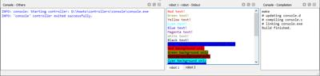

# Version R2020b Released

By Olivier Michel - 29th July 2020

---

Webots R2020b is there! And it's packed with a bunch of new features, new models, improvements and, of course, bug fixes.

However, this article only lists some of the major changes.
Please refer to the [2020 changelog](../reference/changelog-r2020.md) for a comprehensive list of all changes.

---

## 4 New Robot Models

### Spot from Boston Dynamics

Play around with a simulated Spot robot from [Boston Dynamics](http://bostondynamics.com) in Webots.

%figure "Spot Model in Webots"

%end

### P-Rob 3 from F&P Robotics  

P-Rob 3 is a new collaborative robotic arm developed by [F&P Robotics](https://www.fp-robotics.com).

%figure "P-Rob 3 Model in Webots"

%end

### AT-ST Walker Robot Inspired from Star Wars

Matt Denton contributed a nice [demo](https://twitter.com/mantisrobot/status/1254693299702714369) of a two-legged robot inspired by the Star Wars AT-ST walker.

%figure "AT-ST walker in Webots"

%end

### Sprinter Van from Mercedes-Benz

And if you need to transport a few people in using an autonomous van, you will probably be interested by our brand new Sprinter van model from [Mercedes-Benz](https://www.mercedes-benz.com).

%figure "Sprinter Van Model in Webots"

%end

---

## ROS 2 & Webots

We are continuing to develop and improve the support for ROS 2 in Webots with now [11 Webots packages for ROS 2](https://discourse.ros.org/t/new-packages-and-patch-release-for-ros-2-foxy-fitzroy-2020-07-10/15348).
This version of Webots is fully compatible with the two latest versions of ROS 2:
  - [Eloquent Elusor](https://index.ros.org/doc/ros2/Releases/Release-Eloquent-Elusor)
  - [Foxy Fitzroy](https://index.ros.org/doc/ros2/Releases/Release-Foxy-Fitzroy)

See the [webots\_ros2 package documentation](http://wiki.ros.org/webots_ros2) for the installation and usage instructions.
Or, if you can't wait to see the latest features and supported robots, go directly to the [webots\_ros2 GitHub repository](https://github.com/cyberbotics/webots_ros2).

Moreover, we added a new API function to facilitate the integration with the ROS ecosystem.
The [wb\_robot\_get\_urdf](https://cyberbotics.com/doc/reference/robot#wb_robot_get_urdf) function allows users to retrieve a URDF model of a Webots robot.
This is useful, in particular, to display the robot in [RViz](http://wiki.ros.org/rviz).
We also improved the `ros_python` and `universal_robots_ros` ROS simulations to use extern controllers instead of embedding the ROS libraries and we enabled multi-robot ROS 2 simulations.
Last, but not least, Webots now fully supports the ENU [axes convention](https://en.wikipedia.org/wiki/Axes_conventions) which is the standard used in ROS as specified in [REP-0103](https://www.ros.org/reps/rep-0103.html#axis-orientation).

---

## Improved Console

The Webots [console](https://www.cyberbotics.com/doc/guide/the-console) was greatly improved to provide a clearer, easier to manage, text output and error log.
It is now possible to open several consoles.
A new popup menu allows you to select which kind of output is going to be displayed in each console.
This way robots may have their own console, the robot name prefix being removed from the console output.
Other consoles may display for example only the compilation results or only some Webots warnings.
Also, more ANSI control codes are now supported allowing you to output [colorful styled text](https://cyberbotics.com/doc/guide/controller-programming#console-output) from your controller in the Webots consoles.
This should make debugging your robot controllers easier and render the corresponding output more elegant.

%figure "Consoles in Webots"

%end

---

## New Appearances

To let you model more realistic robots and environments we expanded again our `PBRAppearance` library with new PROTO files.

| | | |
| :---: | :---: | :---: |
|  |  |  |
| [Marble](https://cyberbotics.com/doc/guide/appearances#marble) | [MetalStainlessSteelCable](https://cyberbotics.com/doc/guide/appearances#metalstainlesssteelcable) | [Pavement](https://cyberbotics.com/doc/guide/appearances#pavement) |
|  |  |   |
| [Plastic](https://cyberbotics.com/doc/guide/appearances#plastic) | [Parquetry](https://cyberbotics.com/doc/guide/appearances#parquetry) | [PerforatedMetal](https://cyberbotics.com/doc/guide/appearances#perforatedmetal) |
|  |  |  |
| [SolarCell](https://cyberbotics.com/doc/guide/appearances#solarcell) |  |  |

---

## Support for External 3D Mesh Files

A new [Mesh](https://cyberbotics.com/doc/reference/mesh) node was added to support the inclusion of a large variety of external 3D mesh files: [3D Studio mesh](https://wiki.fileformat.com/3d/3ds), [Blender](https://www.blender.org/), [Biovision Hierarchy](https://en.wikipedia.org/wiki/Biovision_Hierarchy), [Collada](https://en.wikipedia.org/wiki/COLLADA), [Filmbox](https://wiki.fileformat.com/3d/fbx/), [STL](https://en.wikipedia.org/wiki/STL_(file_format)), [Wavefront](https://wiki.fileformat.com/3d/obj), [X3D](https://www.web3d.org/getting-started-x3d).
It is also possible to [import](https://cyberbotics.com/doc/guide/the-user-interface#file-menu) such files as Webots primitives.

---

### MJPEG Simulation Streaming

The web interface of Webots now allows you to [stream](https://cyberbotics.com/doc/guide/web-streaming) a simulation as an MJPEG video stream.
The main advantages of this technology compared to the X3D mode, is that it loads faster and provides high fidelity images.
However, it requires higher bandwidth and server CPU/GPU power.

---

### Share your Project with the Community

We created a new [GitHub repository](https://github.com/cyberbotics/community-projects) for the community to share PROTO nodes, controllers, worlds, etc.
Your [contributions](https://github.com/cyberbotics/community-projects/blob/master/CONTRIBUTING.md) are welcome!

---

## Extra Goodies

Webots now supports Python 3.8 on all platforms (Windows, Linux and mac OS).

We added a new [documentation book](https://cyberbotics.com/doc/discord/index) that archives the [Discord chat](https://discordapp.com/invite/nTWbN9m) history so that you can better find answers to your Webots questions by searching the web.

Need a break? Go ahead and visit our brand new [break\_room](../guide/samples-environments.md#break_room-wbt) world.

**Go and [download](https://cyberbotics.com/#download) Webots R2020b today, so you don't miss out on all these great new features!**
