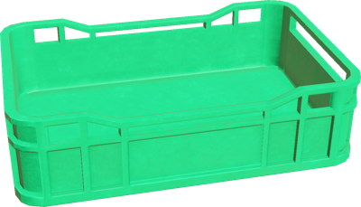
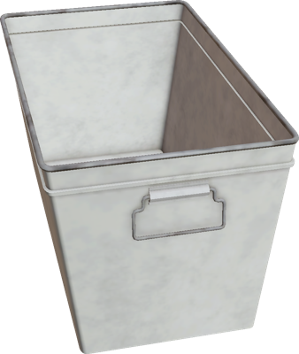

# Version R2021a Released

By Darko Lukic - 15th December 2020

---

Webots R2021a is there! And it's packed with some new features, improvements and, of course, bug fixes.

However, this article only lists some of the major changes.
Please refer to the [R2021 changelog](../reference/changelog-r2021.md) for a comprehensive list of all changes.

## Stars ⭐️ and Milestones 🎉

Webots GitHub repository has reached more than 1000 stars!
This is fantastic news for us as it shows that the Webots community has been growing ahead of our expectations.
It has been 2 years since we started the exciting open-source journey.
We are thankful to all contributors and partners who made the Webots open-source dream becomes a reality.

This year will be also remembered by other milestones:
- Our Discord community is now counting over 1000 members.
- The YouTube Cyberbotics channel has exceeded 1000 subscribers.
- The recently released Webots Docker container has yielded almost 5000 downloads.

----

## Camera Image Segmentation

Webots now is ready for your next deep learning project as it now supports [object recognition and segmentation](https://cyberbotics.com/doc/reference/camera#wb_camera_has_recognition)!

%figure "Image Segmentation"

%end

This new functionality reuses the existing camera recognition functionality to classify the objects in the scene based on the properties of the object instance.
This generic and customizable method allows the user to apply any type of segmentation: semantic, instance, or panoptic segmentation.
After setting the recognition property of an object, the object will be immediately displayed in the segmentation image.

---

## ROS 2 & Webots

We are continuing to develop and improve the support for ROS 2 in Webots with now [13 Webots packages for ROS 2](https://github.com/cyberbotics/webots\_ros2).
This version of Webots is fully compatible with [ROS 2 Foxy Fitzroy](https://index.ros.org/doc/ros2/Releases/Release-Foxy-Fitzroy).

- We are happy to participate in [Google Season of Docs](https://cyberbotics.com/gsod) this year!
Thanks to the [Soft illusion YouTube](https://www.youtube.com/channel/UCrl9pLcAAKy8wuXkN-on3xQ) channel a series of video tutorials about ROS 2 and Webots is now available.
Check [the playlist](https://www.youtube.com/playlist?list=PLt69C9MnPchkP0ZXZOqmIGRTOch8o9GiQ) and learn about ROS 2 basics, how to create a Webots ROS 2 driver, how to do SLAM, or follow AR tags.
- We also significantly enhanced and refactored our documentation for the [webots\_ros2](https://github.com/cyberbotics/webots\_ros2) package.
References, examples, and tutorials, are now gathered to [a single place](https://github.com/cyberbotics/webots\_ros2/wiki) with a clear overview.
- We improved the performance of the [Lidar](https://cyberbotics.com/doc/reference/lidar) node by over 7 times.
- The [InertialUnit](https://cyberbotics.com/doc/reference/inertialunit) node now returns quaternions making it easier to use in ROS 2 nodes.

---

## More Assets

In order to improve our asset library, we have added baskets that may be convenient for your next pick-and-place project.

| | |
| :---: | :---: |
|  |  |

---

## Webots GitHub Action

Running Webots simulations in GitHub's CI has never been easier!

%figure "Webots GitHub Action Image"

%end

Now, you can use [Webots GitHub Action](https://github.com/marketplace/actions/webots-animation) and in a few lines configure Webots to run your worlds in CI.

The GitHub action will automatically publish animation of your Webots simulations to [GitHub Pages](https://pages.github.com/), so you can share them easily with your peers.
In addition, you can integrate unit testing and run the tests every commit.

---

## Extra Goodies

Webots now supports Python 3.9 on all platforms (Windows, Linux, and macOS).

Devices added during the simulation run are available in the robot controller.
We believe this feature will be especially interesting for deep learning applications.

We also added [exposure control](https://cyberbotics.com/doc/reference/camera#wb_camera_get_exposure) to the [Camera](https://cyberbotics.com/doc/reference/camera) node.

**Go and [download](https://cyberbotics.com/#download) Webots R2021a today, so you don't miss out on all these great new features!**
