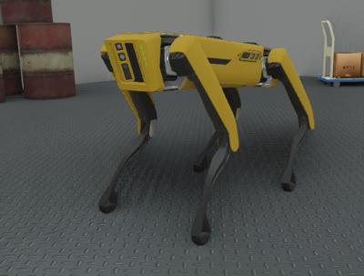

# Version R2021a Released

By Darko Lukic - **XX**th December 2020

---

Webots R2021a is there! And it's packed with a bunch of new features, new models, improvements and, of course, bug fixes.

However, this article only lists some of the major changes.
Please refer to the [2021 changelog](../reference/changelog-r2021.md) for a comprehensive list of all changes.

---

## x New Robot Models

### Spot from Boston Dynamics

Play around with a simulated [Spot robot](../guide/spot.md) from [Boston Dynamics](http://bostondynamics.com) in Webots.

%figure "Spot Model in Webots"

%end

---

## ROS 2 & Webots

We are continuing to develop and improve the support for ROS 2 in Webots with now [12 Webots packages for ROS 2](https://discourse.ros.org/t/new-packages-and-patch-release-for-ros-2-foxy-fitzroy-2020-07-10/15348).
This version of Webots is fully compatible with the two latest versions of ROS 2:
  - [Eloquent Elusor](https://index.ros.org/doc/ros2/Releases/Release-Eloquent-Elusor)
  - [Foxy Fitzroy](https://index.ros.org/doc/ros2/Releases/Release-Foxy-Fitzroy)

// performance improvement lidar and camera  

---

## Image Segmentation

---

## New Appearances

To let you model more realistic robots and environments we expanded again our `PBRAppearance` library with new PROTO files.

| | | |
| :---: | :---: | :---: |
|  |  |  |

---

## Image Segmentation

---

## Extra Goodies

Webots now supports Python 3.9 on all platforms (Windows, Linux and mac OS).

**Go and [download](https://cyberbotics.com/#download) Webots R2021a today, so you don't miss out on all these great new features!**
