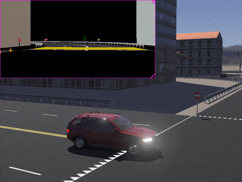

# Version R2021a Released

By Darko Lukic - **XX**th December 2020

---

Webots R2021a is there! And it's packed with some new features, improvements and, of course, bug fixes.

However, this article only lists some of the major changes.
Please refer to the [R2021 changelog](../reference/changelog-r2021.md) for a comprehensive list of all changes.

## Camera Image Segmentation

Webots now is ready for your next deep learning project as it now supports [object recognition and segmentation](https://cyberbotics.com/doc/reference/camera#wb_camera_has_recognition)!

%figure "Image Segmentation"

%end

This new functionality reuses the existing camera recognition functionality to classify the objects in the scene based on the properties of the object instance.
This generic and customizable method allows the user to apply any type of segmentation: semantic, instance, or panoptic seg-mentation.
Simply setting the recognition property at the object model layer, will generate a semantic segmentation.

---

## ROS 2 & Webots

We are continuing to develop and improve the support for ROS 2 in Webots with now [13 Webots packages for ROS 2](https://github.com/cyberbotics/webots\_ros2).
This version of Webots is fully compatible with [ROS 2 Foxy Fitzroy](https://index.ros.org/doc/ros2/Releases/Release-Foxy-Fitzroy).

- We are happy to participate in [Google Season of Docs](https://cyberbotics.com/gsod) this year!
Thanks to the [Soft illusion YouTube](https://www.youtube.com/channel/UCrl9pLcAAKy8wuXkN-on3xQ) channel a series of video tutorials about ROS2 and Webots is now available.
Check [the playlist](https://www.youtube.com/playlist?list=PLt69C9MnPchkP0ZXZOqmIGRTOch8o9GiQ) and learn about ROS2 basics, how to create a Webots ROS2 driver, how to do SLAM, or follow AR tags. 
- We also significantly enhanced and refactored our documentation for the [webots\_ros2](https://github.com/cyberbotics/webots\_ros2) package.
References, examples, and tutorials, are now gathered to [a single place](https://github.com/cyberbotics/webots\_ros2/wiki) with a clear overview.
- We improved the performances of the Lidar node by over 7 times.
- The InertialUnit node now returns quaternions making it easier to use in ROS2 nodes.

---

## More Assets

In order to improve our asset library, we have added baskets that may be convenient for your next pick-and-place project.

| | |
| :---: | :---: |
|  |  |

---

## Webots GitHub Action

Running Webots simulations in GitHub's CI has never been easier!

%figure "Webots GitHub Action"

%end

Now, you can use [Webots GitHub Action](https://github.com/marketplace/actions/webots-animation) and in a few lines configure Webots to run your worlds in CI.

The GitHub action will automatically publish animation of your Webots simulations to [GitHub Pages](https://pages.github.com/), so you can share them easily with your peers.
In addition, you can integrate unit testing and run the tests every commit.

---

## Extra Goodies

Webots now supports Python 3.9 on all platforms (Windows, Linux, and macOS).

**Go and [download](https://cyberbotics.com/#download) Webots R2021a today, so you don't miss out on all these great new features!**
