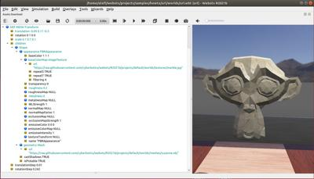
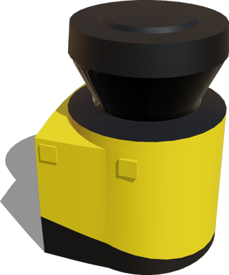

# Version R2021b Released

By Stefania Pedrazzi - 16th July 2021

---

It's that time of year again! Today we're happy to announce the release of Webots R2021b!
And it's packed with some new features, improvements and, of course, bug fixes.

Here we are going to present some of the main new features, but for a comprehensive list of changes please refer to the [ChangeLog](../reference/changelog-r2021.md).

## Improved Support for Reinforcement Learning

We added a set of new functionalities to make it easier to run reinforcement learning experiments.
Other than reducing the Webots package size to speed-up installation on servers and virtual containers, some additional Supervisor API functions to better manage the reset of the simulation has been included.
In particular, it is now possible to save the state of a given node and all its descendant nodes and restore it later during the simulation run or export a node definition as string to duplicate the node a later point.
Then, it is now also possible to artificially and immediately set the position of active and passive joints without having to activate the motor.

An example showing the integration of OpenAI Gym with Webots is now available in our samples library.

---

## Reduce Package Size

For this release we worked hard at finding solutions to reduce the size of the Webots installation packages.
To this end, we removed textures, meshes and sounds from the package.
These assets are now downloaded from the web only when needed and cached for subsequent use.

%figure "New URL Format "

%end

Additionally, we removed the offline documentation and other resources achieving the following results:

| OS | R2021a Package Size | R2021b Package Size |
| :---: | :---: | :---: |
| Windows | 1.65 GB | 448 MB |
| Linux | 1.45 GB | 263 MB |
| macOS | 1.42 GB | 226 MB |

---

## New Web Rendering Engine

Since the introduction of the web interface for streaming simulations and playing recorded animations, we struggled finding optimal parameters for shadows and illuminations that will reproduce exactly the same rendering as in the Webots Desktop application.
Finally, we decided to port our custom 3D renderer WREN to WebAssembly and use it for the web simulation interface in order to minimize the differences with the Desktop version and make it straightforward to run high quality simulations and animations on the web.

During this work, we also took the time to refresh and improve the graphical user interface.

%figure "New Web Simulation Interface"

%end

---

## Extended Motor and Joint Functionalities

The [Motor](../reference/motor.md) and [Joint](../reference/joint.md) nodes have been extended to provide more realistic simulations.

We enhanced the [Motor](../reference/motor.md) node to support coupled motors specifying the linked motor in the `name` field and setting their ratio using the new `multiplier` field.
This new functionality is particularly useful, for example, to simplify multi-fingered grippers.

Then, we added three new PROTO nodes. The `HingeJointWithBacklash` and `Hinge2JointWithBacklash` allow users to easily add a backlash effect in hinges. The `Gear` model can be used to simulate a collision-based transmission.

%figure "Coupled Motors with Gears. In this example gears are not physically enabled."

%end

---

## New Robot Models

We've added many new robot models in this release.

### Modular Mobile Platforms

We just added three new models of modular mobile platform robots used for logistic and indoor transport.
All these models have predefined fields to mount additional devices on the platform and front/back lidars.

| | | |
| :---: | :---: | :---: |
|  |  |  |
| Robotnik Summit-XL Steel | Mobile Industrial Robots MiR100 | REC Fabtino |

### Nyrio Ned

The Nyrio Ned is a 6-axis collaborative robot designed for teaching programming in an industrial environment.

### NVIDIA JetBot

The NVIDIA JetBot is an affordable two-wheeled robot based on the NVIDIA Jetson Nano board widely used in AI robotics applications.

%figure "JetBot in Webots"

%end

A standalone model of the NVIDIA Jetson Nano board is also available.

---

## New Sensors

The SICK S300 lidar model is now included in our sensors library.

%figure "SICK S300"

%end

Additionally, thanks to community contributor [sishamilton](https://github.com/sishamilton), Webots R2021b now provides a new [Altimeter](../reference/altimeter.md) sensor to determine the global altitude of a robot or robot part.
A sample usage of this new device can be found [here](../guide/samples-devices.md#altimeter-wbt).

---

## ROS 2 & Webots

We are continuing to develop and improve the support for ROS 2 in Webots with now 16 Webots packages for ROS 2.
This version of Webots is fully compatible with the two latest versions of ROS 2 and the rolling release:
- [Foxy Fitzroy](https://docs.ros.org/en/foxy/Releases/Release-Foxy-Fitzroy.html)
- [Galactic Geochelone](https://docs.ros.org/en/foxy/Releases/Release-Galactic-Geochelone.html)
- [Rolling Ridley](https://docs.ros.org/en/foxy/Releases/Release-Rolling-Ridley.html)

Check out the new packages we added:
- [`webots_ros2_tesla`](https://github.com/cyberbotics/webots_ros2/tree/master/webots_ros2_tesla): The package demonstrates a simulation of automobiles with Webots and ROS 2. The Tesla Model 3 vehicle follows lanes using a simple OpenCV image processing.
- [`webots_ros2_mavic`](https://github.com/cyberbotics/webots_ros2/tree/master/webots_ros2_mavic): The package demonstrates a simulation of drones with Webots and ROS 2. The DJI' Mavic 2 PRO drone uses a simple PD controller to follow the given [geometry\_msgs/Twist](https://docs.ros.org/en/noetic/api/geometry_msgs/html/msg/Twist.html) commands.
- [`webots_ros2_driver`](https://github.com/cyberbotics/webots_ros2/tree/master/webots_ros2_driver): A new Webots ROS 2 interface core designed for performance, extensibility with C++ plugins, and an easy configuration through URDF files.
- [`webots_ros2_control`](https://github.com/cyberbotics/webots_ros2/tree/master/webots_ros2_control): A `webots_ros2` plugin that integrates the [ros2\_control](https://ros-controls.github.io/control.ros.org/) framework. The plugin is featured in the [webots\_ros2\_turtlebot](https://github.com/cyberbotics/webots_ros2/tree/master/webots_ros2_turtlebot) package.

We haven't forgotten about the old good ROS 1.
It now integrates the [ros\_control](http://wiki.ros.org/ros_control) framework and you don't have to activate sensors with services anymore.
These improvements make Webots much simpler to integrate into ROS 1 applications.
We also included a Tiago example that features SLAM and MoveIt integration.

%figure "Webots integration with ROS, ros_control, gmapping, and MoveIt."

%end

---

## Extra Goodies

A new [Billboard](../reference/billboard.md) node has been introduced to display information in the main view regardless of the position and orientation of the viewpoint.

We added [JavaScript scripting support](../reference/javascript-procedural-proto.md) for procedural PROTO nodes in addition to LUA.

**Go and [download](https://cyberbotics.com/#download) Webots R2021b today, so you don't miss out on all these great new features!**

---

## Acknowledgements

The current release includes contributions from [Adman](https://github.com/Adman), [Aethor](https://github.com/Aethor), [AleBurzio11](https://github.com/AleBurzio11), [aykborstelmann](https://github.com/aykborstelmann), [angel-ayala](https://github.com/angel-ayala), [ar0usel](https://github.com/ar0usel), [bkpcoding](https://github.com/bkpcoding), [Behrouz-m](https://github.com/Behrouz-m), [BruceXSK](https://github.com/BruceXSK), [correll](https://github.com/correll), [DavidMansolino](https://github.com/DavidMansolino), [doggo4242](https://github.com/doggo4242), [Dorteel](https://github.com/Dorteel), [fmrico](https://github.com/fmrico), [it14149](https://github.com/it14149), [jmarsik](https://github.com/jmarsik), [kyax32](https://github.com/kyax32), [medrimonia](https://github.com/medrimonia), [NicolasGuy97](https://github.com/NicolasGuy97), [renan028](https://github.com/renan028), [ShuffleWire](https://github.com/ShuffleWire), [sigmunau](https://github.com/sigmunau), [Simon-Steinmann](https://github.com/Simon-Steinmann), [sishamilton](https://github.com/sishamilton) and [WasabiFan](https://github.com/WasabiFan).
Special thanks go to these contributors and the many other members of our community that have contributed by reporting issues, bugs or provided support and moderation in our [Discord](https://discord.com/invite/nTWbN9m) channel.
