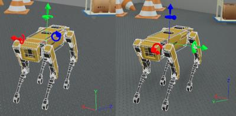
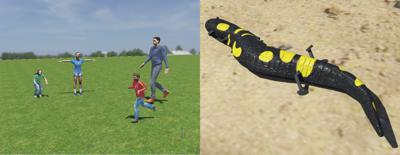

# Version R2022a Released

By Benjamin Délèze - 21th December 2021

---

It's that time of year again! Today we're happy to announce the release of Webots R2022a!
And it's packed with some new features, improvements and, of course, bug fixes.

Here we are going to present some of the main new features, but for a comprehensive list of changes please refer to the [ChangeLog](../reference/changelog-r2022.md).

## Conversion to FLU/ENU

### What is FLU/ENU?

**FLU and ENU are conventions for axis systems.**

Before, Webots was using **NUE** as the global coordinate system and we switched it to be new **ENU** by default.

**NUE** means _North_ along the _X_-positive axis, _Up_ along the _Y_-positive axis and _East_ along the _Z_-positive axis.

**ENU** means _East_ along the _X_-positive axis, _North_ along the _Y_-positive axis and _Up_ along the _Z_-positive axis

In addition, **the object's axis system of Webots is now FLU** (_x-**F**orward, y-**L**eft, z-**U**p_). Whereas before there was no real preferred object's axis system.

%figure "On the left, Webots R2021b, on the right Webots R2022a"

%end

### Why These Changes?

ENU and FLU are the most widely used axis conventions in robotics, including ROS and ROS2.

More and more people are using Webots with ROS2 and we changed the axis convention of Webots to make it easier for them !

### What Changed?

We worked hard to convert all PROTOs and worlds distributed with Webots for you, so that they are ready to use in R2022a.

A mechanism of backward compatibility has been implemented directly in Webots.
Unfortunately, it was not possible to make it work in every cases.
It will try to convert worlds and PROTOs at runtime, but PROTO changes cannot be saved.
We also wrote a [guide](https://cyberbotics.com/doc/guide/from-2021b-to-2022a) to help you convert your own PROTOs and worlds to use them in Webots R2022a.

We are aware that it is a major change and it can be annoying to convert your worlds and PROTOs to the new format.
However, it is a worthwhile effort, especially if you work with ROS.

---

## Skin Node

A new node, the [Skin](../reference/skin.md) node has been introduced to simulate soft mesh animation.
This is particularly useful to simulate humans or animals.

%figure "Skin examples"

%end

---

## Improving User Interface

Several improvement enhanced the user experience:

  - Rotating objects directly in the scene is now easier than before.
  - The zooming speed has been adjusted to make the navigation more pleasant.
  - Webots now displays a warning when a user attempts to add a node in an already started simulation.
  - The **night theme** is now the default theme on Linux.

---

## ROS and ROS 2

The Webots ROS and ROS 2 interfaces were maintained and updated to benefit from the new features of Webots R2022a, such as the ENU/FLU orientations, the Skin node and the GPS speed vector.
A new version of the `webots_ros` package was released for [noetic](https://index.ros.org/p/webots_ros/#noetic).

In addition to this, the Webots ROS 2 interface was fully redesigned to be more user friendly and scalable.
The `webots_ros2_driver` sub-package replaces the previous `webots_ros2_core` sub-package, which is now obsolete.
This new sub-package automatically creates a ROS 2 interface out of a Webots robot model, allowing users to configure the ROS 2 interface in URDF files.
Moreover, users can extend the interface by creating C++ (with [pluginlib](https://github.com/ros/pluginlib/tree/ros2) plugin mechanism) or Python plugins.
The [ROS 2 tutorials](https://github.com/cyberbotics/webots_ros2/wiki/Tutorials) were updated accordingly and further developed.
New versions of the `webots_ros2` ROS package were released for [foxy](https://index.ros.org/p/webots_ros2/#foxy), [galactic](https://index.ros.org/p/webots_ros2/#galactic) and [rolling](https://index.ros.org/p/webots_ros2/#rolling).

Check out the major package improvements and new packages:
- [`webots_ros2_tiago`](https://github.com/cyberbotics/webots_ros2/tree/master/webots_ros2_tiago): The simulation with the [TIAGo](https://pal-robotics.com/robots/tiago/) robot is enhanched so the robot can navigate autonomously using the [Navigation2](https://navigation.ros.org/) package.
- [`webots_ros2_universal_robot`](https://github.com/cyberbotics/webots_ros2/tree/master/webots_ros2_universal_robot): The Universal Robot simulation is also enchanched and it now integrates the [MoveIt2](https://moveit.ros.org/) package.
- [`webots_ros2_tests`](https://github.com/cyberbotics/webots_ros2/tree/master/webots_ros2_tests): We added over 20 system tests to minimize the number of bugs. The package is also a great demonstration of running Webots simulation and ROS 2 nodes in [CI](https://en.wikipedia.org/wiki/Continuous_integration).

---

## Extra Goodies

The performance on [Lidar](../reference/lidar.md) point cloud generation has been greatly improved.

[ContactProperties](../reference/contactproperties.md) now support a new type of friction: **rolling friction**.

**Go and [download Webots R2022a](https://cyberbotics.com/#download) today, so you don't miss out on all these great new features!**

---

## Acknowledgements

The current release includes contributions from [Ayk Borstelmann](https://github.com/aykborstelmann), [CoreCode](https://github.com/core-code), [dzyGIT](https://github.com/dzywater), [Justin-Fisher](https://github.com/Justin-Fisher), [KNTRL9](https://github.com/KNTRL9), [Laurent Lessieux](https://github.com/llessieux), [maciejlichon](https://github.com/maciejlichon), [Oleg Elifantiev](https://github.com/Olegas), [ShuffleWire](https://github.com/ShuffleWire), [Stefan Arndt](https://github.com/stef264), [Snow1](https://github.com/lixk28), [Thomas Feldmeier](https://github.com/Thomas-Feldmeier) and [Tim Clephas](https://github.com/Timple).
Special thanks go to these contributors and the many other members of our community who have contributed by reporting issues, bugs or provided support and moderation in our [Discord](https://discord.com/invite/nTWbN9m) channel.

The development of Webots is also partially supported by several European research projects, including [OpenDR](https://opendr.eu) and [OPTIMA](https://optima-hpc.eu), the [SimGait](https://simgait.org) Swiss national research project, the [SeRoNet](https://www.seronet-projekt.de) German national reseach project, the [RoboCup federation](https://robocup.org) and many other private and academic partners.
