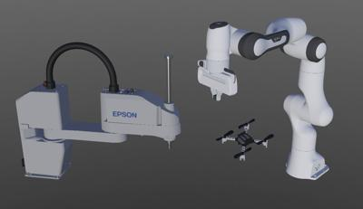
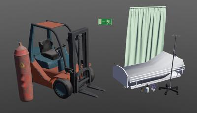
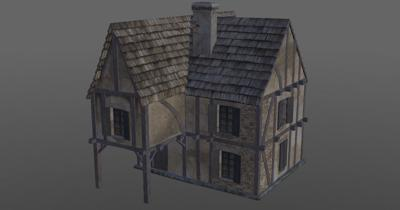

# Version R2022b Released

By Daniel Dias - 13th September 2022

---

It is that time of year again!
Today we are happy to announce the release of Webots R2022b!
This new version is packed with some new features, improvements and, of course, bug fixes.
But it doesn't come alone.
Simultaneously we are releasing [webots.cloud](https://webots.cloud), an open-source webservice to share your simulations online.

Here we are going to present some of the main new features, but for a comprehensive list of changes please refer to the [Change Log](../reference/changelog-r2022.md).

## New Robots

New robot models have been added to the Webots library, the [Crazyflie](../guide/crazyflie.md) quadrotor from [Bitcraze](https://www.bitcraze.io/).
The [Franka Emika](https://www.franka.de/)'s [Panda](../guide/panda.md) robot comes with the [PandaHand](../guide/panda.md#panda-hand) gripper.
Last but not least, Webots finally includes a SCARA-type robot, namely the [SCARA T6](../guide/scara-epson-t6.md) from [Epson](https://epson.com/For-Work/Robots/SCARA/Synthis-T6-All-in-One-SCARA-Robots/p/RT6-602SS).

%figure "Scara T6, Panda and Crazyflie"

%end

You can discover these new robots by exploring the corresponding demo worlds under `File > Open Sample World`.

---

## New Assets

Additional models have been added to the Webots library, namely hospital-themed objects, gas canister and a static forklift.

%figure "New objects"

%end

Two new appearances have also been included, namely [WornBurlap](../guide/appearances.md#wornburlap) and [ScuffedPlastic](../guide/appearances.md#scuffedplastic).

%figure "New appearances"

%end

And finally the "music hall" background was introduced.

---

## webots.cloud

[webots.cloud](https://webots.cloud) is an open-source webservice to share simulations online.
You can share 3D scenes and animations recorded from simulations, but also fully interactive simulations.

### Publish 3D Scenes and Animations

Webots R2022b now includes a "share" button that allows you to upload a 3D scene or an animation on webots.cloud.
This is useful to show models of robots, sensors, actuators, objects, environments or simulation recording play-back to colleagues or to the wide public.
Once your scene or animation is uploaded, you get a link (web URL) pointing to your upload, which you can share.
Anyone with this link can view your 3D scene or animation with a simple mouse click.

### Publish Cloud-Based Simulations

It is also possible to run a Webots simulation in webots.cloud interactively.
In order to do this, your simulation files (worlds, textures, models, protos, controllers, plugins, etc.) should be hosted on a GitHub repository.
You can register this repository on [webots.cloud/simulation](https://webots.cloud/simulation), and get a link to your simulation running online.
Anyone with this link will be able to run your simulation with a simple mouse click.
Behind the scenes, webots.cloud will create a Docker container in a GPU instance, checkout your GitHub repo and run your simulation in there.
The 3D view will be displayed online, possibly with robot windows interactively displaying curves or sliders for changing some parameters online.
This tool could be used to publish open-science results where both reviewers and readers can reproduce your experimental setup with a simple mouse click.

### Demo

#### Scenes

- [Complete Apartment](https://webots.cloud/ScBs2O7)
- [Robotis OP2](https://webots.cloud/ScdAPg1)

#### Animations

- [PR2](https://webots.cloud/AcpeTj6)
- [Nao room](https://webots.cloud/AcTNYs0)

#### Simulations

- [OroBOT Simulation](https://webots.cloud/run?version=R2022b&url=https://github.com/cyberbotics/orobot/blob/main/worlds/OroBOT_uneven.wbt)
- [Spot Simulation](https://webots.cloud/run?version=R2022b&url=https://github.com/cyberbotics/webots-cloud-simulation-examples/blob/main/2_compile_controller/worlds/spot.wbt)

---

## Controller Improvements

Several improvements have been introduced in the way controllers communicate with Webots.
Until now, `<extern>` controllers had to be run in the same machine as the simulation, with R2022b however this is no longer the case and it is now possible for the controller to be run over TCP.
Using the `WEBOTS_CONTROLLER_URL` variable one can specify the URL in the format `<protocol>://<machine_ip>:<webots_port>/<robot_name>` where the supported protocols can be `ipc` for a local connection or `tcp` for a remote one.
Additionally, the way Webots communicates with controllers has been modified, relying on memory mapped files instead of shared memory, allowing for controllers to be run from a docker.
This change does not introduce any loss of performance.

---

## CadShape Node

Although it has always been possible to import 3d models in Webots, the process was not very streamlined.
One could import the 3d model with the similarly named menu option, this approach however often resulted in overly complicated node structures depending on the complexity and the sub-meshes the model was comprised of.
Alternatively one could do the process manually by creating a [Shape](../reference/shape.md) object by defining the geometry using a [Mesh](../reference/mesh.md) node and setting the appearance using a [PBRAppearance](../reference/pbrappearance.md) node, however this approach required using third party software to split the meshes.
The [CadShape](../reference/cadshape.md) node attempts to simplify this process.
When provided a 3d model in collada (.dae) or wavefront (.obj) format, it will generate the corresponding geometry and apply the correct material and texture to every sub-mesh.
The [CadShape](../reference/cadshape.md), as the name implies, is restricted by the same rules that apply to ordinary [Shape](../reference/shape.md) nodes with the sole exception that [CadShape](../reference/cadshape.md) cannot be used as bounding objects.

%figure "Example of model loaded using CadShape"

%end

---

## ROS2

With this release we are continuing to develop and improve the support for ROS 2 in Webots.
New features include:

- Added possibility of importing an URDF robot on the fly
- Added PointCloud2 support for RangeFinder device
- Use [CadShape](../reference/cadshape.md) node to represent visual properties with mesh
- Added support for humble and rolling

And many bug fixes.

---

## Extra Goodies

- A very requested feature, R2022b comes with native support for Apple M1 processors on macOS
- Robot windows now open in the browser
- A `File / New` menu item for the creation of PROTO files

**Go and [download Webots R2022b](https://cyberbotics.com/#download) today, so you do not miss out on all these great new features!**

---

## Acknowledgements

The current release includes contributions from [Alexander Stumpf](https://github.com/astumpf), [Draker](https://github.com/DrakerDG), [Thomas Feldmeier](https://github.com/Thomas-Feldmeier), [Lucas Waelti](https://github.com/LucasWaelti), [Frank Grimm](https://github.com/fgr), [Justin Fisher](https://github.com/Justin-Fisher), [HuNing He](https://github.com/FreshNing), [Kenji Brameld](https://github.com/ijnek), [Cuma Özavcı](https://github.com/CumaOzavci), [Christian Barcelo](https://github.com/BarceloChristian), [Kimberly McGuire](https://github.com/knmcguire), [Darko Lukić](https://github.com/lukicdarkoo), [TaoYibo](https://github.com/TaoYibo1866), [zegang](https://github.com/zegangYang), [BruceXSK](https://github.com/BruceXSK) and [Frederik](https://github.com/TheMangalex).
Special thanks go to these contributors and the many other members of our community who have contributed by reporting issues, bugs or provided support and moderation in our [Discord](https://discord.com/invite/nTWbN9m) channel.

The development of Webots is also partially supported by several European research projects, including [OpenDR](https://opendr.eu) and [OPTIMA](https://optima-hpc.eu), the [SimGait](https://simgait.org) Swiss national research project and many other private and academic partners.
