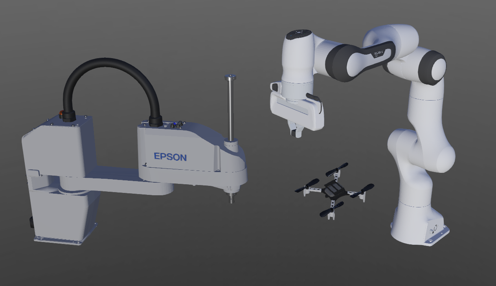

# Version R2022b Released

By Daniel Dias - Xth June 2022

---

It is that time of year again! Today we are happy to announce the release of Webots R2022b!
And it is packed with some new features, improvements and, of course, bug fixes.

Here we are going to present some of the main new features, but for a comprehensive list of changes please refer to the [ChangeLog](../reference/changelog-r2022.md).

## New Robots

New robot models have been added to the Webots library, the [Crazyflie](../guide/crazyflie.md) quadrotor from [Bitcraze](https://www.bitcraze.io/).
[Franka Emika](https://www.franka.de/)'s [Panda](../guide/panda.md) robot that comes with the [PandaHand](../guide/panda.md#panda-hand) gripper.
Last but not least, Webots finally includes a SCARA-type robot, namely the [SCARA T6](../guide/scara-epson-t6.md) from [Epson](https://epson.com/For-Work/Robots/SCARA/Synthis-T6-All-in-One-SCARA-Robots/p/RT6-602SS).

%figure "Scara T6, Panda and Crazyflie"

%end

You can discover these new robots by exploring the corresponding demo worlds under `File > Open Sample World`.

---

## New Assets

Additional models have been added to the Webots library, namely hospital-themed objects, gas canister and a static forklift.

%figure "New objects"

%end

Two new appearances have also been included, namely [WornBurlap](../guide/appearances.md#wornburlap) and [ScuffedPlastic](../guide/appearances.md#scuffedplastic).

%figure "New appearances"

%end

And finally the "music hall" background was introduced.

---

## Webots.cloud

TODO: add description
TODO: add links to demo scenes/animations/simulations

---

## Controller Improvements

Several improvements have been introduced in the way controllers communicate with Webots.
Until now, `<extern>` controllers had to be run in the same machine as the simulation, with R2022b however this is no longer the case and it is now possible for the controller to be run over TCP.
Using the `WEBOTS_CONTROLLER_URL` variable one can specify the url in the format `<protocol>://<machine_ip>:<webots_port>/<robot_name>` where the supported protocols can be `ipc` for a local connection or `tcp` for a remote one.
Additionally, the way Webots communicates with controllers has been modified, relying on memory mapped files instead of shared memory, allowing for controllers to be run from a docker.
The change does not introduce a loss of performance.

---

## CadShape Node

Although it has always been possible to import 3d models in Webots, the process was not very streamlined.
One could import the 3d model with the similarly named menu option, this approach however often resulted in overly complicated node structures depending on the complexity and the sub-meshes the model was comprised of.
Alternatively one could do the process manually by creating a [Shape](../reference/shape.md) object by defining the geometry using a [Mesh](../reference/mesh.md) node and setting the appearance using a [PBRAppearance](../reference/pbrappearance.md) node.
This process was not without issues either, as the 3d models can often be fairly complex and be comprised of multiple sub-meshes and textures that one had to split using third party software prior to using it in Webots.
The [CadShape](../reference/cadshape.md) node attempts to simplify this process.
When provided a 3d model in collada (.dae) or wavefront (.obj) format, it will generate the corresponding geometry and apply the correct material and texture to every sub-mesh.
The [CadShape](../reference/cadshape.md), as the name implies, is restricted by the same rules that apply to ordinary [Shape](../reference/shape.md) nodes with the sole exception that [CadShape](../reference/cadshape.md) cannot be used as bounding objects.
The reason is that using meshes as bounding objects is not considered good practice.

TODO: add picture example

---

## ROS/ROS2

---

## Extra Goodies

- A very requested feature, R2022b comes with native support for Apple M1 processors on macOS
- Robot windows now open in the browser
- A Wizard for the creation of PROTO files

**Go and [download Webots R2022b](https://cyberbotics.com/#download) today, so you do not miss out on all these great new features!**

---

## Acknowledgements

The current release includes contributions from
Special thanks go to these contributors and the many other members of our community who have contributed by reporting issues, bugs or provided support and moderation in our [Discord](https://discord.com/invite/nTWbN9m) channel.

The development of Webots is also partially supported by several European research projects, including [OpenDR](https://opendr.eu) and [OPTIMA](https://optima-hpc.eu), the [SimGait](https://simgait.org) Swiss national research project and many other private and academic partners.
