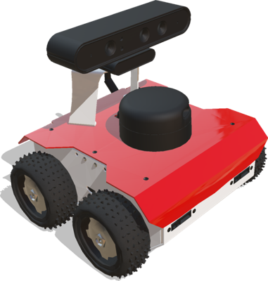

# Version R2023a Released

By Yannick Goumaz - 29th November 2022

---

It is that time of the year again!
Today we are happy to announce the release of Webots R2023a!
This new version is packed with some new features, improvements and, of course, bug fixes.

Here we are going to present some of the main new features, but for a comprehensive list of changes please refer to the [Change Log](../reference/changelog-r2023.md).

## New Robot

A new robot model has been added to the Webots library.
The ROS-based four-wheeled ROSbot robot from [Husarion](https://husarion.com/) is now included in Webots.

%figure "ROSbot"

%end

You can discover this new robot in its demo world under `File > Open Sample World > rosbot.wbt`.

---

## New Device Objects

Devices embedded on the ROSbot have also been added to the Webots library, namely the Mpu-9250 IMU, the RPLidarA2 lidar and the Astra RGB-D camera.

%figure "New devices"

%end

---

## New Assets

Additional models have been added to the Webots library, namely static animals (cow, horse, deer, sheep, dog, fox, cat and rabbit) and a barn.

%figure "New objects"

%end

---

## New Python API

Webots R2023a comes with a brand new Python API!
This API has the advantage of being compatible with all Python distributions (including conda, anaconda, etc.).
The API will always be compatible with current and upcoming Python versions.

This change of API does not induce any change to the methods.
Python controllers developed before Webots R2023a are fully compatible with this new version.

Moreover, in order to enrich the collection of sample controllers, all sample worlds of the device nodes provide an additional Python controller equivalent to the C controller already included to demonstrate the usage of the API functions.

---

## New IMU Sample World

So far, the [InertialUnit](../reference/inertialunit.md) was considered as an IMU, because it provides the ground truth data of the attitude (roll, pitch, yaw) of the object on which it is inserted.
This assumption is fundamentally wrong.
An IMU gives the raw values of its sensors ([Accelerometer](../reference/accelerometer.md), [Gyroscope](../reference/gyro.md), [Compass](../reference/compass.md)) and can optionally provide the attitude output computed from the fusion of its sensors.
The [InertialUnit](../reference/inertialunit.md) just makes life easier for the user who does not want to use a sensor fusion library or algorithm to combine the data from an IMU and compute the attitude.

In addition to the implementation of the Mpu-9250 IMU, Webots R2023a contains a new sample world that demonstrates a simple algorithm for calculating the attitude of a robot from the sensors of an IMU.
The results of the latter are compared to the values given by the [InertialUnit](../reference/inertialunit.md).

You can explore this new sample world in its demo world under `File > Open Sample World > imu.wbt`.

---

## ROS2

With this release we are continuing to develop and improve the support for ROS 2 in Webots.
New features include:

- Added support for Windows Subsystem for Linux (WSL) and macOS.
- Added reset handler to all examples of [`webots_ros2`](https://github.com/cyberbotics/webots_ros2) to support simulation reset from Webots.

And many bug fixes.

---

## Extra Goodies

- A new non-interactive terminal for web streaming.
- The possibility to choose between spherical and cylindrical projections in [Camera](../reference/camera.md) and [RangeFinder](../reference/rangefinder.md) nodes.

**Go and [download Webots R2023a](https://cyberbotics.com/#download) today, so you do not miss out on all these great new features!**

---

## Acknowledgements

The current release includes contributions from [Samuel Howell](https://github.com/RugnirViking), [Frederik](https://github.com/TheMangalex), [ShuffleWire](https://github.com/ShuffleWire), [Kouga](https://github.com/tsubota-kouga) and [Toshiharu Tabuchi](https://github.com/toshiharutf).
Special thanks go to these contributors and the many other members of our community who have contributed by reporting issues, bugs or provided support and moderation in our [Discord](https://discord.com/invite/nTWbN9m) channel.

The development of Webots is also partially supported by several European research projects, including [OpenDR](https://opendr.eu) and [OPTIMA](https://optima-hpc.eu), the [SimGait](https://simgait.org) Swiss national research project and many other private and academic partners.
