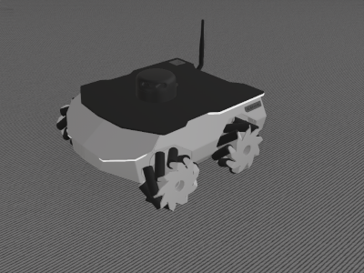
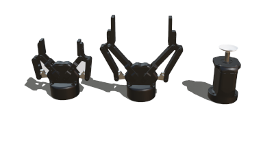

# Version R2023b Released

By Benjamin Délèze - 28th June 2023

---

It is that time of the year again!
Today we are happy to announce the release of Webots R2023b!
This new version is packed with some new features, improvements and, of course, bug fixes.

Here we are going to present some of the main new features, but for a comprehensive list of changes please refer to the [Change Log](../reference/changelog-r2023.md).

## New Robot

A new robot model has been added to the Webots library.
The ROS-based four-wheeled ROSbot XL robot from [Husarion](https://husarion.com/) is now included in Webots.

%figure "ROSbot XL"

%end

You can discover this new robot in its demo world under `File > Open Sample World > rosbot_xl.wbt`.

---

## New Device Objects

Several [Robotiq](https://robotiq.com/) grippers have also been added to the Webots library, namely the 2F-85 and the 2F-140 parallel grippers as well as the EPick vacuum gripper.

%figure "New devices"

%end

---

## Changes for Solid Nodes

In this new version, we removed the `scale` field from [Solid](../reference/solid.md) and its descendants.

This decision was taken because the `scale` field was causing incoherent behavior in solid, devices and robot nodes as it makes no real sense to scale a sensor or a bounding object.

To compensate, we introduced a new node: [Pose](../reference/pose.md) which is the new parent of [Solid](../reference/solid.md). Basically, a [Pose](../reference/pose.md) is a [Transform](../reference/transform.md) without scale.

[Transform](../reference/transform.md) can still be used to scale geometries but not anymore in boundingObjects and it cannot contain any Solid or descendants of Solid like Device and Robot.

A mecanism has been implemented in Webots to automatically convert the Transform in Pose when you open your world except for the case where the scale is not the default one.

If you want to convert your PROTO models, you can use [this script](https://github.com/cyberbotics/webots/blob/develop/scripts/converter/convert_transform_to_pose.py).

---

## New Device Node

A new node has been added to Webots: the [vacuum gripper](../reference/vacuumgripper.md)

You can see this new node at work in its demo world under `File > Open Sample World > vacuum_gripper.wbt`.

---

## Launcher for Extern Controller

A new launcher is now available to run extern controllers.
The launcher takes care of setting all environment variables based on the options specified, the platform and the type of controller being executed.

All options and instructions on how to use this new launcher are available in the [User Guide](../guide/running-extern-robot-controllers.md).

---

## Overhaul of the PROTOs Documentation

All the documentation concerning robots, sensors, actuators and objects have been moved to [webots.cloud](https://webots.cloud/proto).

It is now easier to navigate through the PROTOs, moreover you can also change and test the parameters of PROTOs directly online.

You can also add your own PROTO models to the library so that everybody can use them.

Read more about the new documentation system for PROTOs [here](https://cyberbotics.com/doc/guide/webots-cloud?#share-and-use-your-proto).

---

## ROS2

With this release we continued to develop and improve the support for ROS 2 in Webots.
New features include:

- Added support for ROS 2 Iron Irwini.
- Added an interface for new devices: VacuumGripper, Pen, Compass, Emitter and Receiver.
- Added a new node to start nodes only when Webots is ready.
- Added a new node to start robot plugins in a cleaner way.
- Added a new TIAGo launch file for full configuration.

And many bug fixes.
You can see all the changes in the [main changelog](https://github.com/cyberbotics/webots_ros2/blob/master/webots_ros2/CHANGELOG.rst) of the package.

---

## Extra Goodies

- A [new script](https://github.com/cyberbotics/webots/tree/master/scripts/proto_formatter), integrable in VS Code, to correct the indentation of your PROTO files.
- Robots' grippers now use coupled motors.

**Go and [download Webots R2023b](https://cyberbotics.com/#download) today, so you do not miss out on all these great new features!**

---

## Acknowledgements

The current release includes contributions from [Daniel Dias](https://github.com/ad-daniel), [Kimberly McGuire](https://github.com/knmcguire), [Chandan Bharadwaj](https://github.com/Chandan-Bharadwaj), [Songyang Zhao](https://github.com/songyangZhao), [ShuffleWire](https://github.com/ShuffleWire), [Jakub Delicat](https://github.com/delihus), [Léo Duggan](https://github.com/Jean-Eudes-le-retour), [nilsjor](https://github.com/nilsjor), [Simon Gene Gottlieb](https://github.com/SGSSGene), [Tsubasaya](https://github.com/Minimerl), [Dean Brettle](https://github.com/brettle), [Chirath Pansilu](https://github.com/ChirathPansilu), [fparat](https://github.com/fparat), [Gaël Écorchard](https://github.com/galou), [Ian Burwell](https://github.com/IanBurwell), [Stephan Kunz](https://github.com/stepkun), [Kode Creer](https://github.com/kodecreer), [Toshiharu Tabuchi](https://github.com/toshiharutf), [Justin Beri](https://github.com/justinberi), [DrakerDG](https://github.com/DrakerDG), [Jolon Behrent](https://github.com/JolonB), [Darko Lukić](https://github.com/lukicdarkoo), [Angel Ayala](https://github.com/angel-ayala), [Sebastian Ohl](https://github.com/sebastianohl), [GnSight](https://github.com/ftyghome) and [tantan](https://github.com/naos080415).

Special thanks go to these contributors and the many other members of our community who have contributed by reporting issues, bugs or provided support and moderation in our [Discord](https://discord.com/invite/nTWbN9m) channel.

The development of Webots is also partially supported by several European research projects, including [OpenDR](https://opendr.eu) and [OPTIMA](https://optima-hpc.eu), the [SimGait](https://simgait.org) Swiss national research project and many other private and academic partners.
