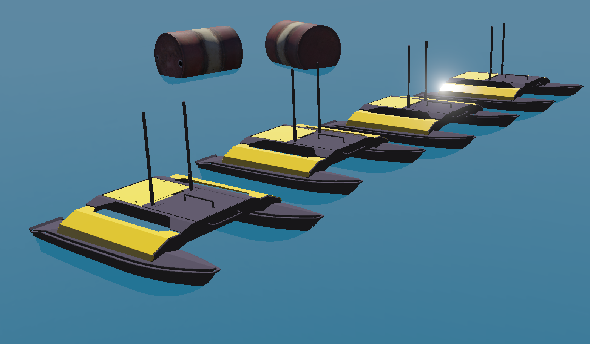

# Version R2025a Released

By Milos Nikolic - 31st January 2025

<!--  -->
---

It is that time of the year again!
Today we are happy to announce the release of Webots R2025a!
This new version is packed with some new features, improvements and, of course, bug fixes.

Here we are going to present some of the main new features, but for a comprehensive list of changes please refer to the [Change Log](../reference/changelog-r2025.md).

## New Robot

A new robot model has been added to the Webots library.
The Heron USV robot from [Clearpath Robotics](https://clearpathrobotics.com/) is now included in Webots.

%figure "Heron USV"

%end

You can discover this new robot in its demo world under `File > Open Sample World > ocean.wbt/swarm.wbt`.

---

## Introducing the W3D Format

Webots 2025a introduces the new `w3d` format, replacing the outdated `x3d` format to simplify simulation workflows.

This update aligns Webots, WebotsJS, and webots.cloud, offering a unified and consistent export system for various elements like sensors, actuators, and visual components.

The transition also removes VRML support, replacing `vrmlField` with `w3dField` for cleaner integration and simplified export processes.

Additionally, the Surveyor robot is enhanced with tracks and an updated controller. These changes make the Webots ecosystem more robust, scalable, and easier to use.

---

## Improvement to the Supervisor API

A new feature enhances the Supervisor API by allowing direct access to internal fields of a PROTO hierarchy.

This includes new functions such as `wb_supervisor_proto_get_field` and `wb_supervisor_proto_get_number_of_fields`, enabling introspection and manipulation of nested PROTO parameters.

Additionally, several existing API methods were renamed for clarity, minimizing the impact on existing controllers. This improvement streamlines simulation control and introspection, making it easier for developers to interact with complex PROTO structures.

All the changes are available in the [Supervisor API](https://cyberbotics.com/doc/reference/supervisor).

---

## ROS and ROS 2

With the deprecation of the `webots_ros` package and the upcoming End of Life (EOL) for ROS 1 Noetic in [May 2025](https://wiki.ros.org/Distributions), we strongly encourage our users to transition to ROS 2 for a more future-proof and robust robotics experience.

If you still require ROS 1 support with Webots, we have got you covered!
We offer a convenient Docker-based solution. Learn more and get started [here](https://github.com/cyberbotics/webots_ros/tree/develop/docker).

We now support the newly released **ROS 2 Jazzy Jalisco** while dropping support for **ROS 2 Iron Irwini**, ensuring compatibility with the latest ROS 2 developments.

### New Demos

**[Husarion ROSbot and ROSbot XL](https://husarion.com/).**
This demo showcases a versatile robotic platform for autonomous navigation and research.
The demo demonstrates usage of the `robot_localization` package for sensor fusion.

%figure "Husarion ROSbot XL"

%end

**[Crazyflie](https://www.bitcraze.io/products/old-products/crazyflie-2-1/).**
A lightweight, agile drone platform designed for indoor exploration.
This demo demonstrates PID control implementation using a Webots ROS 2 plugin.

%figure "Crazyflie"

%end

The packages should be available after ROS 2 sync under name `ros-${ROS_DISTRO}-webots-ros2-crazyflie` and `ros-${ROS_DISTRO}-webots-ros2-husarion`.

For a detailed overview of all the changes, check out the [main changelog](https://github.com/cyberbotics/webots_ros2/blob/master/webots_ros2/CHANGELOG.rst) for the `webots_ros2` package.

---

## Extra Goodies

Webots is now compatible with Ubuntu 24.04 "Noble Numbat" and macOS 14 "Sonoma".

**Go and [download Webots R2025a](https://cyberbotics.com/#download) today, so you do not miss out on all these great new features!**

---

## Acknowledgements

The current release includes contributions from [Abdulrasheed Fawole](https://github.com/Abdulrasheed1729), [Adrián Matejov](https://github.com/Adman), [Andreas Merkle](https://github.com/BlueAndi), [Anthony Welte](https://github.com/TonyWelte), [Benjamin Délèze](https://github.com/BenjaminDeleze), [CoolSpy3](https://github.com/CoolSpy3), [Darko Lukić](https://github.com/lukicdarkoo), [Dean Brettle](https://github.com/brettle), [Elecia White](https://github.com/eleciawhite), [Etaash Mathamsetty](https://github.com/Etaash-mathamsetty), [Frederik](https://github.com/FrederikBark), [FrogGuaGuaGua](https://github.com/FrogGuaGuaGua), [Gabryel Reyes](https://github.com/gabryelreyes), [Gaël Écorchard](https://github.com/galou), [harunkurtdev](https://github.com/harunkurtdev), [Kimberly McGuire](https://github.com/knmcguire), [Koen Yskout](https://github.com/koenyskout), [lonely-poppy](https://github.com/lonely-poppy), [matl-hsk](https://github.com/matl-hsk), [MNikoliCC](https://github.com/MNikoliCC), [nilsjor](https://github.com/nilsjor), [Norbert Schulz](https://github.com/nhjschulz), [Olivier Michel](https://github.com/omichel), [Omar Safwat](https://github.com/amoor22), [ShuffleWire](https://github.com/ShuffleWire), [Stefania Pedrazzi](https://github.com/stefaniapedrazzi), [Survy Vaish](https://github.com/SarvagyaVaish), [Valeriy Van](https://github.com/valeriyvan), [Yan](https://github.com/AntaresMKII), [Yannick Goumaz](https://github.com/ygoumaz), and [YSFツ](https://github.com/yousefbilal).

Special thanks go to these contributors and the many other members of our community who have contributed by reporting issues, bugs or provided support and moderation in our [Discord](https://discord.com/invite/nTWbN9m) channel.

The development of Webots is also partially supported by several European research projects, including [OpenDR](https://opendr.eu) and [OPTIMA](https://optima-hpc.eu), the [SimGait](https://simgait.org) Swiss national research project and many other private and academic partners.
