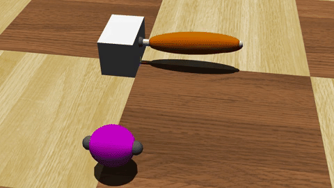
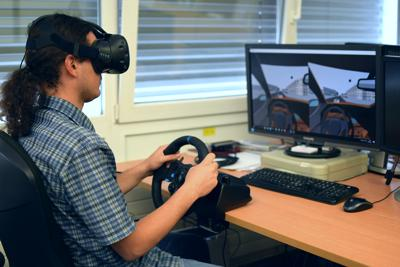
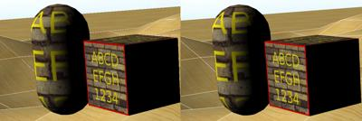

# Version 8.6.0 Released

By Tom Norton - 14th July 2017

---

Today we're happy to announce the release of Webots 8.6.0.
This new release brings a ton of new features and improvements, coupled with the same dedicated patches addressing bugs and regressions.
Listed below are some of the key features of this release (for a full list of changes please refer to the ChangeLog, found [here](../reference/changelog-8.md)).

## New Nodes

### Smart Cameras

It is now possible to add object recognition directly to a Camera using the Recognition node:

%figure "Robot Camera Object Recognition"

%end

The smart camera returns (in addition to the raw image) the list of recognized objects in the camera frame.
Each object will be defined by its relative position, relative orientation, size, position and size on the image, color list and model name.
It is also possible to configure the maximum detection range and maximum number of objects detected simultaneously.

### Muscles

You can now graphically represent the contraction and relaxation of an artificial muscle using the new Muscle node:

%figure "Muscles in Webots"

%end

These muscles are attached to an underlying LinearMotor or RotationalMotor node.
See the feature presentation [video](http://www.youtube.com/watch?v=pd0jD1TbJe4) for more details.

### Blinding Light

Add a LensFlare node to the Viewpoint or any robot camera to simulate glare from the sun:

%figure "Lens Flares"

%end

### Robots within Robots

After many requests from users, it is now possible to insert a Robot node as a descendant of another Robot in the scene tree.
This change adds a new concept to what the Robot node really represents; one can now think of a robot as being a closed system of devices, managed by a controller program.
For example, users may wish to embed a custom device on a humaniod robot.
Here is just one example of the possibilities this change introduces (Image courtesy of [Groupe INTRA](http://www.groupe-intra.com/fra)):

%figure "Radiometer Device Embedded On Tracked EOLE Robot"

%end

The Radiometer runs its own controller to calculate and display radiation levels in the environment, while the EOLE robot runs its own controller for all of its functions.
Now you can create any custom device using a Robot node with its own controller, and embed it in your main robot.

---

## Drive.

### VR

Thanks to Valve introducing OpenVR, you can now experience Webots automobile simulations in VR, putting yourself in the driver's seat.

%figure "HTC Vive headset with Logitech Racing Wheel Controller"

%end

### OSM

With Webots 8.6.0 our environment modelling tools are more advanced than ever.
We've overhauled our OpenStreetMap importer to make modelling real-world road networks and districts in Webots as quick and easy as possible, in even more detail and more accurately than before.
Here is a comparison between previously imported road structures and revamped import:

%figure "OSM Import in 8.5.0"

%end

%figure "Revamped OSM Import in 8.6.0"

%end

We have expanded our library of calibrated vehicles to include models from Lincoln and Range Rover as well as improving and optimizing our existing car models:

%figure "Left: Lincoln MKZ 2017. Right: RangeRover Sport SVR 2015."

%end

Traffic simulation workflow using our SUMO interface is now easier to use, thanks to our new SUMO exporter, letting you create a traffic network based on worlds brought in through the OSM importer.

---

## Interaction, Interaction, Interaction

### It's All Relative

This update also brings about numerous upgrades to user interaction.
Now the Viewpoint movement speed and zoom is always relative to scene geometry.
This means you can easily move around any world, big or small, with ease, from editing sensor positions on an E-puck to positioning buildings in a city simulation.

%figure "Fixed Zoom Speed (Left) vs Relative Zoom Speed (right)"

%end

### Needle in a Haystack

We have also added a new feature that makes scene navigation even easier; with one click of button you can center the view on any object you have selected, near or far:

%figure "The New 'Move to Viewpoint' feature in action"

%end

Now, even if you wish to find a small object nearby, or locate a car that has driven several miles away, one click is all it takes.
You can now even stop accidentally selecting purely visual objects by disabling picking for Shape nodes.
These are just some of the extra workflow improvements we are bringing with Webots 8.6.0.

---

## Better Visuals

### Smooth Edges

We've put work into improving the visual quality of simulations with this update.
Jagged edges are a thing of the past as Multi-Sample Anti-Aliasing (MSAA) support is now enabled in Webots.
MSAA smooths jagged edges of scene geometry for a nicer appearance:

%figure "The effect of MSAA"

%end

The default MSAA level is 2x, but via the preferences this can be increased to as much as 8x or disabled.

### Improved Texture Filtering

Textures can now be filtered using Anisotropic filtering techniques to avoid Moiré patterns and perspective Aliasing.
Here is a checkerboard floor seen from far without and with Anisotropic Filtering enabled:

%figure "Moiré patterns are eliminated with Anisotropic Filtering"

%end

---

## Extra Goodies

World loading time has been reduced by up to 50% on large worlds.

Users on Windows can now benefit from Microsoft text-to-speech technologies via the Speaker API.

The Supervisor API has been extended to perform various new actions, including restarting a robot's controller, getting mouse interactions, getting a node's DEF name, and interacting with the VR headset.

The Webots objects library has been further extended.
