## Actuators

Webots can simulate a lot of standard robotic actuators.
Using the nodes described [below](#generic-actuator-list) and their corresponding APIs is sufficient in most of the cases.

More specific actuators are built on the top of these generic nodes, thanks to the [PROTO system](../reference/proto.md).
These actuators are listed on [webots.cloud](https://webots.cloud/proto?keyword=actuator) under the *actuator* keyword.
They typically correspond to commercially available devices.

### Generic Actuator List

| Icon | Device | Description |
| :---: | --- | --- |
| 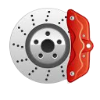 | [Brake](../reference/brake.md) | *Simulates a mechanical braking system.* |
| 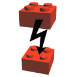 | [Connector](../reference/connector.md) | *Simulates a mechanical and breakable docking system.* |
| 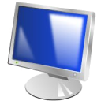 | [Display](../reference/display.md) | *Simulates a computer screen.* |
| 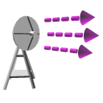 | [Emitter](../reference/emitter.md) | *Simulates radio, serial or infra-red emitters sending data to other robots.* |
| 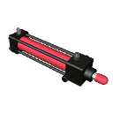 | [LinearMotor](../reference/linearmotor.md) | *Simulates a linear motor.* |
| 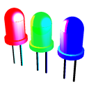 | [LED](../reference/led.md) | *Simulates a light emitting diode (LED).* |
| 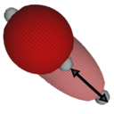 | [Muscle](../reference/muscle.md) | *Simulates the shape of an artificial muscle.* |
|  | [Pen](../reference/pen.md) | *Simulates a pen able to draw on any graphical geometric primitive.* |
| 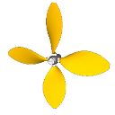 | [Propeller](../reference/propeller.md) | *Simulates a marine or aircraft propeller.* |
| 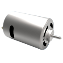 | [RotationalMotor](../reference/rotationalmotor.md) | *Simulates a rotational motor.* |
| 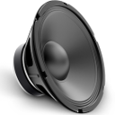 | [Speaker](../reference/speaker.md) | *Simulates a loudspeaker device.* |
| 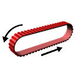 | [Track](../reference/track.md) | *Simulates a track for conveyor belts or tank robots.* |
