# Appearances
This chapter describes the list of available appearance PROTO nodes based on the [PBRAppearance](../reference/pbrappearance.md) node.

## Asphalt

An asphalt material. The color can be overridden using the `colorOverride` field. Useful with the `Road` PROTO.

%figure

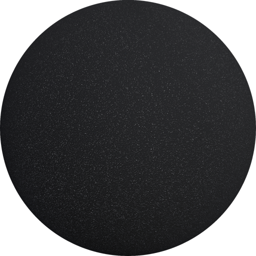

%end

```
Asphalt {
  SFColor colorOverride    1 1 1
  SFNode  textureTransform NULL
  SFFloat IBLStrength      1
}
```

> **File location**: "[WEBOTS\_HOME/projects/appearances/protos/Asphalt.proto]({{ url.github_tree }}/projects/appearances/protos/Asphalt.proto)"

> **License**: Apache License 2.0
[More information.](http://www.apache.org/licenses/LICENSE-2.0)

### Asphalt Field Summary

- `colorOverride`: Defines the default color multiplied with the texture color.

- `textureTransform`: Defines an optional 2d texture transform.

- `IBLStrength`: Defines the strength of ambient lighting from the [Background](../reference/background.md) node.

## BakelitePlastic

A bakelite plastic.

%figure

|     |     |
|:---:|:---:|
| 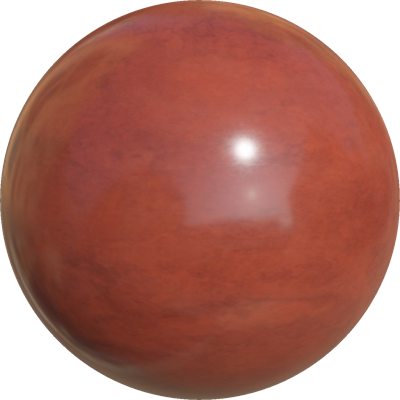 |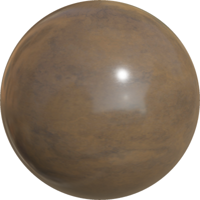 |

%end

```
BakelitePlastic {
  SFString  color            "red"
  SFNode    textureTransform NULL
  SFFloat   IBLStrength      1
}
```

> **File location**: "[WEBOTS\_HOME/projects/appearances/protos/BakelitePlastic.proto]({{ url.github_tree }}/projects/appearances/protos/BakelitePlastic.proto)"

> **License**: Apache License 2.0
[More information.](http://www.apache.org/licenses/LICENSE-2.0)

### BakelitePlastic Field Summary

- `color`: Defines the color of the plastic. This field accepts the following values: `"red"` and `"braun"`.

- `textureTransform`: Defines an optional 2d texture transform.

- `IBLStrength`: Defines the strength of ambient lighting from the [Background](../reference/background.md) node.

## BlanketFabric

A blanket fabric material.

%figure

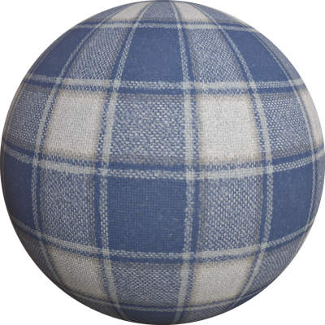

%end

```
BlanketFabric {
  SFColor colorOverride    1 1 1
  SFNode  textureTransform NULL
  SFFloat IBLStrength      1
}
```

> **File location**: "[WEBOTS\_HOME/projects/appearances/protos/BlanketFabric.proto]({{ url.github_tree }}/projects/appearances/protos/BlanketFabric.proto)"

> **License**: Apache License 2.0
[More information.](http://www.apache.org/licenses/LICENSE-2.0)

### BlanketFabric Field Summary

- `colorOverride`: Defines the default color multiplied with the texture color.

- `textureTransform`: Defines an optional 2d texture transform.

- `IBLStrength`: Defines the strength of ambient lighting from the [Background](../reference/background.md) node.

## BrushedAluminium

A brushed aluminum material.

%figure

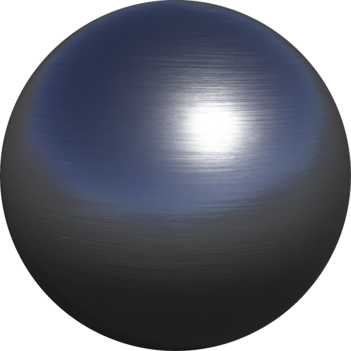

%end

```
BrushedAluminium {
  SFColor colorOverride    1 1 1
  SFNode  textureTransform NULL
  SFFloat IBLStrength      1
}
```

> **File location**: "[WEBOTS\_HOME/projects/appearances/protos/BrushedAluminium.proto]({{ url.github_tree }}/projects/appearances/protos/BrushedAluminium.proto)"

> **License**: Apache License 2.0
[More information.](http://www.apache.org/licenses/LICENSE-2.0)

### BrushedAluminium Field Summary

- `colorOverride`: Defines the default color multiplied with the texture color.

- `textureTransform`: Defines an optional 2d texture transform.

- `IBLStrength`: Defines the strength of ambient lighting from the [Background](../reference/background.md) node.

## BrushedSteel

A brushed steel material.

%figure

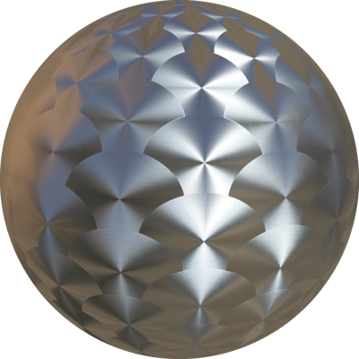

%end

```
BrushedSteel {
  SFColor colorOverride    1 1 1
  SFNode  textureTransform NULL
  SFFloat IBLStrength      1
}
```

> **File location**: "[WEBOTS\_HOME/projects/appearances/protos/BrushedSteel.proto]({{ url.github_tree }}/projects/appearances/protos/BrushedSteel.proto)"

> **License**: Apache License 2.0
[More information.](http://www.apache.org/licenses/LICENSE-2.0)

### BrushedSteel Field Summary

- `colorOverride`: Defines the default color multiplied with the texture color.

- `textureTransform`: Defines an optional 2d texture transform.

- `IBLStrength`: Defines the strength of ambient lighting from the [Background](../reference/background.md) node.

## CarpetFibers

A woolen carpet material.

%figure

|     |     |
|:---:|:---:|
|  |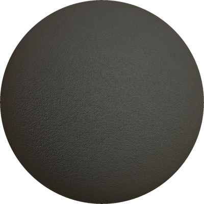 |
| 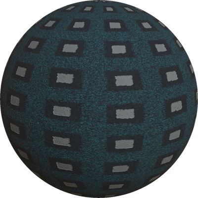 | |

%end

```
CarpetFibers {
  SFColor   colorOverride    1 1 1
  SFString  type             "wooly"
  SFNode    textureTransform NULL
  SFFloat   IBLStrength      1
}
```

> **File location**: "[WEBOTS\_HOME/projects/appearances/protos/CarpetFibers.proto]({{ url.github_tree }}/projects/appearances/protos/CarpetFibers.proto)"

> **License**: Apache License 2.0
[More information.](http://www.apache.org/licenses/LICENSE-2.0)

### CarpetFibers Field Summary

- `colorOverride`: Defines the default color multiplied with the texture color.

- `type`: Defines the carpet type. This field accepts the following values: `"wooly"`, `"synthetic"`, and `"pattern"`.

- `textureTransform`: Defines an optional 2d texture transform.

- `IBLStrength`: Defines the strength of ambient lighting from the [Background](../reference/background.md) node.

## CementTiles

A cement tiles material.

%figure

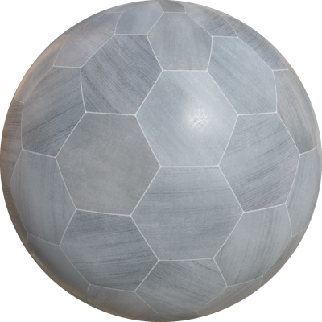

%end

```
CementTiles {
  SFColor colorOverride    1 1 1
  SFNode  textureTransform NULL
  SFFloat IBLStrength      1
}
```

> **File location**: "[WEBOTS\_HOME/projects/appearances/protos/CementTiles.proto]({{ url.github_tree }}/projects/appearances/protos/CementTiles.proto)"

> **License**: Apache License 2.0
[More information.](http://www.apache.org/licenses/LICENSE-2.0)

### CementTiles Field Summary

- `colorOverride`: Defines the default color multiplied with the texture color.

- `textureTransform`: Defines an optional 2d texture transform.

- `IBLStrength`: Defines the strength of ambient lighting from the [Background](../reference/background.md) node.

## Copper

A copper material.

%figure


%end

```
Copper {
  SFNode  textureTransform NULL
  SFFloat IBLStrength      1
}
```

> **File location**: "[WEBOTS\_HOME/projects/appearances/protos/Copper.proto]({{ url.github_tree }}/projects/appearances/protos/Copper.proto)"

> **License**: Apache License 2.0
[More information.](http://www.apache.org/licenses/LICENSE-2.0)

### Copper Field Summary

- `textureTransform`: Defines an optional 2d texture transform.

- `IBLStrength`: Defines the strength of ambient lighting from the [Background](../reference/background.md) node.

## CorrodedMetal

A corroded metal material. The color can be overridden using the `colorOverride` field.

%figure

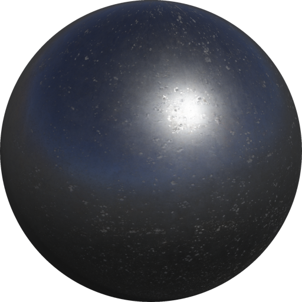

%end

```
CorrodedMetal {
  SFColor colorOverride    1 1 1
  SFNode  textureTransform NULL
  SFFloat IBLStrength      1
}
```

> **File location**: "[WEBOTS\_HOME/projects/appearances/protos/CorrodedMetal.proto]({{ url.github_tree }}/projects/appearances/protos/CorrodedMetal.proto)"

> **License**: Apache License 2.0
[More information.](http://www.apache.org/licenses/LICENSE-2.0)

### CorrodedMetal Field Summary

- `colorOverride`: Defines the default color multiplied with the texture color.

- `textureTransform`: Defines an optional 2d texture transform.

- `IBLStrength`: Defines the strength of ambient lighting from the [Background](../reference/background.md) node.

## CorrugatedMetal

A corrugated metal material. The color can be overridden using the `colorOverride` field.

%figure

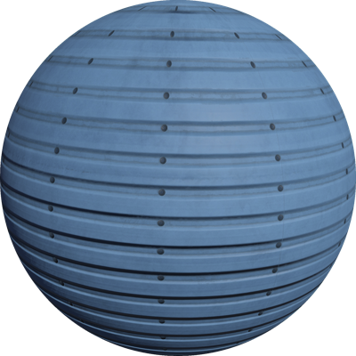

%end

```
CorrugatedMetal {
  SFColor colorOverride    1 1 1
  SFNode  textureTransform NULL
  SFFloat IBLStrength      1
}
```

> **File location**: "[WEBOTS\_HOME/projects/appearances/protos/CorrugatedMetal.proto]({{ url.github_tree }}/projects/appearances/protos/CorrugatedMetal.proto)"

> **License**: Apache License 2.0
[More information.](http://www.apache.org/licenses/LICENSE-2.0)

### CorrugatedMetal Field Summary

- `colorOverride`: Defines the default color multiplied with the texture color.

- `textureTransform`: Defines an optional 2d texture transform.

- `IBLStrength`: Defines the strength of ambient lighting from the [Background](../reference/background.md) node.

## CorrugatedPlates

A corrugated plates material. The color can be overridden using the `colorOverride` field.

%figure


%end

```
CorrugatedPlates {
  SFColor colorOverride    1 1 1
  SFNode  textureTransform NULL
  SFFloat IBLStrength      1
}
```

> **File location**: "[WEBOTS\_HOME/projects/appearances/protos/CorrugatedPlates.proto]({{ url.github_tree }}/projects/appearances/protos/CorrugatedPlates.proto)"

> **License**: Apache License 2.0
[More information.](http://www.apache.org/licenses/LICENSE-2.0)

### CorrugatedPlates Field Summary

- `colorOverride`: Defines the default color multiplied with the texture color.

- `textureTransform`: Defines an optional 2d texture transform.

- `IBLStrength`: Defines the strength of ambient lighting from the [Background](../reference/background.md) node.

## CorrugatedPvc

A corrugated PVC material. The color can be overridden using the `colorOverride` field.

%figure

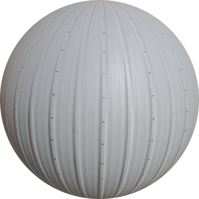

%end

```
CorrugatedPvc {
  SFColor colorOverride    1 1 1
  SFNode  textureTransform NULL
  SFFloat IBLStrength      1
}
```

> **File location**: "[WEBOTS\_HOME/projects/appearances/protos/CorrugatedPvc.proto]({{ url.github_tree }}/projects/appearances/protos/CorrugatedPvc.proto)"

> **License**: Apache License 2.0
[More information.](http://www.apache.org/licenses/LICENSE-2.0)

### CorrugatedPvc Field Summary

- `colorOverride`: Defines the default color multiplied with the texture color.

- `textureTransform`: Defines an optional 2d texture transform.

- `IBLStrength`: Defines the strength of ambient lighting from the [Background](../reference/background.md) node.

## DamascusSteel

A damascus steel material. The color can be overridden using the `colorOverride` field.

%figure

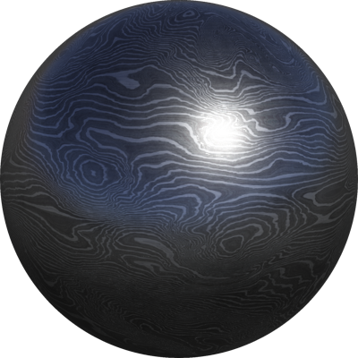

%end

```
DamascusSteel {
  SFColor colorOverride    1 1 1
  SFNode  textureTransform NULL
  SFFloat IBLStrength      1
}
```

> **File location**: "[WEBOTS\_HOME/projects/appearances/protos/DamascusSteel.proto]({{ url.github_tree }}/projects/appearances/protos/DamascusSteel.proto)"

> **License**: Apache License 2.0
[More information.](http://www.apache.org/licenses/LICENSE-2.0)

### DamascusSteel Field Summary

- `colorOverride`: Defines the default color multiplied with the texture color.

- `textureTransform`: Defines an optional 2d texture transform.

- `IBLStrength`: Defines the strength of ambient lighting from the [Background](../reference/background.md) node.

## DryMud

A dry mud material with cracks.

%figure

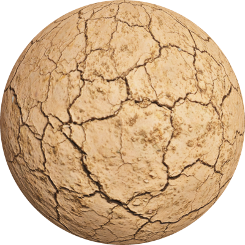

%end

```
DryMud {
  SFNode  textureTransform NULL
  SFFloat IBLStrength      1
}
```

> **File location**: "[WEBOTS\_HOME/projects/appearances/protos/DryMud.proto]({{ url.github_tree }}/projects/appearances/protos/DryMud.proto)"

> **License**: Apache License 2.0
[More information.](http://www.apache.org/licenses/LICENSE-2.0)

### DryMud Field Summary

- `textureTransform`: Defines an optional 2d texture transform.

- `IBLStrength`: Defines the strength of ambient lighting from the [Background](../reference/background.md) node.

## ElectricConduit

An electric conduit material. The color can be overridden using the `colorOverride` field.

%figure

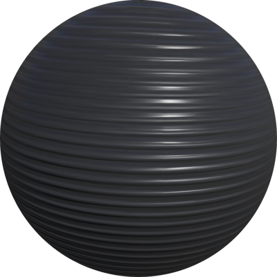

%end

```
ElectricConduit {
  SFColor colorOverride    1 1 1
  SFNode  textureTransform NULL
  SFFloat IBLStrength      1
}
```

> **File location**: "[WEBOTS\_HOME/projects/appearances/protos/ElectricConduit.proto]({{ url.github_tree }}/projects/appearances/protos/ElectricConduit.proto)"

> **License**: Apache License 2.0
[More information.](http://www.apache.org/licenses/LICENSE-2.0)

### ElectricConduit Field Summary

- `colorOverride`: Defines the default color multiplied with the texture color.

- `textureTransform`: Defines an optional 2d texture transform.

- `IBLStrength`: Defines the strength of ambient lighting from the [Background](../reference/background.md) node.

## FlexibleAluminiumDuct

A flexible aluminium duct material. The color can be overridden using the `colorOverride` field.

%figure

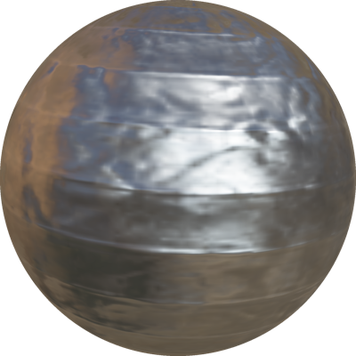

%end

```
FlexibleAluminiumDuct {
  SFColor colorOverride    1 1 1
  SFNode  textureTransform NULL
  SFFloat IBLStrength      1
}
```

> **File location**: "[WEBOTS\_HOME/projects/appearances/protos/FlexibleAluminiumDuct.proto]({{ url.github_tree }}/projects/appearances/protos/FlexibleAluminiumDuct.proto)"

> **License**: Apache License 2.0
[More information.](http://www.apache.org/licenses/LICENSE-2.0)

### FlexibleAluminiumDuct Field Summary

- `colorOverride`: Defines the default color multiplied with the texture color.

- `textureTransform`: Defines an optional 2d texture transform.

- `IBLStrength`: Defines the strength of ambient lighting from the [Background](../reference/background.md) node.

## FormedConcrete

A formed concrete material.

%figure


%end

```
FormedConcrete {
  SFNode  textureTransform NULL
  SFFloat IBLStrength      1
}
```

> **File location**: "[WEBOTS\_HOME/projects/appearances/protos/FormedConcrete.proto]({{ url.github_tree }}/projects/appearances/protos/FormedConcrete.proto)"

> **License**: Apache License 2.0
[More information.](http://www.apache.org/licenses/LICENSE-2.0)

### FormedConcrete Field Summary

- `textureTransform`: Defines an optional 2d texture transform.

- `IBLStrength`: Defines the strength of ambient lighting from the [Background](../reference/background.md) node.

## GalvanizedMetal

A galvanized metal material. The color can be overridden using the `colorOverride` field.

%figure

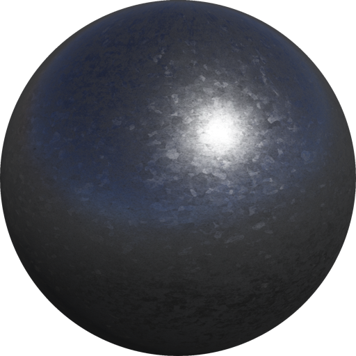

%end

```
GalvanizedMetal {
  SFColor colorOverride    1 1 1
  SFNode  textureTransform NULL
  SFFloat IBLStrength      1
}
```

> **File location**: "[WEBOTS\_HOME/projects/appearances/protos/GalvanizedMetal.proto]({{ url.github_tree }}/projects/appearances/protos/GalvanizedMetal.proto)"

> **License**: Apache License 2.0
[More information.](http://www.apache.org/licenses/LICENSE-2.0)

### GalvanizedMetal Field Summary

- `colorOverride`: Defines the default color multiplied with the texture color.

- `textureTransform`: Defines an optional 2d texture transform.

- `IBLStrength`: Defines the strength of ambient lighting from the [Background](../reference/background.md) node.

## GlossyPaint

A glossy paint material. The color can be selected in the `baseColor` field.

%figure

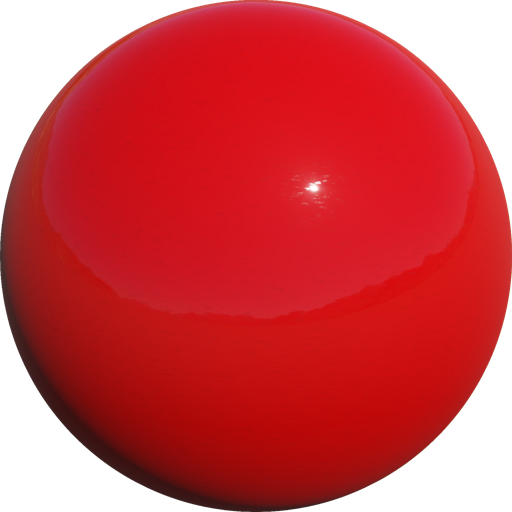

%end

```
GlossyPaint {
  SFColor baseColor        1 1 1
  SFNode  textureTransform TextureTransform { scale 10 10 }
  SFFloat IBLStrength      1
}
```

> **File location**: "[WEBOTS\_HOME/projects/appearances/protos/GlossyPaint.proto]({{ url.github_tree }}/projects/appearances/protos/GlossyPaint.proto)"

> **License**: Apache License 2.0
[More information.](http://www.apache.org/licenses/LICENSE-2.0)

### GlossyPaint Field Summary

- `baseColor`: Defines the paint's color.

- `textureTransform`: Defines an optional 2d texture transform.

- `IBLStrength`: Defines the strength of ambient lighting from the [Background](../reference/background.md) node.

## Grass

A grass material containing several grass types.

%figure

|     |     |
|:---:|:---:|
| 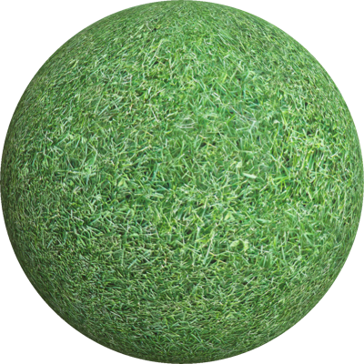 |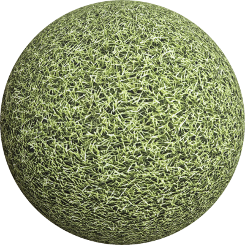 |
| 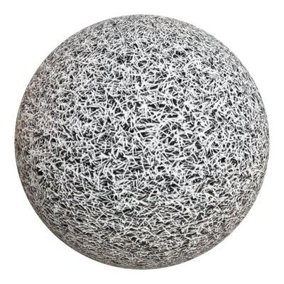 |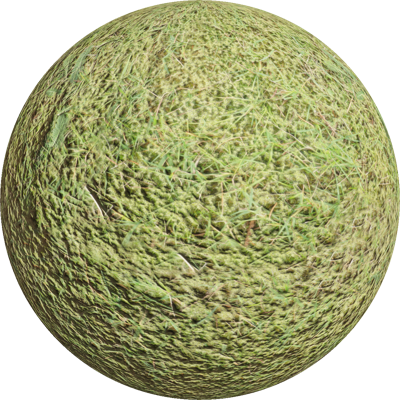 |

%end

```
Grass {
  SFColor  colorOverride    1 1 1
  SFString type             "maintained"
  SFNode   textureTransform NULL
  SFFloat  IBLStrength      1
}
```

> **File location**: "[WEBOTS\_HOME/projects/appearances/protos/Grass.proto]({{ url.github_tree }}/projects/appearances/protos/Grass.proto)"

> **License**: Apache License 2.0
[More information.](http://www.apache.org/licenses/LICENSE-2.0)

### Grass Field Summary

- `colorOverride`: Defines the default color multiplied with the texture color.

- `type`: Defines the grass type. This field accepts the following values: `"maintained"`, `"artificial"`, `"artificial_white" "prickly"`, and `"mossy"`.

- `textureTransform`: Defines an optional 2d texture transform.

- `IBLStrength`: Defines the strength of ambient lighting from the [Background](../reference/background.md) node.

## HammeredCopper

An hammered copper steel material. The color can be overridden using the `colorOverride` field.

%figure

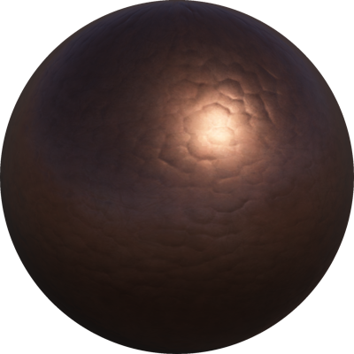

%end

```
HammeredCopper {
  SFColor colorOverride    1 1 1
  SFNode  textureTransform NULL
  SFFloat IBLStrength      1
}
```

> **File location**: "[WEBOTS\_HOME/projects/appearances/protos/HammeredCopper.proto]({{ url.github_tree }}/projects/appearances/protos/HammeredCopper.proto)"

> **License**: Apache License 2.0
[More information.](http://www.apache.org/licenses/LICENSE-2.0)

### HammeredCopper Field Summary

- `colorOverride`: Defines the default color multiplied with the texture color.

- `textureTransform`: Defines an optional 2d texture transform.

- `IBLStrength`: Defines the strength of ambient lighting from the [Background](../reference/background.md) node.

## Leather

A leather material. The color can be overridden using the `colorOverride` field.

%figure

|     |     |
|:---:|:---:|
| 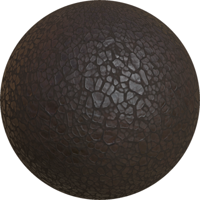 |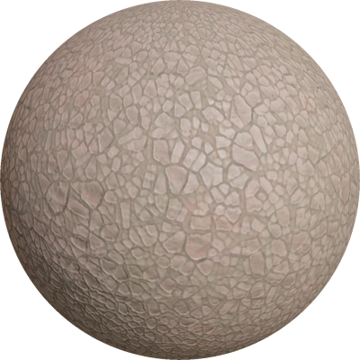 |
| 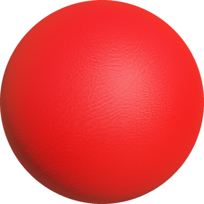 | |

%end

```
Leather {
  SFColor   colorOverride     1 1 1
  SFString  tone              "dark"
  SFString  type              "dollaro"
  SFNode    textureTransform  NULL
  SFFloat   IBLStrength       1
}
```

> **File location**: "[WEBOTS\_HOME/projects/appearances/protos/Leather.proto]({{ url.github_tree }}/projects/appearances/protos/Leather.proto)"

> **License**: Apache License 2.0
[More information.](http://www.apache.org/licenses/LICENSE-2.0)

### Leather Field Summary

- `colorOverride`: Defines the default color multiplied with the texture color.

- `tone`: Defines the tone of the leather. This field accepts the following values: `"dark"` and `"light"`.

- `type`: Defines the type of the leather. This field accepts the following values: `"dollaro"` and `"grain"`.

- `textureTransform`: Defines an optional 2d texture transform.

- `IBLStrength`: Defines the strength of ambient lighting from the [Background](../reference/background.md) node.

## LedStrip

A led strip material.

%figure


%end

```
LedStrip {
  SFColor colorOverride     1 1 1
  SFNode  textureTransform  NULL
  SFFloat IBLStrength       1
  SFFloat emissiveIntensity 1
}
```

> **File location**: "[WEBOTS\_HOME/projects/appearances/protos/LedStrip.proto]({{ url.github_tree }}/projects/appearances/protos/LedStrip.proto)"

> **License**: Apache License 2.0
[More information.](http://www.apache.org/licenses/LICENSE-2.0)

### LedStrip Field Summary

- `colorOverride`: Defines the default color multiplied with the texture color.

- `textureTransform`: Defines an optional 2d texture transform.

- `IBLStrength`: Defines the strength of ambient lighting from the [Background](../reference/background.md) node.

- `emissiveIntensity`: Defines the intensity of the leds.

## Marble

A beige marble material.

%figure


%end

```
Marble {
  SFColor colorOverride     1 1 1
  SFNode  textureTransform  NULL
  SFFloat IBLStrength       1
}
```

> **File location**: "[WEBOTS\_HOME/projects/appearances/protos/Marble.proto]({{ url.github_tree }}/projects/appearances/protos/Marble.proto)"

> **License**: Apache License 2.0
[More information.](http://www.apache.org/licenses/LICENSE-2.0)

### Marble Field Summary

- `colorOverride`: Defines the default color multiplied with the texture color.

- `textureTransform`: Defines an optional 2d texture transform.

- `IBLStrength`: Defines the strength of ambient lighting from the [Background](../reference/background.md) node.

## MarbleTiles

A marble tiles material.

%figure

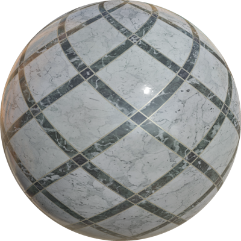

%end

```
MarbleTiles {
  SFColor colorOverride    1 1 1
  SFNode  textureTransform NULL
  SFFloat IBLStrength      1
}
```

> **File location**: "[WEBOTS\_HOME/projects/appearances/protos/MarbleTiles.proto]({{ url.github_tree }}/projects/appearances/protos/MarbleTiles.proto)"

> **License**: Apache License 2.0
[More information.](http://www.apache.org/licenses/LICENSE-2.0)

### MarbleTiles Field Summary

- `colorOverride`: Defines the default color multiplied with the texture color.

- `textureTransform`: Defines an optional 2d texture transform.

- `IBLStrength`: Defines the strength of ambient lighting from the [Background](../reference/background.md) node.

## MattePaint

A matte paint material. The color can be selected in the `baseColor` field.

%figure

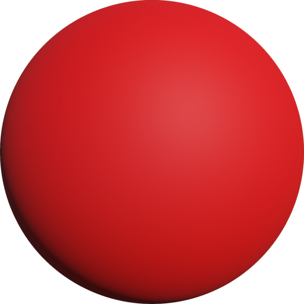

%end

```
MattePaint {
  SFColor baseColor        1 1 1
  SFNode  textureTransform TextureTransform { scale 10 10 }
  SFFloat IBLStrength      1
}
```

> **File location**: "[WEBOTS\_HOME/projects/appearances/protos/MattePaint.proto]({{ url.github_tree }}/projects/appearances/protos/MattePaint.proto)"

> **License**: Apache License 2.0
[More information.](http://www.apache.org/licenses/LICENSE-2.0)

### MattePaint Field Summary

- `baseColor`: Defines the paint's color.

- `textureTransform`: Defines an optional 2d texture transform.

- `IBLStrength`: Defines the strength of ambient lighting from the [Background](../reference/background.md) node.

## MetalPipePaint

A worn paint layer on a metal surface. Useful with the `PipeSection` PROTO or any painted industrial surfaces.

%figure

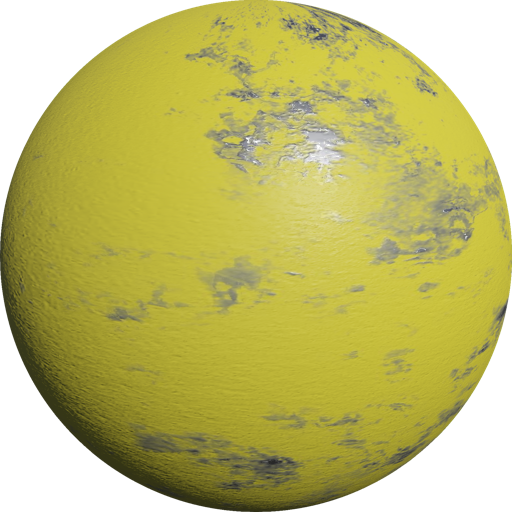

%end

```
MetalPipePaint {
  SFNode  textureTransform NULL
  SFFloat IBLStrength      1
}
```

> **File location**: "[WEBOTS\_HOME/projects/appearances/protos/MetalPipePaint.proto]({{ url.github_tree }}/projects/appearances/protos/MetalPipePaint.proto)"

> **License**: Apache License 2.0
[More information.](http://www.apache.org/licenses/LICENSE-2.0)

### MetalPipePaint Field Summary

- `textureTransform`: Defines an optional 2d texture transform.

- `IBLStrength`: Defines the strength of ambient lighting from the [Background](../reference/background.md) node.

## MetalStainlessSteelCable

A stainless steel cable appearance.

%figure


%end

```
MetalStainlessSteelCable {
  SFNode  textureTransform NULL
  SFFloat IBLStrength      1
}
```

> **File location**: "[WEBOTS\_HOME/projects/appearances/protos/MetalStainlessSteelCable.proto]({{ url.github_tree }}/projects/appearances/protos/MetalStainlessSteelCable.proto)"

> **License**: Apache License 2.0
[More information.](http://www.apache.org/licenses/LICENSE-2.0)

### MetalStainlessSteelCable Field Summary

- `textureTransform`: Defines an optional 2d texture transform.

- `IBLStrength`: Defines the strength of ambient lighting from the [Background](../reference/background.md) node.

## OldPlywood

An old plywood material.

%figure

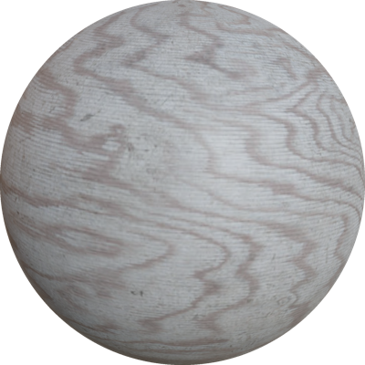

%end

```
OldPlywood {
  SFColor colorOverride    1 1 1
  SFNode  textureTransform NULL
  SFFloat IBLStrength      1
}
```

> **File location**: "[WEBOTS\_HOME/projects/appearances/protos/OldPlywood.proto]({{ url.github_tree }}/projects/appearances/protos/OldPlywood.proto)"

> **License**: Apache License 2.0
[More information.](http://www.apache.org/licenses/LICENSE-2.0)

### OldPlywood Field Summary

- `colorOverride`: Defines the default color multiplied with the texture color.

- `textureTransform`: Defines an optional 2d texture transform.

- `IBLStrength`: Defines the strength of ambient lighting from the [Background](../reference/background.md) node.

## OldSteel

An old battered steel material.

%figure

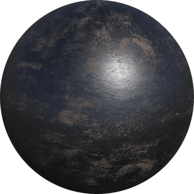

%end

```
OldSteel {
  SFColor colorOverride    1 1 1
  SFNode  textureTransform NULL
  SFFloat IBLStrength      1
}
```

> **File location**: "[WEBOTS\_HOME/projects/appearances/protos/OldSteel.proto]({{ url.github_tree }}/projects/appearances/protos/OldSteel.proto)"

> **License**: Apache License 2.0
[More information.](http://www.apache.org/licenses/LICENSE-2.0)

### OldSteel Field Summary

- `colorOverride`: Defines the default color multiplied with the texture color.

- `textureTransform`: Defines an optional 2d texture transform.

- `IBLStrength`: Defines the strength of ambient lighting from the [Background](../reference/background.md) node.

## OsbWood

An OSB wood material. The color can be overridden using the `colorOverride` field.

%figure

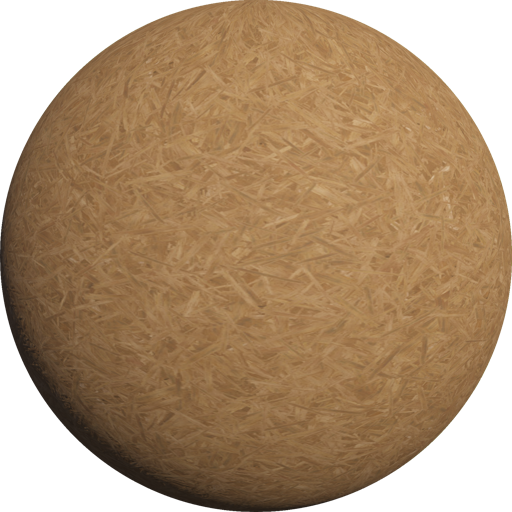

%end

```
OsbWood {
  SFColor colorOverride    1 1 1
  SFNode  textureTransform NULL
  SFFloat IBLStrength      1
}
```

> **File location**: "[WEBOTS\_HOME/projects/appearances/protos/OsbWood.proto]({{ url.github_tree }}/projects/appearances/protos/OsbWood.proto)"

> **License**: Apache License 2.0
[More information.](http://www.apache.org/licenses/LICENSE-2.0)

### OsbWood Field Summary

- `colorOverride`: Defines the default color multiplied with the texture color.

- `textureTransform`: Defines an optional 2d texture transform.

- `IBLStrength`: Defines the strength of ambient lighting from the [Background](../reference/background.md) node.

## PaintedWood

A painted wood material. The color can be overridden using the `colorOverride` field.

%figure

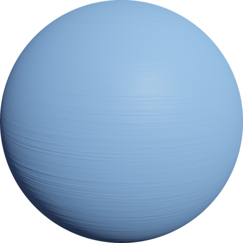

%end

```
PaintedWood {
  SFColor colorOverride    1 1 1
  SFNode  textureTransform NULL
  SFFloat IBLStrength      1
}
```

> **File location**: "[WEBOTS\_HOME/projects/appearances/protos/PaintedWood.proto]({{ url.github_tree }}/projects/appearances/protos/PaintedWood.proto)"

> **License**: Apache License 2.0
[More information.](http://www.apache.org/licenses/LICENSE-2.0)

### PaintedWood Field Summary

- `colorOverride`: Defines the default color multiplied with the texture color.

- `textureTransform`: Defines an optional 2d texture transform.

- `IBLStrength`: Defines the strength of ambient lighting from the [Background](../reference/background.md) node.

## Parquetry

A parquetry material.
The type of parquetry can be set using the `type` field.
The color can be overridden using the `colorOverride` field.

%figure

|     |     |
|:---:|:---:|
| 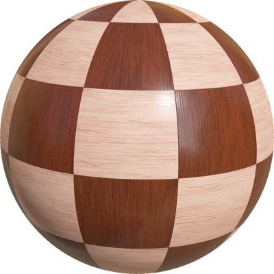 |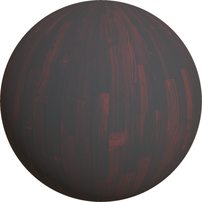 |
| 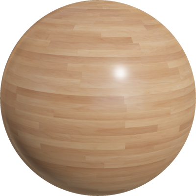 |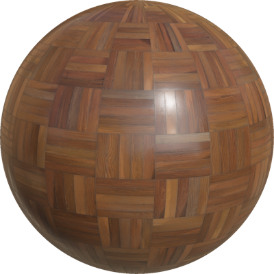 |

%end

```
Parquetry {
  SFString type             "mosaic"
  SFColor  colorOverride    1 1 1
  SFNode   textureTransform NULL
  SFFloat  IBLStrength      1
}
```

> **File location**: "[WEBOTS\_HOME/projects/appearances/protos/Parquetry.proto]({{ url.github_tree }}/projects/appearances/protos/Parquetry.proto)"

> **License**: Apache License 2.0
[More information.](http://www.apache.org/licenses/LICENSE-2.0)

### Parquetry Field Summary

- `type`: Defines the parquetry type. This field accepts the following values: `"chequered"`, `"dark strip"`, `"light strip"`, and `"mosaic"`.

- `colorOverride`: Defines the default color multiplied with the texture color.

- `textureTransform`: Defines an optional 2d texture transform.

- `IBLStrength`: Defines the strength of ambient lighting from the [Background](../reference/background.md) node.

## Pavement

A pavement material.
The type of pavement can be set using the `type` field.
The color can be overridden using the `colorOverride` field.

%figure

|     |     |
|:---:|:---:|
|  |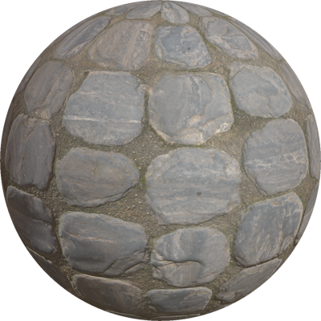 |
|  |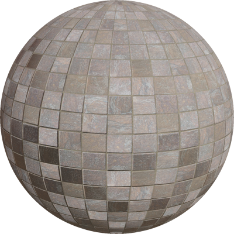 |
| 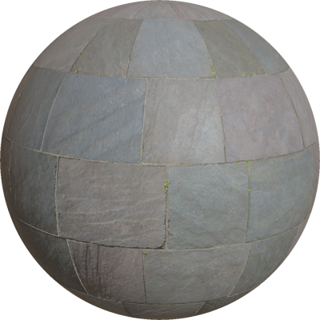 |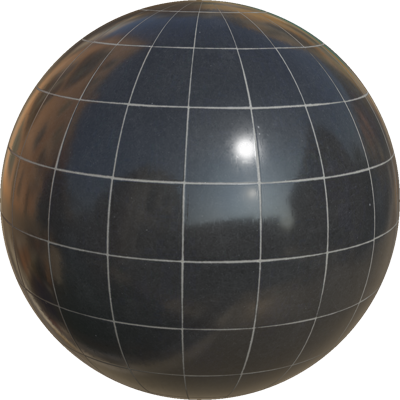 |

%end

```
Pavement {
  SFString type             "braun square stone"
  SFColor  colorOverride     1 1 1
  SFNode   textureTransform  NULL
  SFFloat  IBLStrength       1
}
```

> **File location**: "[WEBOTS\_HOME/projects/appearances/protos/Pavement.proto]({{ url.github_tree }}/projects/appearances/protos/Pavement.proto)"

> **License**: Apache License 2.0
[More information.](http://www.apache.org/licenses/LICENSE-2.0)

### Pavement Field Summary

- `type`: Defines the pavement type. This field accepts the following values: `"black stone"`, `"braun stone"`, `"braun square stone"`, `"grid"`, `"slate"`, and `"tiles"`.

- `colorOverride`: Defines the default color multiplied with the texture color.

- `textureTransform`: Defines an optional 2d texture transform.

- `IBLStrength`: Defines the strength of ambient lighting from the [Background](../reference/background.md) node.

## Pcb

A PCB material.

%figure


%end

```
Pcb {
  SFNode  textureTransform NULL
  SFFloat IBLStrength      1
}
```

> **File location**: "[WEBOTS\_HOME/projects/appearances/protos/Pcb.proto]({{ url.github_tree }}/projects/appearances/protos/Pcb.proto)"

> **License**: Apache License 2.0
[More information.](http://www.apache.org/licenses/LICENSE-2.0)

### Pcb Field Summary

- `textureTransform`: Defines an optional 2d texture transform.

- `IBLStrength`: Defines the strength of ambient lighting from the [Background](../reference/background.md) node.

## PerforatedMetal

A perforated metal material.

%figure

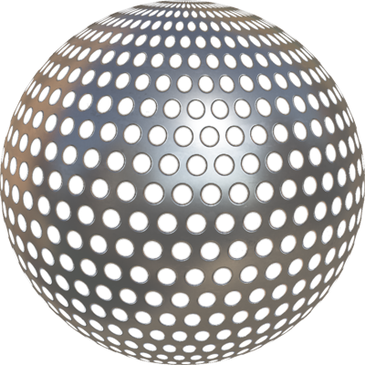

%end

```
PerforatedMetal {
  SFColor colorOverride    1 1 1
  SFNode  textureTransform NULL
  SFFloat IBLStrength      1
}
```

> **File location**: "[WEBOTS\_HOME/projects/appearances/protos/PerforatedMetal.proto]({{ url.github_tree }}/projects/appearances/protos/PerforatedMetal.proto)"

> **License**: Apache License 2.0
[More information.](http://www.apache.org/licenses/LICENSE-2.0)

### PerforatedMetal Field Summary

- `colorOverride`: Defines the default color multiplied with the texture color.

- `textureTransform`: Defines an optional 2d texture transform.

- `IBLStrength`: Defines the strength of ambient lighting from the [Background](../reference/background.md) node.

## Plaster

A plaster material. The color can be overridden using the `colorOverride` field.

%figure

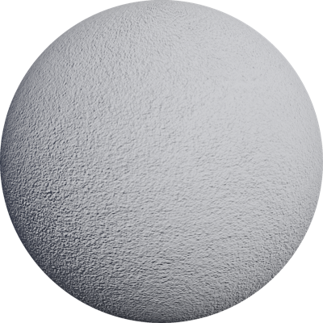

%end

```
Plaster {
  SFColor colorOverride    1 1 1
  SFNode  textureTransform NULL
  SFFloat IBLStrength      1
}
```

> **File location**: "[WEBOTS\_HOME/projects/appearances/protos/Plaster.proto]({{ url.github_tree }}/projects/appearances/protos/Plaster.proto)"

> **License**: Apache License 2.0
[More information.](http://www.apache.org/licenses/LICENSE-2.0)

### Plaster Field Summary

- `colorOverride`: Defines the default color multiplied with the texture color.

- `textureTransform`: Defines an optional 2d texture transform.

- `IBLStrength`: Defines the strength of ambient lighting from the [Background](../reference/background.md) node.

## Plastic

A plastic material containing several types.

%figure

|     |     |
|:---:|:---:|
|  |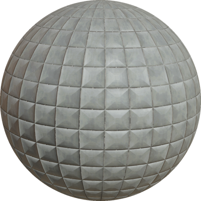 |

%end

```
Plastic {
  SFColor  colorOverride    1 1 1
  SFString type             "rough"
  SFNode   textureTransform NULL
  SFFloat  IBLStrength      1
}
```

> **File location**: "[WEBOTS\_HOME/projects/appearances/protos/Plastic.proto]({{ url.github_tree }}/projects/appearances/protos/Plastic.proto)"

> **License**: Apache License 2.0
[More information.](http://www.apache.org/licenses/LICENSE-2.0)

### Plastic Field Summary

- `colorOverride`: Defines the default color multiplied with the texture color.

- `type`: Defines the plastic type. This field accepts the following values: `"rough"` and `"padded"`.

- `textureTransform`: Defines an optional 2d texture transform.

- `IBLStrength`: Defines the strength of ambient lighting from the [Background](../reference/background.md) node.

## PorcelainChevronTiles

A porcelain chevron tiles material.

%figure


%end

```
PorcelainChevronTiles {
  SFColor colorOverride    1 1 1
  SFNode  textureTransform NULL
  SFFloat IBLStrength      1
}
```

> **File location**: "[WEBOTS\_HOME/projects/appearances/protos/PorcelainChevronTiles.proto]({{ url.github_tree }}/projects/appearances/protos/PorcelainChevronTiles.proto)"

> **License**: Apache License 2.0
[More information.](http://www.apache.org/licenses/LICENSE-2.0)

### PorcelainChevronTiles Field Summary

- `colorOverride`: Defines the default color multiplied with the texture color.

- `textureTransform`: Defines an optional 2d texture transform.

- `IBLStrength`: Defines the strength of ambient lighting from the [Background](../reference/background.md) node.

## RedBricks

A tiled brick material. Useful with the `Wall` PROTO.

%figure

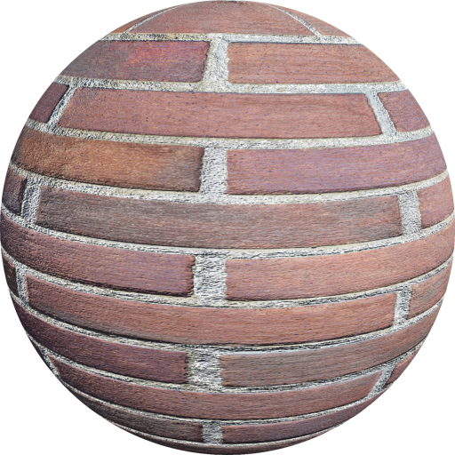

%end

```
RedBricks {
  SFNode  textureTransform NULL
  SFFloat IBLStrength      1
}
```

> **File location**: "[WEBOTS\_HOME/projects/appearances/protos/RedBricks.proto]({{ url.github_tree }}/projects/appearances/protos/RedBricks.proto)"

> **License**: Apache License 2.0
[More information.](http://www.apache.org/licenses/LICENSE-2.0)

### RedBricks Field Summary

- `textureTransform`: Defines an optional 2d texture transform.

- `IBLStrength`: Defines the strength of ambient lighting from the [Background](../reference/background.md) node.

## ReflectiveSurface

A reflective surface material.

%figure

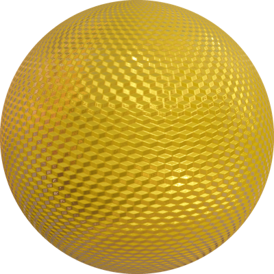

%end

```
ReflectiveSurface {
  SFFloat metalness         0.5
  SFColor emissiveColor     0 0 0
  SFFloat emissiveIntensity 1
  SFColor baseColorMap      1 1 1
  SFBool  useBaseColorMap   TRUE
  SFNode  textureTransform  NULL
  SFFloat IBLStrength       1
}
```

> **File location**: "[WEBOTS\_HOME/projects/appearances/protos/ReflectiveSurface.proto]({{ url.github_tree }}/projects/appearances/protos/ReflectiveSurface.proto)"

> **License**: Apache License 2.0
[More information.](http://www.apache.org/licenses/LICENSE-2.0)

### ReflectiveSurface Field Summary

- `useBaseColorMap`: Defines wheather the base color texture should be used or not.

- `textureTransform`: Defines an optional 2d texture transform.

- `IBLStrength`: Defines the strength of ambient lighting from the [Background](../reference/background.md) node.

## RoughConcrete

A rough concrete material. The color can be overridden using the `colorOverride` field.

%figure

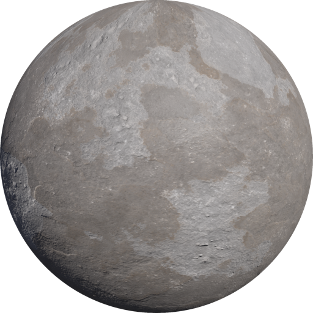

%end

```
RoughConcrete {
  SFColor colorOverride    1 1 1
  SFNode  textureTransform NULL
  SFFloat IBLStrength      1
}
```

> **File location**: "[WEBOTS\_HOME/projects/appearances/protos/RoughConcrete.proto]({{ url.github_tree }}/projects/appearances/protos/RoughConcrete.proto)"

> **License**: Apache License 2.0
[More information.](http://www.apache.org/licenses/LICENSE-2.0)

### RoughConcrete Field Summary

- `colorOverride`: Defines the default color multiplied with the texture color.

- `textureTransform`: Defines an optional 2d texture transform.

- `IBLStrength`: Defines the strength of ambient lighting from the [Background](../reference/background.md) node.

## RoughOak

A rough oak material. The color can be overridden using the `colorOverride` field.

%figure

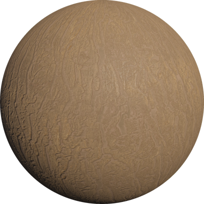

%end

```
RoughOak {
  SFColor colorOverride    1 1 1
  SFNode  textureTransform NULL
  SFFloat IBLStrength      1
}
```

> **File location**: "[WEBOTS\_HOME/projects/appearances/protos/RoughOak.proto]({{ url.github_tree }}/projects/appearances/protos/RoughOak.proto)"

> **License**: Apache License 2.0
[More information.](http://www.apache.org/licenses/LICENSE-2.0)

### RoughOak Field Summary

- `colorOverride`: Defines the default color multiplied with the texture color.

- `textureTransform`: Defines an optional 2d texture transform.

- `IBLStrength`: Defines the strength of ambient lighting from the [Background](../reference/background.md) node.

## RoughPine

A pine wood material. The color can be overridden using the `colorOverride` field.

%figure

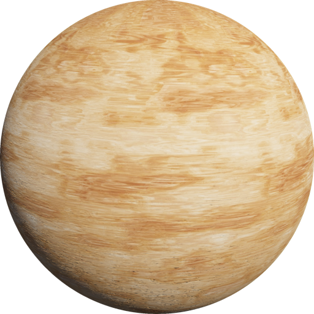

%end

```
RoughPine {
  SFColor colorOverride    1 1 1
  SFNode  textureTransform NULL
  SFFloat IBLStrength      1
}
```

> **File location**: "[WEBOTS\_HOME/projects/appearances/protos/RoughPine.proto]({{ url.github_tree }}/projects/appearances/protos/RoughPine.proto)"

> **License**: Apache License 2.0
[More information.](http://www.apache.org/licenses/LICENSE-2.0)

### RoughPine Field Summary

- `colorOverride`: Defines the default color multiplied with the texture color.

- `textureTransform`: Defines an optional 2d texture transform.

- `IBLStrength`: Defines the strength of ambient lighting from the [Background](../reference/background.md) node.

## RoughPolymer

A rough polymer material.

%figure


%end

```
RoughPolymer {
  SFColor baseColor        1 1 1
  SFNode  textureTransform NULL
  SFFloat IBLStrength      1
}
```

> **File location**: "[WEBOTS\_HOME/projects/appearances/protos/RoughPolymer.proto]({{ url.github_tree }}/projects/appearances/protos/RoughPolymer.proto)"

> **License**: Apache License 2.0
[More information.](http://www.apache.org/licenses/LICENSE-2.0)

### RoughPolymer Field Summary

- `baseColor`: Defines the base color of the material.

- `textureTransform`: Defines an optional 2d texture transform.

- `IBLStrength`: Defines the strength of ambient lighting from the [Background](../reference/background.md) node.

## Roughcast

A rough plaster material. Useful with the `Wall` PROTO.

%figure

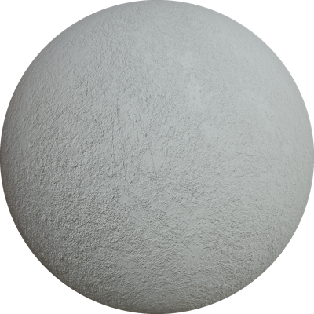

%end

```
Roughcast {
  SFColor colorOverride    1 1 1
  SFNode  textureTransform NULL
  SFFloat IBLStrength      1
}
```

> **File location**: "[WEBOTS\_HOME/projects/appearances/protos/Roughcast.proto]({{ url.github_tree }}/projects/appearances/protos/Roughcast.proto)"

> **License**: Apache License 2.0
[More information.](http://www.apache.org/licenses/LICENSE-2.0)

### Roughcast Field Summary

- `colorOverride`: Defines the default color multiplied with the texture color.

- `textureTransform`: Defines an optional 2d texture transform.

- `IBLStrength`: Defines the strength of ambient lighting from the [Background](../reference/background.md) node.

## Rubber

A rubber material.
The type of rubber can be set using the `type` field.

%figure

|     |     |
|:---:|:---:|
|  | |

%end

```
Rubber {
  SFString  type              "flat"
  SFNode    textureTransform  NULL
  SFFloat   IBLStrength       1
}
```

> **File location**: "[WEBOTS\_HOME/projects/appearances/protos/Rubber.proto]({{ url.github_tree }}/projects/appearances/protos/Rubber.proto)"

> **License**: Apache License 2.0
[More information.](http://www.apache.org/licenses/LICENSE-2.0)

### Rubber Field Summary

- `type`: Defines the rubber type. This field accepts the following values: `"flat"` and `"dotted"`.

- `textureTransform`: Defines an optional 2d texture transform.

- `IBLStrength`: Defines the strength of ambient lighting from the [Background](../reference/background.md) node.

## RustyMetal

An old battered steel material.
The color can be overridden using the `colorOverride` field and the amount of rust can be set using the `rustLevel` field.

%figure


%end

```
RustyMetal {
  SFInt32  rustLevel        1
  SFColor  colorOverride    1 1 1
  SFNode   textureTransform NULL
  SFFloat  IBLStrength      1
}
```

> **File location**: "[WEBOTS\_HOME/projects/appearances/protos/RustyMetal.proto]({{ url.github_tree }}/projects/appearances/protos/RustyMetal.proto)"

> **License**: Apache License 2.0
[More information.](http://www.apache.org/licenses/LICENSE-2.0)

### RustyMetal Field Summary

- `rustLevel`: Defines how much the metal is rusted. This field accepts the following values: `1` and `2`.

- `colorOverride`: Defines the default color multiplied with the texture color.

- `textureTransform`: Defines an optional 2d texture transform.

- `IBLStrength`: Defines the strength of ambient lighting from the [Background](../reference/background.md) node.

## Sand

A sand material.

%figure


%end

```
Sand {
  SFNode  textureTransform NULL
  SFFloat IBLStrength      1
}
```

> **File location**: "[WEBOTS\_HOME/projects/appearances/protos/Sand.proto]({{ url.github_tree }}/projects/appearances/protos/Sand.proto)"

> **License**: Apache License 2.0
[More information.](http://www.apache.org/licenses/LICENSE-2.0)

### Sand Field Summary

- `textureTransform`: Defines an optional 2d texture transform.

- `IBLStrength`: Defines the strength of ambient lighting from the [Background](../reference/background.md) node.

## SandyGround

A sandy ground material. The color can be selected using the `colorOverride` field. Useful with the UnevenTerrain PROTO.

%figure


%end

```
SandyGround {
  SFColor colorOverride    1 1 1
  SFNode  textureTransform TextureTransform { scale 4 4 }
  SFFloat IBLStrength      1
}
```

> **File location**: "[WEBOTS\_HOME/projects/appearances/protos/SandyGround.proto]({{ url.github_tree }}/projects/appearances/protos/SandyGround.proto)"

> **License**: Apache License 2.0
[More information.](http://www.apache.org/licenses/LICENSE-2.0)

### SandyGround Field Summary

- `colorOverride`: Defines the default color multiplied with the texture color.

- `textureTransform`: Defines an optional 2d texture transform.

- `IBLStrength`: Defines the strength of ambient lighting from the [Background](../reference/background.md) node.

## ScratchedPaint

A scratched paint material.

%figure


%end

```
ScratchedPaint {
  SFColor colorOverride    1 1 1
  SFNode  textureTransform NULL
  SFFloat IBLStrength      1
  SFBool  metalScratch     TRUE
}
```

> **File location**: "[WEBOTS\_HOME/projects/appearances/protos/ScratchedPaint.proto]({{ url.github_tree }}/projects/appearances/protos/ScratchedPaint.proto)"

> **License**: Apache License 2.0
[More information.](http://www.apache.org/licenses/LICENSE-2.0)

### ScratchedPaint Field Summary

- `colorOverride`: Defines the default color multiplied with the texture color.

- `textureTransform`: Defines an optional 2d texture transform.

- `IBLStrength`: Defines the strength of ambient lighting from the [Background](../reference/background.md) node.

- `metalScratch`: Defines if the scratches should uncover metal or not.

## ScrewThread

A screw thread material. The color can be overridden using the `colorOverride` field.

%figure


%end

```
ScrewThread {
  SFColor colorOverride    1 1 1
  SFNode  textureTransform NULL
  SFFloat IBLStrength      1
}
```

> **File location**: "[WEBOTS\_HOME/projects/appearances/protos/ScrewThread.proto]({{ url.github_tree }}/projects/appearances/protos/ScrewThread.proto)"

> **License**: Apache License 2.0
[More information.](http://www.apache.org/licenses/LICENSE-2.0)

### ScrewThread Field Summary

- `colorOverride`: Defines the default color multiplied with the texture color.

- `textureTransform`: Defines an optional 2d texture transform.

- `IBLStrength`: Defines the strength of ambient lighting from the [Background](../reference/background.md) node.

## ShinyLeather

A shiny leather material. The color can be selected using the `colorOverride` field. Useful with any of the vehicle PROTOs.

%figure


%end

```
ShinyLeather {
  SFColor colorOverride    1 1 1
  SFNode  textureTransform TextureTransform { scale 4 4 }
  SFFloat IBLStrength      1
}
```

> **File location**: "[WEBOTS\_HOME/projects/appearances/protos/ShinyLeather.proto]({{ url.github_tree }}/projects/appearances/protos/ShinyLeather.proto)"

> **License**: Apache License 2.0
[More information.](http://www.apache.org/licenses/LICENSE-2.0)

### ShinyLeather Field Summary

- `colorOverride`: Defines the leather's color.

- `textureTransform`: Defines an optional 2d texture transform.

- `IBLStrength`: Defines the strength of ambient lighting from the [Background](../reference/background.md) node.

## Soil

A soil material.

%figure

|     |     |
|:---:|:---:|
|  | |

%end

```
Soil {
  SFString  type              "braun"
  SFNode    textureTransform  NULL
  SFColor   color             1 1 1
  SFFloat   IBLStrength       1
}
```

> **File location**: "[WEBOTS\_HOME/projects/appearances/protos/Soil.proto]({{ url.github_tree }}/projects/appearances/protos/Soil.proto)"

> **License**: Apache License 2.0
[More information.](http://www.apache.org/licenses/LICENSE-2.0)

### Soil Field Summary

- `type`: Defines the soil type. This field accepts the following values: `"braun"` and `"grey"`.

- `textureTransform`: Defines an optional 2d texture transform.

- `IBLStrength`: Defines the strength of ambient lighting from the [Background](../reference/background.md) node.

## SolarCell

A solar panel cell material.

%figure


%end

```
SolarCell {
  SFNode  textureTransform  NULL
  SFFloat IBLStrength       1
}
```

> **File location**: "[WEBOTS\_HOME/projects/appearances/protos/SolarCell.proto]({{ url.github_tree }}/projects/appearances/protos/SolarCell.proto)"

> **License**: Apache License 2.0
[More information.](http://www.apache.org/licenses/LICENSE-2.0)

### SolarCell Field Summary

- `textureTransform`: Defines an optional 2d texture transform.

- `IBLStrength`: Defines the strength of ambient lighting from the [Background](../reference/background.md) node.

## ThreadMetalPlate

A worn paint layer on a metal surface.
The type of metal surface can be set using the `type` field.

%figure

|     |     |
|:---:|:---:|
|  | |

%end

```
ThreadMetalPlate {
  SFString  type               "oval"
  SFColor   colorOverride      1 1 1
  SFNode    textureTransform   NULL
  SFFloat   IBLStrength        1
}
```

> **File location**: "[WEBOTS\_HOME/projects/appearances/protos/ThreadMetalPlate.proto]({{ url.github_tree }}/projects/appearances/protos/ThreadMetalPlate.proto)"

> **License**: Apache License 2.0
[More information.](http://www.apache.org/licenses/LICENSE-2.0)

### ThreadMetalPlate Field Summary

- `type`: Defines the motif type on the material. This field accepts the following values: `"oval"` and `"square"`.

- `colorOverride`: Defines the default color multiplied with the texture color.

- `textureTransform`: Defines an optional 2d texture transform.

- `IBLStrength`: Defines the strength of ambient lighting from the [Background](../reference/background.md) node.

## TireRubber

A tire rubber material.
It can be a car tire or a bike tire.

%figure

|     |     |
|:---:|:---:|
|  | |

%end

```
TireRubber {
  SFNode    textureTransform NULL
  SFFloat   IBLStrength      1
  SFString  type             "car"
}
```

> **File location**: "[WEBOTS\_HOME/projects/appearances/protos/TireRubber.proto]({{ url.github_tree }}/projects/appearances/protos/TireRubber.proto)"

> **License**: Apache License 2.0
[More information.](http://www.apache.org/licenses/LICENSE-2.0)

### TireRubber Field Summary

- `textureTransform`: Defines an optional 2d texture transform.

- `IBLStrength`: Defines the strength of ambient lighting from the [Background](../reference/background.md) node.

- `type`: Defines the type of tire. This field accepts the following values: `"bike"` and `"car"`.

## VarnishedPine

A pine wood material covered with a layer of varnish. The color can be overridden using the `colorOverride` field.

%figure


%end

```
VarnishedPine {
  SFColor colorOverride    0.8039 0.6745 0.5764
  SFNode  textureTransform NULL
  SFFloat IBLStrength      1
}
```

> **File location**: "[WEBOTS\_HOME/projects/appearances/protos/VarnishedPine.proto]({{ url.github_tree }}/projects/appearances/protos/VarnishedPine.proto)"

> **License**: Apache License 2.0
[More information.](http://www.apache.org/licenses/LICENSE-2.0)

### VarnishedPine Field Summary

- `colorOverride`: Defines the default color multiplied with the texture color.

- `textureTransform`: Defines an optional 2d texture transform.

- `IBLStrength`: Defines the strength of ambient lighting from the [Background](../reference/background.md) node.

## WireFence

A wire fence material. The color can be overridden using the `colorOverride` field.

%figure


%end

```
WireFence {
  SFColor colorOverride    1 1 1
  SFNode  textureTransform NULL
  SFFloat IBLStrength      1
}
```

> **File location**: "[WEBOTS\_HOME/projects/appearances/protos/WireFence.proto]({{ url.github_tree }}/projects/appearances/protos/WireFence.proto)"

> **License**: Apache License 2.0
[More information.](http://www.apache.org/licenses/LICENSE-2.0)

### WireFence Field Summary

- `colorOverride`: Defines the default color multiplied with the texture color.

- `textureTransform`: Defines an optional 2d texture transform.

- `IBLStrength`: Defines the strength of ambient lighting from the [Background](../reference/background.md) node.

