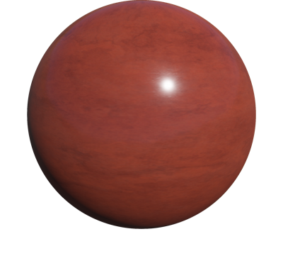
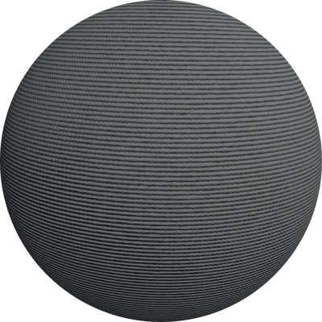
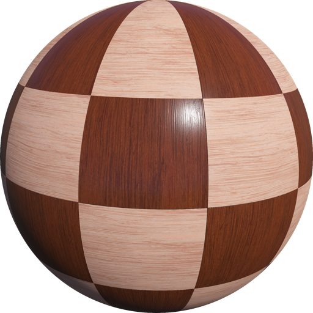
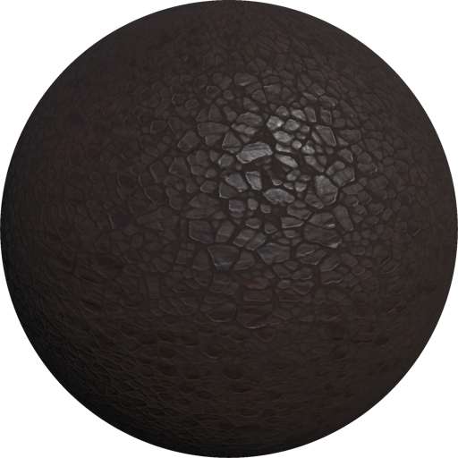
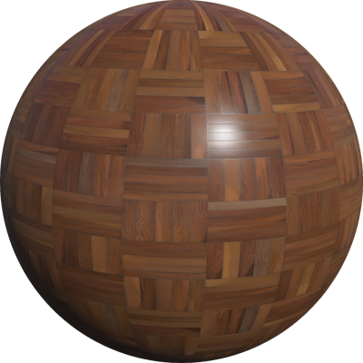
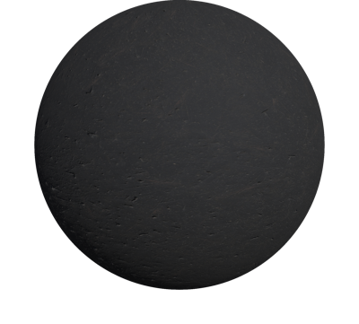
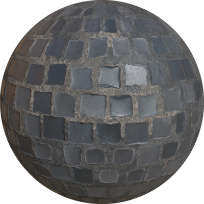
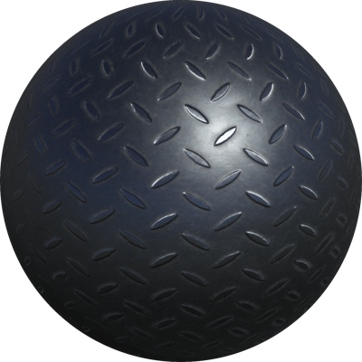

# Appearances
This chapter describes the list of available appearance PROTO nodes based on the [PBRAppearance](../reference/pbrappearance.md) node.

## Asphalt

An asphalt material. The color can be overridden using the `colorOverride` field. Useful with the `Road` PROTO.

%figure


%end

Derived from [PBRAppearance](../reference/pbrappearance.md).

```
Asphalt {
  SFColor colorOverride    1 1 1
  SFNode  textureTransform NULL
  SFFloat IBLStrength      1
}
```

> **File location**: "[WEBOTS\_HOME/projects/appearances/protos/Asphalt.proto](https://github.com/cyberbotics/webots/tree/master/projects/appearances/protos/Asphalt.proto)"

> **License**: Apache License 2.0
[More information.](http://www.apache.org/licenses/LICENSE-2.0)

### Asphalt Field Summary

- `colorOverride`: Defines the default color multiplied with the texture color.

- `textureTransform`: Defines an optional 2d texture transform.

- `IBLStrength`: Defines the strength of ambient lighting from the Background node.

## BakelitePlastic

A bakelite plastic.

%figure



%end

Derived from [PBRAppearance](../reference/pbrappearance.md).

```
BakelitePlastic {
  SFNode  textureTransform NULL
  SFFloat IBLStrength      1
}
```

> **File location**: "[WEBOTS\_HOME/projects/appearances/protos/BakelitePlastic.proto](https://github.com/cyberbotics/webots/tree/master/projects/appearances/protos/BakelitePlastic.proto)"

> **License**: Apache License 2.0
[More information.](http://www.apache.org/licenses/LICENSE-2.0)

### BakelitePlastic Field Summary

- `textureTransform`: Defines an optional 2d texture transform.

- `IBLStrength`: Defines the strength of ambient lighting from the Background node.

## BrushedAluminium

A brushed aluminum material.

%figure


%end

Derived from [PBRAppearance](../reference/pbrappearance.md).

```
BrushedAluminium {
  SFColor colorOverride    1 1 1
  SFNode  textureTransform NULL
  SFFloat IBLStrength      1
}
```

> **File location**: "[WEBOTS\_HOME/projects/appearances/protos/BrushedAluminium.proto](https://github.com/cyberbotics/webots/tree/master/projects/appearances/protos/BrushedAluminium.proto)"

> **License**: Apache License 2.0
[More information.](http://www.apache.org/licenses/LICENSE-2.0)

### BrushedAluminium Field Summary

- `colorOverride`: Defines the default color multiplied with the texture color.

- `textureTransform`: Defines an optional 2d texture transform.

- `IBLStrength`: Defines the strength of ambient lighting from the Background node.

## CarpetFibers

A woolen carpet material. Useful with the `Floor` PROTO.

%figure



%end

Derived from [PBRAppearance](../reference/pbrappearance.md).

```
CarpetFibers {
  SFColor colorOverride    1 1 1
  SFNode  textureTransform NULL
  SFFloat IBLStrength      1
}
```

> **File location**: "[WEBOTS\_HOME/projects/appearances/protos/CarpetFibers.proto](https://github.com/cyberbotics/webots/tree/master/projects/appearances/protos/CarpetFibers.proto)"

> **License**: Apache License 2.0
[More information.](http://www.apache.org/licenses/LICENSE-2.0)

### CarpetFibers Field Summary

- `colorOverride`: Defines the default color multiplied with the texture color.

- `textureTransform`: Defines an optional 2d texture transform.

- `IBLStrength`: Defines the strength of ambient lighting from the Background node.

## ChequeredParquetry

A wooden material in a chequered pattern covered with a layer of varnish. Useful with the `Floor` PROTO.

%figure



%end

Derived from [PBRAppearance](../reference/pbrappearance.md).

```
ChequeredParquetry {
  SFNode  textureTransform NULL
  SFFloat IBLStrength      1
}
```

> **File location**: "[WEBOTS\_HOME/projects/appearances/protos/ChequeredParquetry.proto](https://github.com/cyberbotics/webots/tree/master/projects/appearances/protos/ChequeredParquetry.proto)"

> **License**: Apache License 2.0
[More information.](http://www.apache.org/licenses/LICENSE-2.0)

### ChequeredParquetry Field Summary

- `textureTransform`: Defines an optional 2d texture transform.

- `IBLStrength`: Defines the strength of ambient lighting from the Background node.

## CorrodedMetal

A corroded metal material. The color can be overridden using the `colorOverride` field.

%figure


%end

Derived from [PBRAppearance](../reference/pbrappearance.md).

```
CorrodedMetal {
  SFColor colorOverride    1 1 1
  SFNode  textureTransform NULL
  SFFloat IBLStrength      1
}
```

> **File location**: "[WEBOTS\_HOME/projects/appearances/protos/CorrodedMetal.proto](https://github.com/cyberbotics/webots/tree/master/projects/appearances/protos/CorrodedMetal.proto)"

> **License**: Apache License 2.0
[More information.](http://www.apache.org/licenses/LICENSE-2.0)

### CorrodedMetal Field Summary

- `colorOverride`: Defines the default color multiplied with the texture color.

- `textureTransform`: Defines an optional 2d texture transform.

- `IBLStrength`: Defines the strength of ambient lighting from the Background node.

## CorrugatedMetal

A corrugated metal material. The color can be overridden using the `colorOverride` field.

%figure


%end

Derived from [PBRAppearance](../reference/pbrappearance.md).

```
CorrugatedMetal {
  SFColor colorOverride    1 1 1
  SFNode  textureTransform NULL
  SFFloat IBLStrength      1
}
```

> **File location**: "[WEBOTS\_HOME/projects/appearances/protos/CorrugatedMetal.proto](https://github.com/cyberbotics/webots/tree/master/projects/appearances/protos/CorrugatedMetal.proto)"

> **License**: Apache License 2.0
[More information.](http://www.apache.org/licenses/LICENSE-2.0)

### CorrugatedMetal Field Summary

- `colorOverride`: Defines the default color multiplied with the texture color.

- `textureTransform`: Defines an optional 2d texture transform.

- `IBLStrength`: Defines the strength of ambient lighting from the Background node.

## DamascusSteel

A damascus steel material. The color can be overridden using the `colorOverride` field.

%figure


%end

Derived from [PBRAppearance](../reference/pbrappearance.md).

```
DamascusSteel {
  SFColor colorOverride    1 1 1
  SFNode  textureTransform NULL
  SFFloat IBLStrength      1
}
```

> **File location**: "[WEBOTS\_HOME/projects/appearances/protos/DamascusSteel.proto](https://github.com/cyberbotics/webots/tree/master/projects/appearances/protos/DamascusSteel.proto)"

> **License**: Apache License 2.0
[More information.](http://www.apache.org/licenses/LICENSE-2.0)

### DamascusSteel Field Summary

- `colorOverride`: Defines the default color multiplied with the texture color.

- `textureTransform`: Defines an optional 2d texture transform.

- `IBLStrength`: Defines the strength of ambient lighting from the Background node.

## DarkParquetry

A dark parquetry material.

%figure


%end

Derived from [PBRAppearance](../reference/pbrappearance.md).

```
DarkParquetry {
  SFColor colorOverride    1 1 1
  SFNode  textureTransform NULL
  SFFloat IBLStrength      1
}
```

> **File location**: "[WEBOTS\_HOME/projects/appearances/protos/DarkParquetry.proto](https://github.com/cyberbotics/webots/tree/master/projects/appearances/protos/DarkParquetry.proto)"

> **License**: Apache License 2.0
[More information.](http://www.apache.org/licenses/LICENSE-2.0)

### DarkParquetry Field Summary

- `colorOverride`: Defines the default color multiplied with the texture color.

- `textureTransform`: Defines an optional 2d texture transform.

- `IBLStrength`: Defines the strength of ambient lighting from the Background node.

## ElectricConduit

An electric conduit material. The color can be overridden using the `colorOverride` field.

%figure


%end

Derived from [PBRAppearance](../reference/pbrappearance.md).

```
ElectricConduit {
  SFColor colorOverride    1 1 1
  SFNode  textureTransform NULL
  SFFloat IBLStrength      1
}
```

> **File location**: "[WEBOTS\_HOME/projects/appearances/protos/ElectricConduit.proto](https://github.com/cyberbotics/webots/tree/master/projects/appearances/protos/ElectricConduit.proto)"

> **License**: Apache License 2.0
[More information.](http://www.apache.org/licenses/LICENSE-2.0)

### ElectricConduit Field Summary

- `colorOverride`: Defines the default color multiplied with the texture color.

- `textureTransform`: Defines an optional 2d texture transform.

- `IBLStrength`: Defines the strength of ambient lighting from the Background node.

## FlexibleAluminiumDuct

A flexible aluminium duct material. The color can be overridden using the `colorOverride` field.

%figure


%end

Derived from [PBRAppearance](../reference/pbrappearance.md).

```
FlexibleAluminiumDuct {
  SFColor colorOverride    1 1 1
  SFNode  textureTransform NULL
  SFFloat IBLStrength      1
}
```

> **File location**: "[WEBOTS\_HOME/projects/appearances/protos/FlexibleAluminiumDuct.proto](https://github.com/cyberbotics/webots/tree/master/projects/appearances/protos/FlexibleAluminiumDuct.proto)"

> **License**: Apache License 2.0
[More information.](http://www.apache.org/licenses/LICENSE-2.0)

### FlexibleAluminiumDuct Field Summary

- `colorOverride`: Defines the default color multiplied with the texture color.

- `textureTransform`: Defines an optional 2d texture transform.

- `IBLStrength`: Defines the strength of ambient lighting from the Background node.

## GalvanizedMetal

A galvanized metal material. The color can be overridden using the `colorOverride` field.

%figure


%end

Derived from [PBRAppearance](../reference/pbrappearance.md).

```
GalvanizedMetal {
  SFColor colorOverride    1 1 1
  SFNode  textureTransform NULL
  SFFloat IBLStrength      1
}
```

> **File location**: "[WEBOTS\_HOME/projects/appearances/protos/GalvanizedMetal.proto](https://github.com/cyberbotics/webots/tree/master/projects/appearances/protos/GalvanizedMetal.proto)"

> **License**: Apache License 2.0
[More information.](http://www.apache.org/licenses/LICENSE-2.0)

### GalvanizedMetal Field Summary

- `colorOverride`: Defines the default color multiplied with the texture color.

- `textureTransform`: Defines an optional 2d texture transform.

- `IBLStrength`: Defines the strength of ambient lighting from the Background node.

## GlossyPaint

A glossy paint material. The color can be selected in the `baseColor` field.

%figure


%end

Derived from [PBRAppearance](../reference/pbrappearance.md).

```
GlossyPaint {
  SFColor baseColor        1 1 1
  SFNode  textureTransform TextureTransform { scale 10 10 }
  SFFloat IBLStrength      1
}
```

> **File location**: "[WEBOTS\_HOME/projects/appearances/protos/GlossyPaint.proto](https://github.com/cyberbotics/webots/tree/master/projects/appearances/protos/GlossyPaint.proto)"

> **License**: Apache License 2.0
[More information.](http://www.apache.org/licenses/LICENSE-2.0)

### GlossyPaint Field Summary

- `baseColor`: Defines the paint's color.

- `textureTransform`: Defines an optional 2d texture transform.

- `IBLStrength`: Defines the strength of ambient lighting from the Background node.

## HammeredCopper

An hammered copper steel material. The color can be overridden using the `colorOverride` field.

%figure


%end

Derived from [PBRAppearance](../reference/pbrappearance.md).

```
HammeredCopper {
  SFColor colorOverride    1 1 1
  SFNode  textureTransform NULL
  SFFloat IBLStrength      1
}
```

> **File location**: "[WEBOTS\_HOME/projects/appearances/protos/HammeredCopper.proto](https://github.com/cyberbotics/webots/tree/master/projects/appearances/protos/HammeredCopper.proto)"

> **License**: Apache License 2.0
[More information.](http://www.apache.org/licenses/LICENSE-2.0)

### HammeredCopper Field Summary

- `colorOverride`: Defines the default color multiplied with the texture color.

- `textureTransform`: Defines an optional 2d texture transform.

- `IBLStrength`: Defines the strength of ambient lighting from the Background node.

## Leather

A leather material. The color can be overridden using the `colorOverride` field.

%figure



%end

Derived from [PBRAppearance](../reference/pbrappearance.md).

```
Leather {
  SFColor                    colorOverride     1 1 1
  SFString                   tone              "dark"
  SFNode                     textureTransform  NULL
  SFFloat                    IBLStrength       1
}
```

> **File location**: "[WEBOTS\_HOME/projects/appearances/protos/Leather.proto](https://github.com/cyberbotics/webots/tree/master/projects/appearances/protos/Leather.proto)"

> **License**: Apache License 2.0
[More information.](http://www.apache.org/licenses/LICENSE-2.0)

### Leather Field Summary

- `colorOverride`: Defines the default color multiplied with the texture color.

- `tone`: Defines the tone of the leather (either `dark` or `light`)

- `textureTransform`: Defines an optional 2d texture transform.

- `IBLStrength`: Defines the strength of ambient lighting from the Background node.

## MattePaint

A matte paint material. The color can be selected in the `baseColor` field.

%figure


%end

Derived from [PBRAppearance](../reference/pbrappearance.md).

```
MattePaint {
  SFColor baseColor        1 1 1
  SFNode  textureTransform TextureTransform { scale 10 10 }
  SFFloat IBLStrength      1
}
```

> **File location**: "[WEBOTS\_HOME/projects/appearances/protos/MattePaint.proto](https://github.com/cyberbotics/webots/tree/master/projects/appearances/protos/MattePaint.proto)"

> **License**: Apache License 2.0
[More information.](http://www.apache.org/licenses/LICENSE-2.0)

### MattePaint Field Summary

- `baseColor`: Defines the paint's color.

- `textureTransform`: Defines an optional 2d texture transform.

- `IBLStrength`: Defines the strength of ambient lighting from the Background node.

## MetalPipePaint

A worn paint layer on a metal surface. Useful with the `PipeSection` PROTO or any painted industrial surfaces.

%figure


%end

Derived from [PBRAppearance](../reference/pbrappearance.md).

```
MetalPipePaint {
  SFNode  textureTransform NULL
  SFFloat IBLStrength      1
}
```

> **File location**: "[WEBOTS\_HOME/projects/appearances/protos/MetalPipePaint.proto](https://github.com/cyberbotics/webots/tree/master/projects/appearances/protos/MetalPipePaint.proto)"

> **License**: Apache License 2.0
[More information.](http://www.apache.org/licenses/LICENSE-2.0)

### MetalPipePaint Field Summary

- `textureTransform`: Defines an optional 2d texture transform.

- `IBLStrength`: Defines the strength of ambient lighting from the Background node.

## OldPlywood

An old plywood material.

%figure


%end

Derived from [PBRAppearance](../reference/pbrappearance.md).

```
OldPlywood {
  SFColor colorOverride    1 1 1
  SFNode  textureTransform NULL
  SFFloat IBLStrength      1
}
```

> **File location**: "[WEBOTS\_HOME/projects/appearances/protos/OldPlywood.proto](https://github.com/cyberbotics/webots/tree/master/projects/appearances/protos/OldPlywood.proto)"

> **License**: Apache License 2.0
[More information.](http://www.apache.org/licenses/LICENSE-2.0)

### OldPlywood Field Summary

- `colorOverride`: Defines the default color multiplied with the texture color.

- `textureTransform`: Defines an optional 2d texture transform.

- `IBLStrength`: Defines the strength of ambient lighting from the Background node.

## OldSteel

An old battered steel material.

%figure


%end

Derived from [PBRAppearance](../reference/pbrappearance.md).

```
OldSteel {
  SFColor colorOverride    1 1 1
  SFNode  textureTransform NULL
  SFFloat IBLStrength      1
}
```

> **File location**: "[WEBOTS\_HOME/projects/appearances/protos/OldSteel.proto](https://github.com/cyberbotics/webots/tree/master/projects/appearances/protos/OldSteel.proto)"

> **License**: Apache License 2.0
[More information.](http://www.apache.org/licenses/LICENSE-2.0)

### OldSteel Field Summary

- `colorOverride`: Defines the default color multiplied with the texture color.

- `textureTransform`: Defines an optional 2d texture transform.

- `IBLStrength`: Defines the strength of ambient lighting from the Background node.

## OsbWood

An OSB wood material. The color can be overridden using the `colorOverride` field.

%figure


%end

Derived from [PBRAppearance](../reference/pbrappearance.md).

```
OsbWood {
  SFColor colorOverride    1 1 1
  SFNode  textureTransform NULL
  SFFloat IBLStrength      1
}
```

> **File location**: "[WEBOTS\_HOME/projects/appearances/protos/OsbWood.proto](https://github.com/cyberbotics/webots/tree/master/projects/appearances/protos/OsbWood.proto)"

> **License**: Apache License 2.0
[More information.](http://www.apache.org/licenses/LICENSE-2.0)

### OsbWood Field Summary

- `colorOverride`: Defines the default color multiplied with the texture color.

- `textureTransform`: Defines an optional 2d texture transform.

- `IBLStrength`: Defines the strength of ambient lighting from the Background node.

## PaintedWood

A painted wood material. The color can be overridden using the `colorOverride` field.

%figure


%end

Derived from [PBRAppearance](../reference/pbrappearance.md).

```
PaintedWood {
  SFColor colorOverride    1 1 1
  SFNode  textureTransform NULL
  SFFloat IBLStrength      1
}
```

> **File location**: "[WEBOTS\_HOME/projects/appearances/protos/PaintedWood.proto](https://github.com/cyberbotics/webots/tree/master/projects/appearances/protos/PaintedWood.proto)"

> **License**: Apache License 2.0
[More information.](http://www.apache.org/licenses/LICENSE-2.0)

### PaintedWood Field Summary

- `colorOverride`: Defines the default color multiplied with the texture color.

- `textureTransform`: Defines an optional 2d texture transform.

- `IBLStrength`: Defines the strength of ambient lighting from the Background node.

## Parquetry

A wooden material in a tesselated block pattern covered with a layer of varnish. Useful with the `Floor` PROTO.

%figure



%end

Derived from [PBRAppearance](../reference/pbrappearance.md).

```
Parquetry {
  SFColor colorOverride    1 1 1
  SFNode  textureTransform NULL
  SFFloat IBLStrength      1
}
```

> **File location**: "[WEBOTS\_HOME/projects/appearances/protos/Parquetry.proto](https://github.com/cyberbotics/webots/tree/master/projects/appearances/protos/Parquetry.proto)"

> **License**: Apache License 2.0
[More information.](http://www.apache.org/licenses/LICENSE-2.0)

### Parquetry Field Summary

- `colorOverride`: Defines the default color multiplied with the texture color.

- `textureTransform`: Defines an optional 2d texture transform.

- `IBLStrength`: Defines the strength of ambient lighting from the Background node.

## Plaster

A plaster material. The color can be overridden using the `colorOverride` field.

%figure


%end

Derived from [PBRAppearance](../reference/pbrappearance.md).

```
Plaster {
  SFColor colorOverride    1 1 1
  SFNode  textureTransform NULL
  SFFloat IBLStrength      1
}
```

> **File location**: "[WEBOTS\_HOME/projects/appearances/protos/Plaster.proto](https://github.com/cyberbotics/webots/tree/master/projects/appearances/protos/Plaster.proto)"

> **License**: Apache License 2.0
[More information.](http://www.apache.org/licenses/LICENSE-2.0)

### Plaster Field Summary

- `colorOverride`: Defines the default color multiplied with the texture color.

- `textureTransform`: Defines an optional 2d texture transform.

- `IBLStrength`: Defines the strength of ambient lighting from the Background node.

## RedBricks

A tiled brick material. Useful with the `Wall` PROTO.

%figure


%end

Derived from [PBRAppearance](../reference/pbrappearance.md).

```
RedBricks {
  SFNode  textureTransform NULL
  SFFloat IBLStrength      1
}
```

> **File location**: "[WEBOTS\_HOME/projects/appearances/protos/RedBricks.proto](https://github.com/cyberbotics/webots/tree/master/projects/appearances/protos/RedBricks.proto)"

> **License**: Apache License 2.0
[More information.](http://www.apache.org/licenses/LICENSE-2.0)

### RedBricks Field Summary

- `textureTransform`: Defines an optional 2d texture transform.

- `IBLStrength`: Defines the strength of ambient lighting from the Background node.

## RoughConcrete

A rough concrete material. The color can be overridden using the `colorOverride` field.

%figure


%end

Derived from [PBRAppearance](../reference/pbrappearance.md).

```
RoughConcrete {
  SFColor colorOverride    1 1 1
  SFNode  textureTransform NULL
  SFFloat IBLStrength      1
}
```

> **File location**: "[WEBOTS\_HOME/projects/appearances/protos/RoughConcrete.proto](https://github.com/cyberbotics/webots/tree/master/projects/appearances/protos/RoughConcrete.proto)"

> **License**: Apache License 2.0
[More information.](http://www.apache.org/licenses/LICENSE-2.0)

### RoughConcrete Field Summary

- `colorOverride`: Defines the default color multiplied with the texture color.

- `textureTransform`: Defines an optional 2d texture transform.

- `IBLStrength`: Defines the strength of ambient lighting from the Background node.

## RoughOak

A rough oak material. The color can be overridden using the `colorOverride` field.

%figure


%end

Derived from [PBRAppearance](../reference/pbrappearance.md).

```
RoughOak {
  SFColor colorOverride    1 1 1
  SFNode  textureTransform NULL
  SFFloat IBLStrength      1
}
```

> **File location**: "[WEBOTS\_HOME/projects/appearances/protos/RoughOak.proto](https://github.com/cyberbotics/webots/tree/master/projects/appearances/protos/RoughOak.proto)"

> **License**: Apache License 2.0
[More information.](http://www.apache.org/licenses/LICENSE-2.0)

### RoughOak Field Summary

- `colorOverride`: Defines the default color multiplied with the texture color.

- `textureTransform`: Defines an optional 2d texture transform.

- `IBLStrength`: Defines the strength of ambient lighting from the Background node.

## RoughPine

A pine wood material. The color can be overridden using the `colorOverride` field.

%figure


%end

Derived from [PBRAppearance](../reference/pbrappearance.md).

```
RoughPine {
  SFColor colorOverride    1 1 1
  SFNode  textureTransform NULL
  SFFloat IBLStrength      1
}
```

> **File location**: "[WEBOTS\_HOME/projects/appearances/protos/RoughPine.proto](https://github.com/cyberbotics/webots/tree/master/projects/appearances/protos/RoughPine.proto)"

> **License**: Apache License 2.0
[More information.](http://www.apache.org/licenses/LICENSE-2.0)

### RoughPine Field Summary

- `colorOverride`: Defines the default color multiplied with the texture color.

- `textureTransform`: Defines an optional 2d texture transform.

- `IBLStrength`: Defines the strength of ambient lighting from the Background node.

## Roughcast

A rough plaster material. Useful with the `Wall` PROTO.

%figure


%end

Derived from [PBRAppearance](../reference/pbrappearance.md).

```
Roughcast {
  SFColor colorOverride    1 1 1
  SFNode  textureTransform NULL
  SFFloat IBLStrength      1
}
```

> **File location**: "[WEBOTS\_HOME/projects/appearances/protos/Roughcast.proto](https://github.com/cyberbotics/webots/tree/master/projects/appearances/protos/Roughcast.proto)"

> **License**: Apache License 2.0
[More information.](http://www.apache.org/licenses/LICENSE-2.0)

### Roughcast Field Summary

- `colorOverride`: Defines the default color multiplied with the texture color.

- `textureTransform`: Defines an optional 2d texture transform.

- `IBLStrength`: Defines the strength of ambient lighting from the Background node.

## Rubber

A rubber material.

%figure



%end

Derived from [PBRAppearance](../reference/pbrappearance.md).

```
Rubber {
  SFNode  textureTransform NULL
  SFFloat IBLStrength      1
}
```

> **File location**: "[WEBOTS\_HOME/projects/appearances/protos/Rubber.proto](https://github.com/cyberbotics/webots/tree/master/projects/appearances/protos/Rubber.proto)"

> **License**: Apache License 2.0
[More information.](http://www.apache.org/licenses/LICENSE-2.0)

### Rubber Field Summary

- `textureTransform`: Defines an optional 2d texture transform.

- `IBLStrength`: Defines the strength of ambient lighting from the Background node.

## RustyMetal

An old battered steel material.
The color can be overridden using the `colorOverride` field and the amount of rust can be set using the `rustLevel` field.

%figure


%end

Derived from [PBRAppearance](../reference/pbrappearance.md).

```
RustyMetal {
  SFInt32        rustLevel        1
  SFColor        colorOverride    1 1 1
  SFNode         textureTransform NULL
  SFFloat        IBLStrength      1
}
```

> **File location**: "[WEBOTS\_HOME/projects/appearances/protos/RustyMetal.proto](https://github.com/cyberbotics/webots/tree/master/projects/appearances/protos/RustyMetal.proto)"

> **License**: Apache License 2.0
[More information.](http://www.apache.org/licenses/LICENSE-2.0)

### RustyMetal Field Summary

- `rustLevel`: Defines how much the metal is rusted.

- `colorOverride`: Defines the default color multiplied with the texture color.

- `textureTransform`: Defines an optional 2d texture transform.

- `IBLStrength`: Defines the strength of ambient lighting from the Background node.

## SandyGround

A sandy ground material. The color can be selected using the `colorOverride` field. Useful with the UnevenTerrain PROTO.

%figure


%end

Derived from [PBRAppearance](../reference/pbrappearance.md).

```
SandyGround {
  SFColor colorOverride    1 1 1
  SFNode  textureTransform TextureTransform { scale 4 4 }
  SFFloat IBLStrength      1
}
```

> **File location**: "[WEBOTS\_HOME/projects/appearances/protos/SandyGround.proto](https://github.com/cyberbotics/webots/tree/master/projects/appearances/protos/SandyGround.proto)"

> **License**: Apache License 2.0
[More information.](http://www.apache.org/licenses/LICENSE-2.0)

### SandyGround Field Summary

- `colorOverride`: Defines the default color multiplied with the texture color.

- `textureTransform`: Defines an optional 2d texture transform.

- `IBLStrength`: Defines the strength of ambient lighting from the Background node.

## ScrewThread

A screw thread material. The color can be overridden using the `colorOverride` field.

%figure


%end

Derived from [PBRAppearance](../reference/pbrappearance.md).

```
ScrewThread {
  SFColor colorOverride    1 1 1
  SFNode  textureTransform NULL
  SFFloat IBLStrength      1
}
```

> **File location**: "[WEBOTS\_HOME/projects/appearances/protos/ScrewThread.proto](https://github.com/cyberbotics/webots/tree/master/projects/appearances/protos/ScrewThread.proto)"

> **License**: Apache License 2.0
[More information.](http://www.apache.org/licenses/LICENSE-2.0)

### ScrewThread Field Summary

- `colorOverride`: Defines the default color multiplied with the texture color.

- `textureTransform`: Defines an optional 2d texture transform.

- `IBLStrength`: Defines the strength of ambient lighting from the Background node.

## ShinyLeather

A shiny leather material. The color can be selected using the `colorOverride` field. Useful with any of the vehicle PROTOs.

%figure


%end

Derived from [PBRAppearance](../reference/pbrappearance.md).

```
ShinyLeather {
  SFColor colorOverride    1 1 1
  SFNode  textureTransform TextureTransform { scale 4 4 }
  SFFloat IBLStrength      1
}
```

> **File location**: "[WEBOTS\_HOME/projects/appearances/protos/ShinyLeather.proto](https://github.com/cyberbotics/webots/tree/master/projects/appearances/protos/ShinyLeather.proto)"

> **License**: Apache License 2.0
[More information.](http://www.apache.org/licenses/LICENSE-2.0)

### ShinyLeather Field Summary

- `colorOverride`: Defines the leather's color.

- `textureTransform`: Defines an optional 2d texture transform.

- `IBLStrength`: Defines the strength of ambient lighting from the Background node.

## SquarePavement

A square pavement material. The color can be overridden using the `colorOverride` field.

%figure



%end

Derived from [PBRAppearance](../reference/pbrappearance.md).

```
SquarePavement {
  SFColor colorOverride    1 1 1
  SFNode  textureTransform NULL
  SFFloat IBLStrength      1
}
```

> **File location**: "[WEBOTS\_HOME/projects/appearances/protos/SquarePavement.proto](https://github.com/cyberbotics/webots/tree/master/projects/appearances/protos/SquarePavement.proto)"

> **License**: Apache License 2.0
[More information.](http://www.apache.org/licenses/LICENSE-2.0)

### SquarePavement Field Summary

- `colorOverride`: Defines the default color multiplied with the texture color.

- `textureTransform`: Defines an optional 2d texture transform.

- `IBLStrength`: Defines the strength of ambient lighting from the Background node.

## StonePavement

A stone pavement material. The color can be overridden using the `colorOverride` field.

%figure


%end

Derived from [PBRAppearance](../reference/pbrappearance.md).

```
StonePavement {
  SFColor colorOverride    1 1 1
  SFNode  textureTransform NULL
  SFFloat IBLStrength      1
}
```

> **File location**: "[WEBOTS\_HOME/projects/appearances/protos/StonePavement.proto](https://github.com/cyberbotics/webots/tree/master/projects/appearances/protos/StonePavement.proto)"

> **License**: Apache License 2.0
[More information.](http://www.apache.org/licenses/LICENSE-2.0)

### StonePavement Field Summary

- `colorOverride`: Defines the default color multiplied with the texture color.

- `textureTransform`: Defines an optional 2d texture transform.

- `IBLStrength`: Defines the strength of ambient lighting from the Background node.

## ThreadMetalPlate

A worn paint layer on a metal surface. Useful with the `PipeSection` PROTO or any painted industrial surfaces.

%figure



%end

Derived from [PBRAppearance](../reference/pbrappearance.md).

```
ThreadMetalPlate {
  SFColor colorOverride    1 1 1
  SFNode  textureTransform NULL
  SFFloat IBLStrength      1
}
```

> **File location**: "[WEBOTS\_HOME/projects/appearances/protos/ThreadMetalPlate.proto](https://github.com/cyberbotics/webots/tree/master/projects/appearances/protos/ThreadMetalPlate.proto)"

> **License**: Apache License 2.0
[More information.](http://www.apache.org/licenses/LICENSE-2.0)

### ThreadMetalPlate Field Summary

- `colorOverride`: Defines the default color multiplied with the texture color.

- `textureTransform`: Defines an optional 2d texture transform.

- `IBLStrength`: Defines the strength of ambient lighting from the Background node.

## VarnishedPine

A pine wood material covered with a layer of varnish. The color can be overridden using the `colorOverride` field.

%figure


%end

Derived from [PBRAppearance](../reference/pbrappearance.md).

```
VarnishedPine {
  SFColor colorOverride    0.8039 0.6745 0.5764
  SFNode  textureTransform NULL
  SFFloat IBLStrength      1
}
```

> **File location**: "[WEBOTS\_HOME/projects/appearances/protos/VarnishedPine.proto](https://github.com/cyberbotics/webots/tree/master/projects/appearances/protos/VarnishedPine.proto)"

> **License**: Apache License 2.0
[More information.](http://www.apache.org/licenses/LICENSE-2.0)

### VarnishedPine Field Summary

- `colorOverride`: Defines the default color multiplied with the texture color.

- `textureTransform`: Defines an optional 2d texture transform.

- `IBLStrength`: Defines the strength of ambient lighting from the Background node.

## WireFence

A wire fence material. The color can be overridden using the `colorOverride` field.

%figure


%end

Derived from [PBRAppearance](../reference/pbrappearance.md).

```
WireFence {
  SFColor colorOverride    1 1 1
  SFNode  textureTransform NULL
  SFFloat IBLStrength      1
}
```

> **File location**: "[WEBOTS\_HOME/projects/appearances/protos/WireFence.proto](https://github.com/cyberbotics/webots/tree/master/projects/appearances/protos/WireFence.proto)"

> **License**: Apache License 2.0
[More information.](http://www.apache.org/licenses/LICENSE-2.0)

### WireFence Field Summary

- `colorOverride`: Defines the default color multiplied with the texture color.

- `textureTransform`: Defines an optional 2d texture transform.

- `IBLStrength`: Defines the strength of ambient lighting from the Background node.

