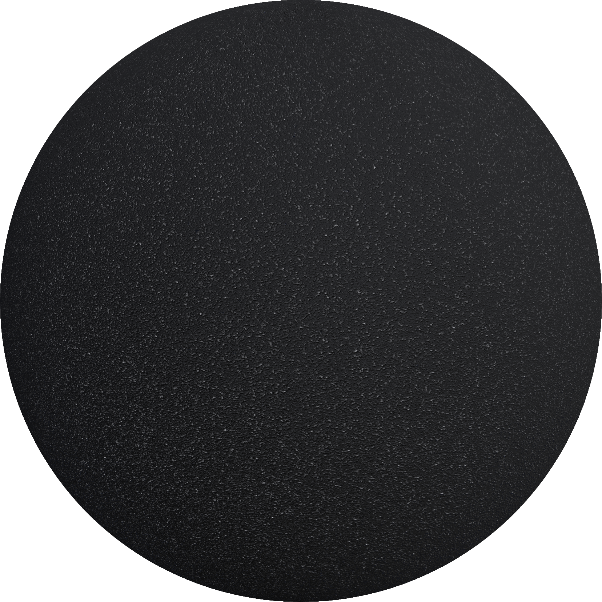
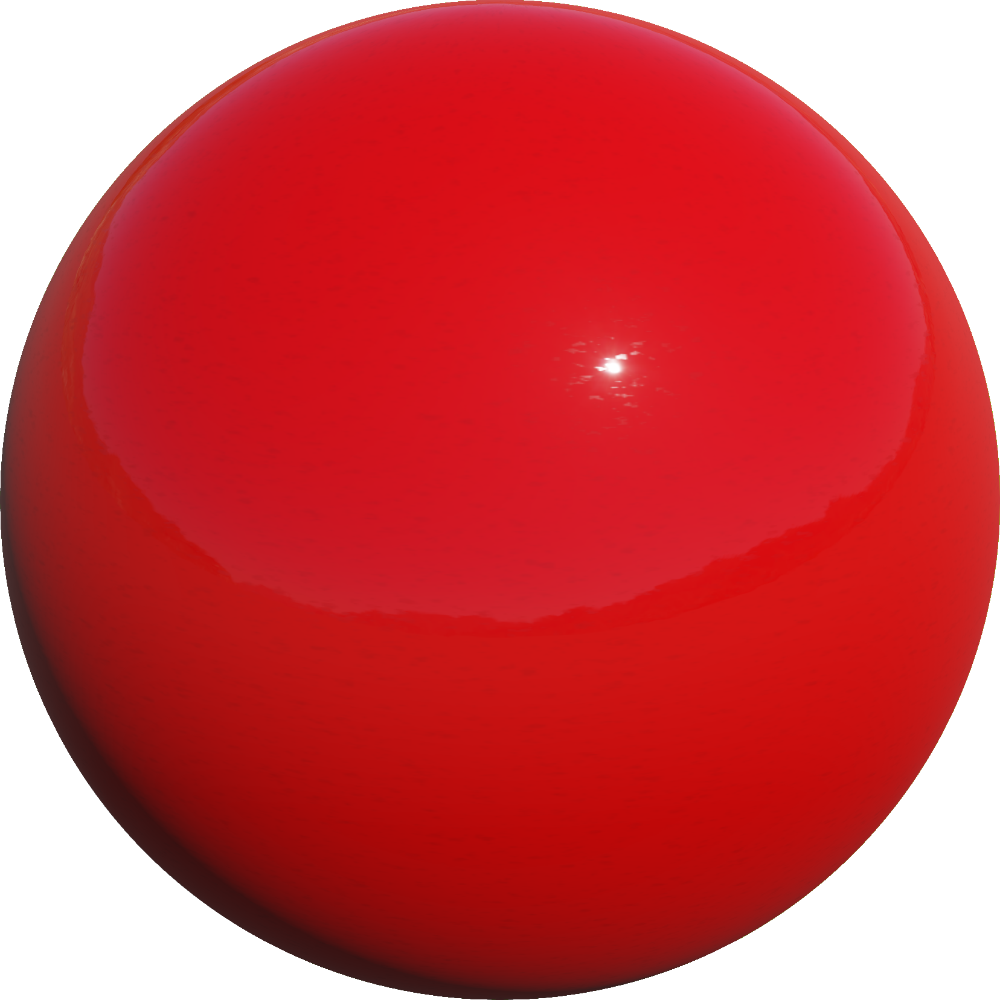
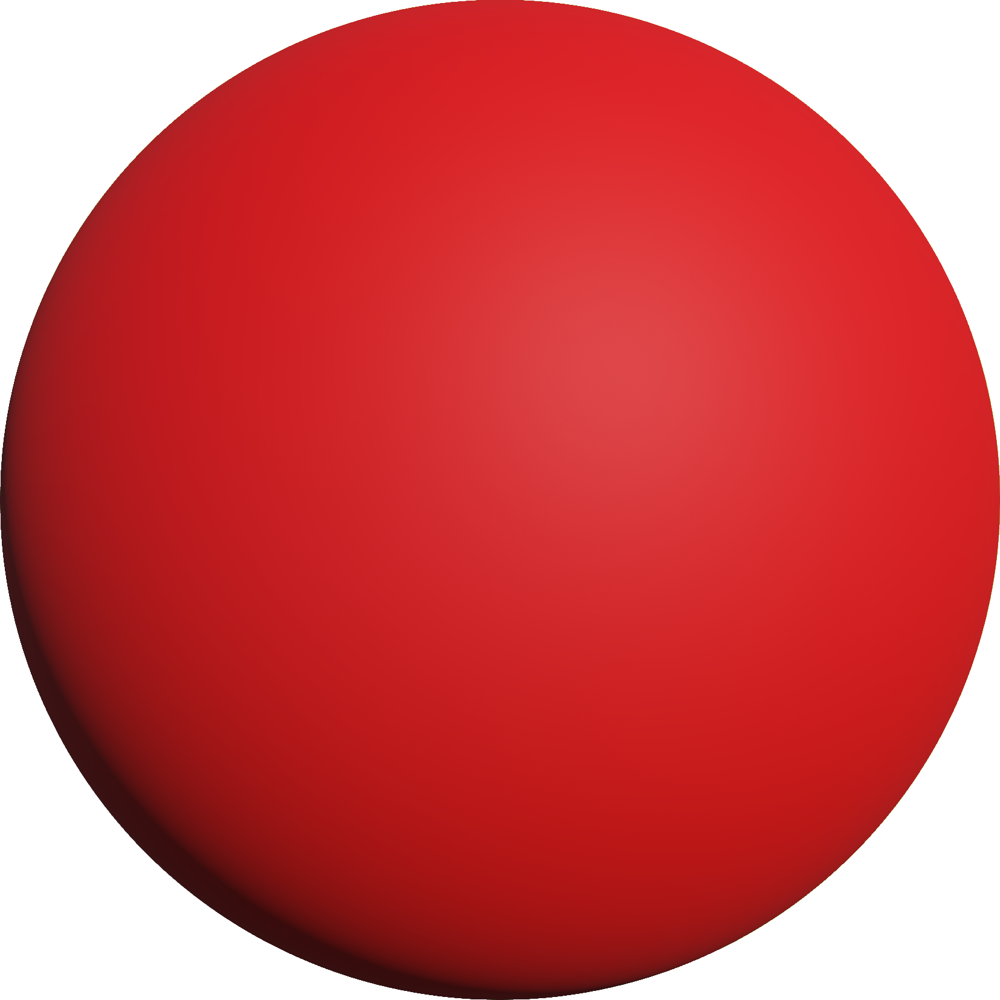
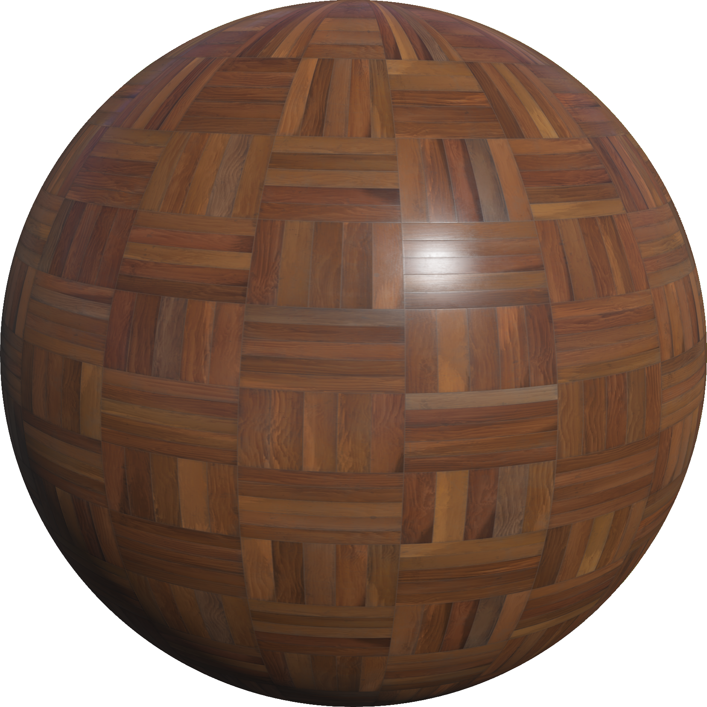
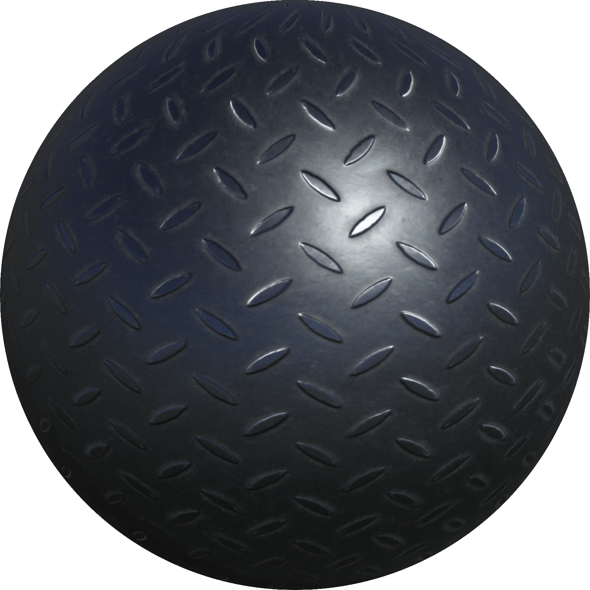

# Appearances
This chapter describes the list of available appearance PROTO nodes based on the [PBRAppearance](../reference/pbrappearance.md) node.

## Asphalt

An asphalt material. The color can be overridden using the `colorOverride` field. Useful with the `Road` PROTO.

%figure



%end

Derived from [PBRAppearance](../reference/pbrappearance.md).

```
Asphalt {
  SFColor colorOverride    1 1 1
  SFNode  textureTransform NULL
  SFNode  environmentMap   NULL
  SFFloat IBLStrength      1
}
```

> **File location**: "WEBOTS\_HOME/projects/appearances/protos/Asphalt.proto"

> **License**: Apache License 2.0
[More information.](http://www.apache.org/licenses/LICENSE-2.0)

### Asphalt Field Summary

- `colorOverride`: Defines the default color multiplied with the texture color.

- `textureTransform`: Defines an optional 2d texture transform.

- `environmentMap`: Defines an optional `Cubemap` node overriding the skybox for this object.

- `IBLStrength`: Defines the strength of ambient lighting from the Cubemap node.

## BrushedAluminium

A brushed aluminum material.

%figure


%end

Derived from [PBRAppearance](../reference/pbrappearance.md).

```
BrushedAluminium {
  SFColor colorOverride    1 1 1
  SFNode  textureTransform NULL
  SFNode  environmentMap   NULL
  SFFloat IBLStrength      1
}
```

> **File location**: "WEBOTS\_HOME/projects/appearances/protos/BrushedAluminium.proto"

> **License**: Apache License 2.0
[More information.](http://www.apache.org/licenses/LICENSE-2.0)

### BrushedAluminium Field Summary

- `colorOverride`: Defines the default color multiplied with the texture color.

- `textureTransform`: Defines an optional 2d texture transform.

- `environmentMap`: Defines an optional `Cubemap` node overriding the skybox for this object.

- `IBLStrength`: Defines the strength of ambient lighting from the Cubemap node.

## CarpetFibers

A woolen carpet material. Useful with the `Floor` PROTO.

%figure


%end

Derived from [PBRAppearance](../reference/pbrappearance.md).

```
CarpetFibers {
  SFColor colorOverride    1 1 1
  SFNode  textureTransform NULL
  SFNode  environmentMap   NULL
  SFFloat IBLStrength      1
}
```

> **File location**: "WEBOTS\_HOME/projects/appearances/protos/CarpetFibers.proto"

> **License**: Apache License 2.0
[More information.](http://www.apache.org/licenses/LICENSE-2.0)

### CarpetFibers Field Summary

- `colorOverride`: Defines the default color multiplied with the texture color.

- `textureTransform`: Defines an optional 2d texture transform.

- `environmentMap`: Defines an optional `Cubemap` node overriding the skybox for this object.

- `IBLStrength`: Defines the strength of ambient lighting from the Cubemap node.

## ChequeredParquetry

A wooden material in a chequered pattern covered with a layer of varnish. Useful with the `Floor` PROTO.

%figure


%end

Derived from [PBRAppearance](../reference/pbrappearance.md).

```
ChequeredParquetry {
  SFNode  textureTransform NULL
  SFNode  environmentMap   NULL
  SFFloat IBLStrength      1
}
```

> **File location**: "WEBOTS\_HOME/projects/appearances/protos/ChequeredParquetry.proto"

> **License**: Apache License 2.0
[More information.](http://www.apache.org/licenses/LICENSE-2.0)

### ChequeredParquetry Field Summary

- `textureTransform`: Defines an optional 2d texture transform.

- `environmentMap`: Defines an optional `Cubemap` node overriding the skybox for this object.

- `IBLStrength`: Defines the strength of ambient lighting from the Cubemap node.

## GlossyCarPaint

A glossy car paint material. The color can be selected in the `baseColor` field. Useful with any of the vehicle PROTOs.

%figure



%end

Derived from [PBRAppearance](../reference/pbrappearance.md).

```
GlossyCarPaint {
  SFColor baseColor        1 1 1
  SFNode  textureTransform TextureTransform { scale 10 10 }
  SFNode  environmentMap   NULL
  SFFloat IBLStrength      1
}
```

> **File location**: "WEBOTS\_HOME/projects/appearances/protos/GlossyCarPaint.proto"

> **License**: Apache License 2.0
[More information.](http://www.apache.org/licenses/LICENSE-2.0)

### GlossyCarPaint Field Summary

- `baseColor`: Defines the paint's color.

- `textureTransform`: Defines an optional 2d texture transform.

- `environmentMap`: Defines an optional `Cubemap` node overriding the skybox for this object.

- `IBLStrength`: Defines the strength of ambient lighting from the Cubemap node.

## MatteCarPaint

A matte car paint material. The color can be selected in the `baseColor` field. Useful with any of the vehicle PROTOs.

%figure



%end

Derived from [PBRAppearance](../reference/pbrappearance.md).

```
MatteCarPaint {
  SFColor baseColor        1 1 1
  SFNode  textureTransform TextureTransform { scale 10 10 }
  SFNode  environmentMap   NULL
  SFFloat IBLStrength      1
}
```

> **File location**: "WEBOTS\_HOME/projects/appearances/protos/MatteCarPaint.proto"

> **License**: Apache License 2.0
[More information.](http://www.apache.org/licenses/LICENSE-2.0)

### MatteCarPaint Field Summary

- `baseColor`: Defines the paint's color.

- `textureTransform`: Defines an optional 2d texture transform.

- `environmentMap`: Defines an optional `Cubemap` node overriding the skybox for this object.

- `IBLStrength`: Defines the strength of ambient lighting from the Cubemap node.

## MetalPipePaint

A worn paint layer on a metal surface. Useful with the `PipeSection` PROTO or any painted industrial surfaces.

%figure


%end

Derived from [PBRAppearance](../reference/pbrappearance.md).

```
MetalPipePaint {
  SFNode  textureTransform NULL
  SFNode  environmentMap   NULL
  SFFloat IBLStrength      1
}
```

> **File location**: "WEBOTS\_HOME/projects/appearances/protos/MetalPipePaint.proto"

> **License**: Apache License 2.0
[More information.](http://www.apache.org/licenses/LICENSE-2.0)

### MetalPipePaint Field Summary

- `textureTransform`: Defines an optional 2d texture transform.

- `environmentMap`: Defines an optional `Cubemap` node overriding the skybox for this object.

- `IBLStrength`: Defines the strength of ambient lighting from the Cubemap node.

## OldSteel

An old battered steel material.

%figure


%end

Derived from [PBRAppearance](../reference/pbrappearance.md).

```
OldSteel {
  SFColor colorOverride    1 1 1
  SFNode  textureTransform NULL
  SFNode  environmentMap   NULL
  SFFloat IBLStrength      1
}
```

> **File location**: "WEBOTS\_HOME/projects/appearances/protos/OldSteel.proto"

> **License**: Apache License 2.0
[More information.](http://www.apache.org/licenses/LICENSE-2.0)

### OldSteel Field Summary

- `colorOverride`: Defines the default color multiplied with the texture color.

- `textureTransform`: Defines an optional 2d texture transform.

- `environmentMap`: Defines an optional `Cubemap` node overriding the skybox for this object.

- `IBLStrength`: Defines the strength of ambient lighting from the Cubemap node.

## PaintedWood

A painted wood material. The color can be overridden using the `colorOverride` field.

%figure


%end

Derived from [PBRAppearance](../reference/pbrappearance.md).

```
PaintedWood {
  SFColor colorOverride    1 1 1
  SFNode  textureTransform NULL
  SFNode  environmentMap   NULL
  SFFloat IBLStrength      1
}
```

> **File location**: "WEBOTS\_HOME/projects/appearances/protos/PaintedWood.proto"

> **License**: Apache License 2.0
[More information.](http://www.apache.org/licenses/LICENSE-2.0)

### PaintedWood Field Summary

- `colorOverride`: Defines the default color multiplied with the texture color.

- `textureTransform`: Defines an optional 2d texture transform.

- `environmentMap`: Defines an optional `Cubemap` node overriding the skybox for this object.

- `IBLStrength`: Defines the strength of ambient lighting from the Cubemap node.

## Parquetry

A wooden material in a tesselated block pattern covered with a layer of varnish. Useful with the `Floor` PROTO.

%figure



%end

Derived from [PBRAppearance](../reference/pbrappearance.md).

```
Parquetry {
  SFColor colorOverride    1 1 1
  SFNode  textureTransform NULL
  SFNode  environmentMap   NULL
  SFFloat IBLStrength      1
}
```

> **File location**: "WEBOTS\_HOME/projects/appearances/protos/Parquetry.proto"

> **License**: Apache License 2.0
[More information.](http://www.apache.org/licenses/LICENSE-2.0)

### Parquetry Field Summary

- `colorOverride`: Defines the default color multiplied with the texture color.

- `textureTransform`: Defines an optional 2d texture transform.

- `environmentMap`: Defines an optional `Cubemap` node overriding the skybox for this object.

- `IBLStrength`: Defines the strength of ambient lighting from the Cubemap node.

## RedBricks

A tiled brick material. Useful with the `Wall` PROTO.

%figure


%end

Derived from [PBRAppearance](../reference/pbrappearance.md).

```
RedBricks {
  SFNode  textureTransform NULL
  SFNode  environmentMap   NULL
  SFFloat IBLStrength      1
}
```

> **File location**: "WEBOTS\_HOME/projects/appearances/protos/RedBricks.proto"

> **License**: Apache License 2.0
[More information.](http://www.apache.org/licenses/LICENSE-2.0)

### RedBricks Field Summary

- `textureTransform`: Defines an optional 2d texture transform.

- `environmentMap`: Defines an optional `Cubemap` node overriding the skybox for this object.

- `IBLStrength`: Defines the strength of ambient lighting from the Cubemap node.

## RoughConcrete

A rough concrete material. The color can be overridden using the `colorOverride` field.

%figure


%end

Derived from [PBRAppearance](../reference/pbrappearance.md).

```
RoughConcrete {
  SFColor colorOverride    1 1 1
  SFNode  textureTransform NULL
  SFNode  environmentMap   NULL
  SFFloat IBLStrength      1
}
```

> **File location**: "WEBOTS\_HOME/projects/appearances/protos/RoughConcrete.proto"

> **License**: Apache License 2.0
[More information.](http://www.apache.org/licenses/LICENSE-2.0)

### RoughConcrete Field Summary

- `colorOverride`: Defines the default color multiplied with the texture color.

- `textureTransform`: Defines an optional 2d texture transform.

- `environmentMap`: Defines an optional `Cubemap` node overriding the skybox for this object.

- `IBLStrength`: Defines the strength of ambient lighting from the Cubemap node.

## RoughOak

A rough oak material. The color can be overridden using the `colorOverride` field.

%figure


%end

Derived from [PBRAppearance](../reference/pbrappearance.md).

```
RoughOak {
  SFColor colorOverride    1 1 1
  SFNode  textureTransform NULL
  SFNode  environmentMap   NULL
  SFFloat IBLStrength      1
}
```

> **File location**: "WEBOTS\_HOME/projects/appearances/protos/RoughOak.proto"

> **License**: Apache License 2.0
[More information.](http://www.apache.org/licenses/LICENSE-2.0)

### RoughOak Field Summary

- `colorOverride`: Defines the default color multiplied with the texture color.

- `textureTransform`: Defines an optional 2d texture transform.

- `environmentMap`: Defines an optional `Cubemap` node overriding the skybox for this object.

- `IBLStrength`: Defines the strength of ambient lighting from the Cubemap node.

## RoughPine

A pine wood material. The color can be overridden using the `colorOverride` field.

%figure


%end

Derived from [PBRAppearance](../reference/pbrappearance.md).

```
RoughPine {
  SFColor colorOverride    1 1 1
  SFNode  textureTransform NULL
  SFNode  environmentMap   NULL
  SFFloat IBLStrength      1
}
```

> **File location**: "WEBOTS\_HOME/projects/appearances/protos/RoughPine.proto"

> **License**: Apache License 2.0
[More information.](http://www.apache.org/licenses/LICENSE-2.0)

### RoughPine Field Summary

- `colorOverride`: Defines the default color multiplied with the texture color.

- `textureTransform`: Defines an optional 2d texture transform.

- `environmentMap`: Defines an optional `Cubemap` node overriding the skybox for this object.

- `IBLStrength`: Defines the strength of ambient lighting from the Cubemap node.

## Roughcast

A rough plaster material. Useful with the `Wall` PROTO.

%figure


%end

Derived from [PBRAppearance](../reference/pbrappearance.md).

```
Roughcast {
  SFColor colorOverride    1 1 1
  SFNode  textureTransform NULL
  SFNode  environmentMap   NULL
  SFFloat IBLStrength      1
}
```

> **File location**: "WEBOTS\_HOME/projects/appearances/protos/Roughcast.proto"

> **License**: Apache License 2.0
[More information.](http://www.apache.org/licenses/LICENSE-2.0)

### Roughcast Field Summary

- `colorOverride`: Defines the default color multiplied with the texture color.

- `textureTransform`: Defines an optional 2d texture transform.

- `environmentMap`: Defines an optional `Cubemap` node overriding the skybox for this object.

- `IBLStrength`: Defines the strength of ambient lighting from the Cubemap node.

## SandyGround

A sandy ground material. The color can be selected using the `colorOverride` field. Useful with the UnevenTerrain PROTO.

%figure


%end

Derived from [PBRAppearance](../reference/pbrappearance.md).

```
SandyGround {
  SFColor colorOverride    1 1 1
  SFNode  textureTransform TextureTransform { scale 4 4 }
  SFNode  environmentMap   NULL
  SFFloat IBLStrength      1
}
```

> **File location**: "WEBOTS\_HOME/projects/appearances/protos/SandyGround.proto"

> **License**: Apache License 2.0
[More information.](http://www.apache.org/licenses/LICENSE-2.0)

### SandyGround Field Summary

- `colorOverride`: Defines the default color multiplied with the texture color.

- `textureTransform`: Defines an optional 2d texture transform.

- `environmentMap`: Defines a `Cubemap` node overriding the skybox for this object.

- `IBLStrength`: Defines the strength of ambient lighting from the Cubemap node.

## ShinyLeather

A shiny leather material. The color can be selected using the `colorOverride` field. Useful with any of the vehicle PROTOs.

%figure


%end

Derived from [PBRAppearance](../reference/pbrappearance.md).

```
ShinyLeather {
  SFColor colorOverride    1 1 1
  SFNode  textureTransform TextureTransform { scale 4 4 }
  SFNode  environmentMap   NULL
  SFFloat IBLStrength      1
}
```

> **File location**: "WEBOTS\_HOME/projects/appearances/protos/ShinyLeather.proto"

> **License**: Apache License 2.0
[More information.](http://www.apache.org/licenses/LICENSE-2.0)

### ShinyLeather Field Summary

- `colorOverride`: Defines the leather's color.

- `textureTransform`: Defines an optional 2d texture transform.

- `environmentMap`: Defines a `Cubemap` node overriding the skybox for this object.

- `IBLStrength`: Defines the strength of ambient lighting from the Cubemap node.

## StonePavement

A stone pavement material. The color can be overridden using the `colorOverride` field. Useful with the `Road` PROTO.

%figure


%end

Derived from [PBRAppearance](../reference/pbrappearance.md).

```
StonePavement {
  SFColor colorOverride    1 1 1
  SFNode  textureTransform NULL
  SFNode  environmentMap   NULL
  SFFloat IBLStrength      1
}
```

> **File location**: "WEBOTS\_HOME/projects/appearances/protos/StonePavement.proto"

> **License**: Apache License 2.0
[More information.](http://www.apache.org/licenses/LICENSE-2.0)

### StonePavement Field Summary

- `colorOverride`: Defines the default color multiplied with the texture color.

- `textureTransform`: Defines an optional 2d texture transform.

- `environmentMap`: Defines an optional `Cubemap` node overriding the skybox for this object.

- `IBLStrength`: Defines the strength of ambient lighting from the Cubemap node.

## ThreadMetalPlate

A worn paint layer on a metal surface. Useful with the `PipeSection` PROTO or any painted industrial surfaces.

%figure



%end

Derived from [PBRAppearance](../reference/pbrappearance.md).

```
ThreadMetalPlate {
  SFColor colorOverride    1 1 1
  SFNode  textureTransform NULL
  SFNode  environmentMap   NULL
  SFFloat IBLStrength      1
}
```

> **File location**: "WEBOTS\_HOME/projects/appearances/protos/ThreadMetalPlate.proto"

> **License**: Apache License 2.0
[More information.](http://www.apache.org/licenses/LICENSE-2.0)

### ThreadMetalPlate Field Summary

- `colorOverride`: Defines the default color multiplied with the texture color.

- `textureTransform`: Defines an optional 2d texture transform.

- `environmentMap`: Defines an optional `Cubemap` node overriding the skybox for this object.

- `IBLStrength`: Defines the strength of ambient lighting from the Cubemap node.

## VarnishedPine

A pine wood material covered with a layer of varnish. The color can be overridden using the `colorOverride` field.

%figure


%end

Derived from [PBRAppearance](../reference/pbrappearance.md).

```
VarnishedPine {
  SFColor colorOverride    0.8039 0.6745 0.5764
  SFNode  textureTransform NULL
  SFNode  environmentMap   NULL
  SFFloat IBLStrength      1
}
```

> **File location**: "WEBOTS\_HOME/projects/appearances/protos/VarnishedPine.proto"

> **License**: Apache License 2.0
[More information.](http://www.apache.org/licenses/LICENSE-2.0)

### VarnishedPine Field Summary

- `colorOverride`: Defines the default color multiplied with the texture color.

- `textureTransform`: Defines an optional 2d texture transform.

- `environmentMap`: Defines an optional `Cubemap` node overriding the skybox for this object.

- `IBLStrength`: Defines the strength of ambient lighting from the Cubemap node.
