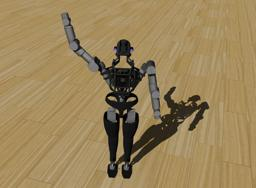

## Boston Dynamics' Atlas

%robot atlas images/robots/atlas/model.thumbnail.png

The "Atlas" is a humanoid robot developed by [Boston Dynamics](https://www.bostondynamics.com/atlas) with funding and oversight from DARPA.
The robot is 1.8 meters tall and is designed for a variety of search and rescue tasks.

### Atlas PROTO

Derived from [Robot](../reference/robot.md).

```
Atlas {
  SFVec3f    translation     0 1 0
  SFRotation rotation        1 0 0 -1.5708
  SFString   name            "Atlas"
  SFString   controller      "hello_world_demo"
  MFString   controllerArgs  []
  SFString   customData      ""
  SFBool     supervisor      FALSE
  SFBool     synchronization TRUE
  MFNode     pelvisSlot      []
}
```

> **File location**: "WEBOTS\_HOME/projects/robots/boston_dynamics/atlas/protos/Atlas.proto"

#### Atlas Field Summary

- `pelvisSlot`: Extends the robot with new nodes in the pelvis slot.

### Samples

You will find the following sample in the folder: "WEBOTS\_HOME/projects/robots/boston_dynamics/atlas/worlds".

#### atlas.wbt

 This simulation shows an Atlas robot in a simple environment. The robot is moving its right arm.
