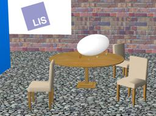

## LIS Blimp

%robot blimp images/robots/blimp/model.thumbnail.png

The "Blimp" robot is a Zeppelin-like aerial robot developed by the [EPFL LIS laboratory](https://lis.epfl.ch/).

### Blimp PROTO

Derived from [Robot](../reference/robot.md).

```
Blimp {
  SFVec3f    translation     0 0 0
  SFRotation rotation        0 1 0 0
  SFString   name            "Blimp"
  SFString   controller      "blimp"
  MFString   controllerArgs  []
  SFString   customData      ""
  SFBool     supervisor      FALSE
  SFBool     synchronization TRUE
  MFNode     extensionSlot   []
}
```

> **File location**: "WEBOTS\_HOME/projects/robots/epfl/lis/protos/Blimp.proto"

#### Blimp Field Summary

- `extensionSlot`: Extends the robot with new nodes in the extension slot.

### Samples

You will find the following sample in this folder: "WEBOTS\_HOME/projects/robots/epfl/lis/worlds".

### blimp\_lis.wbt

 This is an example of the flying blimp robot developed at the Laboratory of Intelligent Systems (LIS) at EPFL.
You can use your keyboard, or a joystick to control the Blimp's motion across the room.
Use the up, down, right, left, page up, page down and space (reset) keys.
Various [Transform](../reference/transform.md) and [IndexedFaceSet](../reference/indexedfaceset.md) nodes are used to model the room using textures and transparency.
A *physics plugin* is used to add thrust and other forces to the simulation.

> **Note**:
[Fluid](../reference/fluid.md) and [Propeller](../reference/propeller.md) nodes are now recommended to create flying robots.
