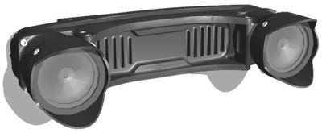

## Camera Sensors

Adding a generic [Camera](../reference/camera.md) node is sufficient for most of the applications.
Generic cameras are customizable (resolution, field of view, noise, etc.) and include a zoom and a focusing mechanism by default.
Special effects like motion blur, various models of noise, lens distortion and the use of a spherical projection are available.

In addition to adding generic [Camera](../reference/camera.md) nodes, some predefined camera models are also present in Webots.

### Smart Camera

If a [Recognition](../reference/recognition.md) node is added to the camera, the camera can return not only the image but also all objects detected in the camera image and their size and position.
It is therefore very easy to simulate smart cameras such as the Mobileye.

%figure "Smart camera output"


%end


### MultiSense S21

The `MultiSense S21` is a range sensor based on a stereoscopic camera.

Our model of this sensor includes several Webots devices.

The internal `IntertialUnit` device is present to get the roll, pitch and yaw angles of the device.
The left and right RGB images of the stereoscopic camera can be retrieved independently using Webots [Cameras](../reference/camera.md).
Alternatively, a RGB [Camera](../reference/camera.md) and a [RangeFinder](../reference/rangefinder.md) device can be enabled at the center of the `MultiSense S21` device.
These two "meta" devices are present to mimic the cloud of 3D colored points generated by the real device.

The internal device names used to retrieve the devices from the controller can be computed from the `MultiSenseS21.name` field using [the following table](#internal-devices-names), where the `MultiSenseS21.name` part should be replaced by the actual value of the `name` field.
For example if `MultiSenseS21.name` is set to "MultiSense S21" the inertial unit device name is "MultiSense S21 inertial unit".

%figure "Internal devices names"

| Device                                                               | Name                                      |
| -------------------------------------------------------------------- | ----------------------------------------- |
| InertialUnit                                                         |  "`MultiSenseS21.name` inertial unit"     |
| Left RGB Camera (`MultiSenseS21.leftCamera` should be enabled)       |  "`MultiSenseS21.name` left camera"       |
| Right RGB Camera (`MultiSenseS21.rightCamera` should be enabled)     |  "`MultiSenseS21.name` right camera"      |
| Meta RGB Camera (`MultiSenseS21.metaCamera` should be enabled)       |  "`MultiSenseS21.name` meta camera"       |
| Meta RangeFinder (`MultiSenseS21.metaRangeFinder` should be enabled) |  "`MultiSenseS21.name` meta range finder" |

%end

%figure "MultiSenseS21 stereoscopic camera"



%end

```
PROTO MultiSenseS21 [
  SFVec3f    translation         0 0 0
  SFRotation rotation            0 1 0 0
  SFString   name                "MultiSense S21"
  SFInt32    cameraWidth         1024
  SFInt32    cameraHeight        544
  SFFloat    cameraFieldOfView   1.4
  SFFloat    cameraNoise         0
  SFFloat    rangeFinderNoise    0
  SFFloat    rangeFinderMaxRange 300
  SFBool     leftCamera          TRUE
  SFBool     rightCamera         TRUE
  SFBool     metaCamera          FALSE
  SFBool     metaRangeFinder     FALSE
  SFBool     enablePhysics       TRUE
]
```

The `name` field defines the `MultiSenseS21` name and is used to compute the internal device names (cf. [this table](#internal-devices-names)).

The `cameraWidth` and `cameraHeight` fields specify the resolution of all the internal rendering devices (i.e. [Cameras](../reference/camera.md) and [RangeFinder](../reference/rangefinder.md)).

The `cameraFieldOfView` field specifies the horizontal field of view of all the internal rendering devices.

The `cameraNoise` field specifies the noise of all the internal rendering devices(cf. `Camera.noise`).

The `rangeFinderNoise` field specifies the noise of the internal meta RangeFinder (cf. `RangeFinder.noise`).

The `rangeFinderMaxRange` field specifies the max range of the internal meta RangeFinder (cf. `RangeFinder.maxRange`).

The `leftCamera`, `rightCamera`, `metaCamera` and `metaRangeFinder` fields allow to enable the corresponding internal rendering devices.

The `enablePhysics` field specifies if the sensor should be affected by physics (mass = 1.5 [kg]) or not.
