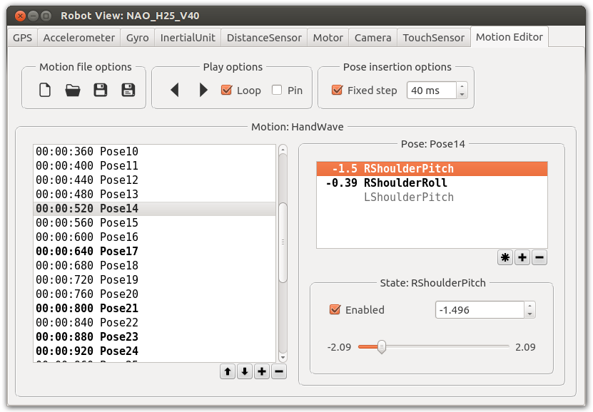

## Controller Plugin

The controller functionality can be extended with user-implemented plugins.
The purpose of a controller plugin is to ease the programming of robot-specific robot windows and remote-control wrappers.

Programming controller plugins rather than programming directly in the controller is more convenient because it increases considerably the modularity and the scalability of the code.
For example a robot window can be used for several robots.

### Fundamentals

Whatever its language, a controller executable is linked with the Webots controller library (libController) at startup.
A controller plugin is a shared library loaded dynamically (at runtime) by libController after a specific event depending on its type.

The following [figure](#controller-plugin-overview) shows an overview of the controller plugin system.
In this figure, the dashed arrows shows how the shared libraries are loaded, and the large dash lines represents an Inter-Process Communication (IPC).
The IPC between libController and Webots is a pipe (On Windows this is a named pipe, and otherwise a local domain socket).
The IPC between libRemoteControl and the real robot is defined by the user (TCP/IP, Serial, etc.).

The system has been designed as follows.
All the entities (the controller, the remote control library and the robot window library) should only call the libController interface (Webots API) functions.
The controller should not be aware of its robot window and its real robot for modularity reasons.
The only exception is about the robot window library which can be aware of the remote control library in order to initialize and monitor it.
This can be done via the libController API through the `wb_robot_get_mode`, `wb_robot_set_mode` and the `wb_remote_control_custom_function` functions.
Of course these rules can be easily broken because every entity runs into the same process.
However, we recommend to respect them to get a good design.

The controller plugins have been designed to be written in C/C++, because the result should be a dynamic library.
However, it's certainly possible to write them in other languages using a C/C++ wrapper inbetween.

After its loading, some controller plugin functions (entry points) are called by libController.
A set of entry points have to be defined to let the controller plugin work smoothly.
Some of these entry points are required and some are optional.

The [Robot](../reference/robot.md) node defines the location of the controller plugin through its *window* and its *remoteControl* fields.

The controller plugin runs in the main thread of the process (also known as GUI thread): the same as the controller executable.
This implies that if an entry point of a plugin is blocked, the controller will also be blocked.
And if the plugin crashes, the controller is also crashed.

The search algorithm to convert the *window* and the *remoteControl* to an existing path is explained in the [Reference Manual](../reference/robot.md).

Each distributed shared library is built thanks to the main Makefile (the same as the one used to build the controllers):

`WEBOTS_HOME/resources/Makefile.include`
%figure "Controller plugin overview"
%chart
graph LR
  Webots[Webots] -.-> libController[libController]
  subgraph Controller thread
  controller[controller] --> libController
    libController -->|1| libRobotWindow[libRobotWindow]
    libController -->|0..1| libRemoteControl[libRemoteControl]
  end
      libRemoteControl -.-> RealRobot[Real Robot]
%end
%end

### Robot Window

A robot window allows the programmer to efficiently create custom user interfaces for his robots.
Robot windows can be opened by double-clicking on the virtual robot, or using the [context menu](the-3d-window.md#context-menu).
The *window* field of the [Robot](../reference/robot.md) node specifies a robot window.

Robot windows are implemented in HTML and provide the following features:

1. They rely on HTML layout and Javascript programming.
2. They communicate directly with the robot controller using two Javascript functions: `webots.window("<robot window name>").receive` and `webots.window("<robot window name>").send`.
The equivalent controller functions are `wb_robot_wwi_receive_text` and `wb_robot_wwi_send_text`.
3. They are web-ready and could be used to display robot windows on web pages.

A simple example of an HTML robot window is provided in the `robots/thymio/thymio2.wbt` sample simulation and demonstrates:

- How to display sensor information in the robot window.
- How to send user interface events (like mouse clicks) from the robot window to the controller program.
- How to change the title of the robot window from the controller program.

The HTML robot windows can communicate with controller programs written using any of the supported programming languages, i.e. C, C++, Python, Java, MATLAB and ROS.
If a [Robot](../reference/robot.md)'s controller is changed or restarted during the simulation run, the robot window associated to the same [Robot](../reference/robot.md) node will be restarted as well.

The vehicle, Darwin-OP robot windows and BotStudio still use the native robot window (see below).
However, they will soon be ported to the HTML robot window.
After that, the native robot window system will be progressively phased out.

### Native Robot Window (Deprecated)

Native robot windows still exist in Webots.
However, they are deprecated and it is not recommended to use them when developing new robot windows.
They are more complicated to implement than HTML robot windows and are known to cause Qt DLL conflicts with third-party software, such as MATLAB or NAOqi.

The entry points of a native robot window controller plugin are:

- `bool wbw_init()`

    This is the first function called by libController. Its goal is to initialize the
    graphical user interface without showing it.

- `void wbw_cleanup()`

    This is the last function called by libController. Its goal is to cleanup the
    library (destroy the GUI, release the memory, store the current library state,
    etc.)

- `void wbw_pre_update_gui()`

    This function is called before the `wbw_update_gui` function to inform its imminent call.
    Its purpose is to inform that from this moment, the pipe answering from Webots
    to the controller can receive data. If data is coming from the Webots pipe,
    then the `wbw_update_gui` function should return as soon as possible.

- `void wbw_update_gui()`

    The aim of this function is to process the GUI events until something is
    available on the Webots pipe.

- `void wbw_read_sensors()`

    This function is called when it is time to read the sensors values from the
    Webots API. For example in this callback function the `wb_distance_sensor_get_value`
    function can be called.

- `void wbw_write_actuators()`

    This function is called when it is time to write the actuator commands from the
    Webots API. For example in this callback function the `wb_motor_set_position` function
    can be called.

- `void wbw_show()`

    This function is called when the GUI should be shown. This can occur either when
    the user double-clicks on the virtual robot, or when he selects the `Robot |
    Show Robot Window` menu item, or at controller startup if the
    *showWindow* field of the [Robot](../reference/robot.md) node is enabled.

- `void *wbw_robot_window_custom_function(void *)`

    This function can optionally be defined to communicate and pass data from and to
    the controller program. It is called directly by the user from the controller
    when executing the `wb_robot_window_custom_function` C function or
    `Robot::windowCustomFunction` C++ function. You can find more information
    in the [Reference Manual](../reference/robot.md#wb_robot_window_custom_function).

The internal behavior of the `wb_robot_step` function call is the key point to understanding how the different entry points of the robot window plugin are called (pseudo-code):

```c
wb_robot_step() {
  wbw_write_actuators();
  wbw_pre_update_gui();
  write_request_to_webots_pipe();
  wbw_update_gui(); // returns when something on the pipe
  read_request_to_webots_pipe();
  wbw_read_sensors();
}
```

As the Qt libraries are included in Webots (used by the Webots GUI), and all our samples are based on it, we recommend to choose also this framework to create your GUI.
The `Makefile.include` mentioned above allows you to efficiently link with the Qt framework embedded in Webots.

The Webots pipe handle (integer id) is available in the WEBOTS\_PIPE\_IN environment variable.

The Qt utility library helps you to initialize Qt correctly (pipe, window visibility, ...).
Refer to the next section for more information related with this library.

If the robot window cannot be loaded (bad path, bad initialization, etc.), a generic robot window is opened instead.
This generic robot window displays several sensors and actuators.
The source code of this robot window is a good demonstrator of the robot window plugin abilities.
All the source code is located in the following directory:

- `WEBOTS_HOME/resources/projects/plugins/robot_windows/generic_window`

Other samples can be found in the following directories:

- `WEBOTS_HOME/projects/robots/e-puck/plugins/robot_windows/botstudio`
- `WEBOTS_HOME/projects/robots/e-puck/plugins/robot_windows/e-puck_window`

#### Qt Utility Library

In order to facilitate the creation of native robot window using the Qt framework, Webots has a utility library allowing to hide the complexity of the management of the robot windows.

This library contains various classes including a subclass of QMainApplication managing the pipe events, a subclass of QMainWindow dealing with the close events, a class to handle Webots standard paths, and a collection of widgets to display the Webots devices.
The source code of the generic robot window is a good example illustrating how to use this library.

The location of the qt utility library is `WEBOTS_HOME/resources/projects/libraries/qt_utils`.

#### Motion Editor

A motion is a chronological sequence of robot poses.
A pose is defined by a set of commands (in position) of the robot motors.

The motion is stored in a motion file in a user-readable format.
The controller API allows to play easily the motion files on your robot.
You can get the complete motion API in the [Reference Manual](../reference/motion.md).

The motion editor (cf. the [figure](#motion-editor-view)) is a GUI which helps to create motions which can be played by a robot.
This editor is implemented as a Qt widget of the legacy generic window (deprecated).
This means that the motion editor is accessible only if the robot is linked with the generic window i.e. by setting the `Robot.window` field to `generic_window`.

In the motion editor different fonts and colors are used to identify the status of poses and motor states: modified items are displayed using bold font, disabled states are written in gray, and items with values outside the valid motor position range are written in red.

%figure "Motion editor view"



%end

### Remote-Control Plugin

A remote-control plugin allows to simply and efficiently create an interface using the Webots API to communicate with a real robot.
The main purpose of a remote-control library is to wrap all the Webots API functions used by the robot with a protocol communicating to the real robot.
Generally, a program (client) runs on the real robot, and decodes the communication protocol to dialog with the real robot devices.

The remote-control library is initialized when an entity calls the `wb_robot_set_mode` libController function.
This entity is typically libRobotWindow, because it's quite convenient to use the GUI to initialize the communication (i.e. entering the IP address of the robot, etc.).

There are two entry points to the remote-control library:

- `bool wbr_init(WbrInterface *ri)`

    This function is called by libController to initialize the remote control
    library. It is called after the first `wb_robot_set_mode` function call. The goal of
    this function is to map the functions given into the `WbrInterface` structure
    with functions inside the remote-control library.

- `void wbr_cleanup()`

    This function is called by libController to cleanup the library.

The `WbrInterface` structure has several functions (mandatory) which have to be mapped to let the remote-control library run smoothly.
Here they are:

- `bool wbr_start(void *arg)`

    This function is called when the connection with the real robot should start.
    The return value of this function should inform if the connection has been a
    success or not. The argument matches with the argument given to
    the `wb_robot_set_mode` function when initializing the remote-control. As the robot window
    library is often responsible for calling the `wb_robot_set_mode` function, the structure
    passed between them should match.

- `void wbr_stop()`

    This function is called when the connection with the real robot should stop.
    Typically a command stopping the real robot actuators should be sent just before
    stopping the connection.

- `bool wbr_has_failed()`

    This function is called very often by libController to check the validity of the
    connection. The value returned by this function should always match with the
    connection validity.

- `void wbr_stop_actuators()`

    This function is called to stop the actuators of the real robot. This is called
    when the user pressed the pause button of the simulator.

- `int wbr_robot_step(int period)`

    This function is called when the controller enters in the step loop. The aim of
    this function is to send the actuator commands and then to read the vaues of the
    enabled sensors. The timing problem should be solved there. The robot should
    wait at least *period* milliseconds, and return the delta time if this *period*
    is exceeded.

As mentioned above, all the Webots API functionalities that should work with the real robot have to be wrapped into the remote-control library.
To achieve this:

- The internal state of the libController has to be setup to match with the current state of the robot.

    Typically, when the value of a sensor is known the corresponding
    `wbr_sensor_set_value` function has to be called.

- The commands sent to the libController have to be wrapped.

    Typically, when the command of an actuator is setup the corresponding
    `wbr_actuator_set_value)` function is called, and has to be sent to the real robot.

The complete definition of the remote control API and of the `WbrInterface` structure is contained in the following file:

`WEBOTS_HOME/include/controller/c/webots/remote_control.h`

For example, if you want to be able to use the distance sensor of the real robot, you have to wrap the `wbr_set_sampling_period` function (to set the internal state of the remote control library to read this distance sensor only when required), and to call the `wbr_distance_sensor_set_value` function into the remote-control library when the distance sensor is refreshed (typically into the `wbr_robot_step` function).

A complete sample (communicating with the e-puck robot using bluetooth) can be found in this directory:

`WEBOTS_HOME/projects/robots/e-puck/plugins/remote_controls/e-puck_bluetooth`
